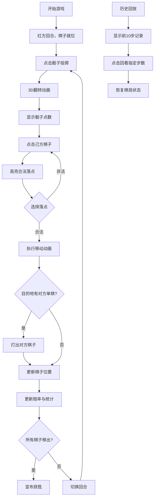

## 1. 产品概述
唐代长安西市胡商棋馆双陆棋博弈与下注赔率实时模拟互动游戏，用户扮演棋馆裁判操控红蓝双方棋子进行对弈，体验古代博戏文化。

- 核心目标：还原唐代双陆棋玩法，实现棋子移动、骰子投掷、合法走法判定、赔率实时计算等完整游戏循环
- 目标用户：对古代博弈文化、历史模拟游戏感兴趣的玩家
- 市场价值：将传统棋牌游戏与现代Web技术结合，创造沉浸式历史文化体验

## 2. 核心特性

### 2.1 用户角色
| 角色 | 注册方式 | 核心权限 |
|------|----------|----------|
| 裁判玩家 | 无需注册，直接进入 | 操控红蓝双方棋子、投掷骰子、回看历史棋局 |

### 2.2 功能模块
1. **棋盘区域**：24格楔形棋盘，支持棋子拖拽与点击移动，合法落点高亮显示
2. **骰子区域**：两颗骨质骰子，3D翻转动画，随机点数生成
3. **状态面板**：回合数、棋子统计、赔率显示、概率分布、历史回放
4. **游戏规则引擎**：双陆棋规则判定、吃子逻辑、胜负判定
5. **赔率计算系统**：实时胜率评估，动态赔率更新

### 2.3 页面详情
| 页面名称 | 模块名称 | 功能描述 |
|----------|----------|----------|
| 主游戏页面 | 棋盘组件 | CSS Grid绘制24格楔形棋盘，显示棋子位置，处理点击/拖拽事件 |
| 主游戏页面 | 骰子组件 | 3D翻转动画，随机点数生成，动画结束后回传结果 |
| 主游戏页面 | 状态面板 | 显示回合数、双方棋子统计、实时赔率、概率分布、历史回放按钮 |
| 主游戏页面 | 装饰区域 | 左侧棋馆装饰（挂轴、铜灯），营造唐代氛围 |

## 3. 核心流程
用户进入游戏后，红蓝双方各15枚棋子就位，红方先行。点击骰子触发3D翻转动画，停稳后显示点数。点击己方棋子高亮显示所有合法落点，点击落点完成移动。若目的地有对方单枚棋子则将其打出棋盘。每步移动后更新赔率，回合交替。率先将所有棋子移出棋盘者获胜。支持回看前10步棋局状态。

## 4. 用户界面设计

### 4.1 设计风格
- **主色调**：深木色 #3a2a1a（背景）、浅木黄 #d4a76a（棋盘）、深褐 #5d3a1a（格线）
- **棋子颜色**：朱砂红 #c0392b（红方）、青金石蓝 #2c3e50（蓝方）
- **强调色**：金色 #d4a017（文字）、半透明金 #ffd700（高亮光晕）
- **字体**：仿古楷体 'KaiTi', serif
- **棋子样式**：扁圆形，直径16px，CSS圆形渐变模拟漆器质感，带半透明投影
- **骰子样式**：骨质白色 #f5f5dc，黑色点数圆点
- **整体氛围**：唐代西市胡商棋馆，古朴典雅，充满历史感

### 4.2 页面布局
| 区域 | 模块 | UI元素 |
|------|------|--------|
| 左侧20% | 装饰区 | 挂轴、铜灯装饰元素，细木纹背景 |
| 中间60% | 棋盘区 | 24格楔形棋盘，红蓝棋子，高亮落点动画 |
| 右侧20% | 状态面板 | 回合数、棋子统计、赔率条、概率分布、回放按钮 |
| 棋盘下方 | 骰子区 | 两颗骰子，点击投掷，3D翻转动画 |

### 4.3 响应式设计
- **宽屏（>1200px）**：三栏布局，左侧装饰、中间棋盘、右侧面板
- **中屏（768-1200px）**：两栏布局，左侧棋盘（70%）、右侧面板（30%），装饰区简化
- **窄屏（<768px）**：单栏布局，棋盘在上，面板在下，装饰区隐藏
- **触摸优化**：棋子点击区域扩大，落点高亮更明显

### 4.4 动效设计
- **骰子动画**：framer-motion的rotateX/rotateY实现3D翻转，持续1.5秒，缓动曲线easeOut
- **棋子移动**：framer-motion布局动画，平滑缓动，持续0.3秒
- **高亮动画**：半透明金色圆环脉冲闪烁，opacity 0.3-0.8循环
- **赔率更新**：数值变化时颜色渐变过渡
- **页面加载**：棋盘和元素依次淡入，staggered reveal效果
