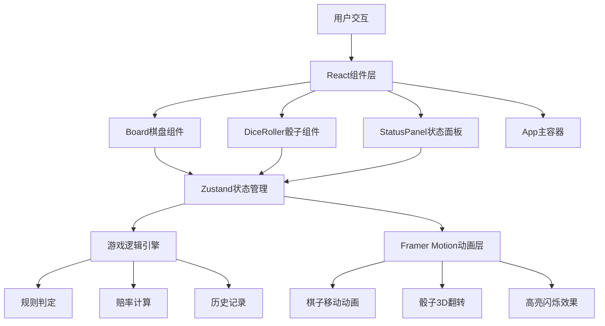

## 1. 架构设计
纯前端React应用，采用组件化架构，状态管理与UI分离。



## 2. 技术描述
- **前端框架**：React@18 + TypeScript
- **构建工具**：Vite@5 + @vitejs/plugin-react
- **状态管理**：Zustand@4
- **动画库**：Framer Motion@11
- **样式方案**：CSS Modules + CSS变量，自定义主题色
- **初始化方式**：Vite + react-ts模板

## 3. 项目结构
```
auto98/
├── package.json
├── vite.config.js
├── tsconfig.json
├── index.html
└── src/
    ├── main.tsx          # React根组件，挂载App
    ├── App.tsx           # 主游戏容器，布局管理
    ├── store/
    │   └── gameStore.ts  # Zustand状态管理，游戏逻辑
    └── components/
        ├── Board.tsx     # 棋盘组件，24格渲染，交互处理
        ├── DiceRoller.tsx # 骰子组件，3D动画，点数生成
        └── StatusPanel.tsx # 状态面板，统计与赔率显示
```

## 4. 数据模型

### 4.1 核心类型定义
```typescript
// 棋子颜色
type Player = 'red' | 'blue';

// 棋子状态
interface Piece {
  id: number;
  player: Player;
  position: number; // 0-23: 棋盘格, 24: 已出局, -1: 被打出
  isOut: boolean;
}

// 骰子结果
interface DiceResult {
  die1: number;
  die2: number;
  used: [boolean, boolean];
}

// 历史记录
interface HistoryEntry {
  pieces: Piece[];
  currentPlayer: Player;
  turn: number;
  dice: DiceResult | null;
  odds: { red: number; blue: number };
  timestamp: number;
}

// 游戏状态
interface GameState {
  pieces: Piece[];
  currentPlayer: Player;
  turn: number;
  dice: DiceResult | null;
  selectedPieceId: number | null;
  validMoves: number[];
  odds: { red: number; blue: number };
  history: HistoryEntry[];
  historyIndex: number;
  winner: Player | null;
  isRolling: boolean;
}
```

### 4.2 状态操作
```typescript
interface GameActions {
  rollDice: () => void;
  selectPiece: (pieceId: number) => void;
  movePiece: (pieceId: number, targetPos: number) => void;
  calculateValidMoves: (pieceId: number) => number[];
  updateOdds: () => void;
  saveHistory: () => void;
  goToHistory: (index: number) => void;
  resetGame: () => void;
}
```

## 5. 核心算法

### 5.1 合法走法计算
```
输入：棋子ID、当前骰子点数
输出：合法落点数组
逻辑：
1. 获取棋子当前位置
2. 检查骰子是否已使用
3. 计算目标位置 = 当前位置 + 骰子点数
4. 若目标位置 > 23，检查是否可移出
5. 检查目标位置棋子情况：
   - 空：合法
   - 己方棋子：不合法（不能叠加）
   - 对方单枚：合法（可打出）
   - 对方两枚及以上：不合法（有阻挡）
6. 返回所有合法落点
```

### 5.2 赔率计算算法
```
输入：双方棋子位置、出局数量
输出：红方赔率、蓝方赔率
逻辑：
1. 计算红方进度 = (出局数*24 + Σ(24-位置)) / (15*24)
2. 计算蓝方进度 = (出局数*24 + Σ(24-位置)) / (15*24)
3. 差值 = 红方进度 - 蓝方进度
4. 基础赔率 = 1.0
5. 每差1枚出局棋子，赔率变化0.2
6. 位置优势附加调整系数（0.1-0.3）
7. 红方赔率 = 基础赔率 + 差值 * 调整系数
8. 蓝方赔率 = 基础赔率 - 差值 * 调整系数
9. 限制赔率范围 [0.5, 3.0]
```

### 5.3 骰子概率分布
```
点数：2  3  4  5  6  7  8  9  10 11 12
组合：1  2  3  4  5  6  5  4  3  2  1
概率：1/36, 2/36, ..., 6/36, ..., 1/36
```

## 6. 性能优化
- **FPS目标**：棋子移动动画稳定45FPS以上
- **重渲染优化**：React.memo包裹组件，useMemo缓存计算结果
- **动画性能**：使用transform和opacity属性，避免layout thrashing
- **状态更新**：Zustand切片选择，避免不必要的重渲染
- **响应时间**：棋盘重渲染 < 50ms，使用requestAnimationFrame批量更新
