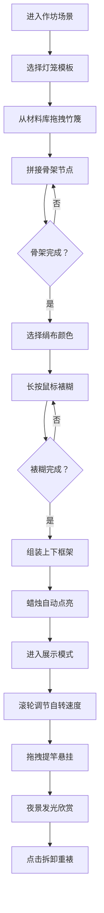

## 1. 产品概述

本产品是一款在浏览器中模拟古代灯笼铺手工制作流程的交互式应用，解决传统手工艺制作中不同灯笼样式的骨架结构与裱糊效果难以在动手前直观预览和调整配色的问题。

- 核心目标：为灯笼手工艺爱好者、学习者和设计师提供一个沉浸式的虚拟制作体验平台
- 目标用户：传统手工艺爱好者、文化传承学习者、灯饰设计师
- 产品价值：降低灯笼制作学习成本，提升设计效率，传承中华传统工艺文化

## 2. 核心功能

### 2.1 用户角色

| 角色 | 注册方式 | 核心权限 |
|------|----------|----------|
| 普通用户 | 无需注册，直接使用 | 完整体验灯笼制作全流程，保存和预览成品 |

### 2.2 功能模块

1. **主工作台**：虚拟北宋汴京灯市作坊场景，支持骨架拼接、裱糊、组装全流程操作
2. **材料库面板**：左侧可收放抽屉，提供竹篾、亚麻线等制作材料
3. **颜色属性面板**：右侧固定面板，提供绢布颜色选择和属性调节
4. **灯笼渲染器**：实时渲染骨架、绢布、蜡烛光影效果
5. **展示悬挂系统**：成品灯笼自转展示、物理摆动、夜景发光效果

### 2.3 页面详情

| 页面名称 | 模块名称 | 功能描述 |
|----------|----------|-------------|
| 主工作台 | 骨架拼接模块 | 拖拽竹篾到操作台，三种模板（宫灯六边形、走马灯圆柱形、纱灯方形），节点拖拽调整比例，竹篾卡入动画 |
| 主工作台 | 裱糊模块 | 四种绢布颜色选择，长按鼠标涂抹裱糊，绢布展开动画，张力检测与裂纹提示 |
| 主工作台 | 组装模块 | 拖拽木制框架扣合，蜡烛点亮动画，烛光径向渐变抖动效果 |
| 主工作台 | 展示模块 | 灯笼自转（滚轮调速），骨架阴影投射，点击面可拆卸重新裱糊 |
| 主工作台 | 悬挂模块 | 提竿拖拽悬挂，物理阻尼摆动，夜景星空背景，灯笼发光照明 |
| 材料面板 | 材料选择 | 竹篾、亚麻线材料展示，点击激活当前材料 |
| 颜色面板 | 颜色选择 | 四种绢布颜色色块，选中发光边框动画 |

## 3. 核心流程

用户从进入应用开始，依次经历材料选择→骨架拼接→裱糊上色→框架组装→成品展示→悬挂欣赏的完整制作流程。

## 4. 用户界面设计

### 4.1 设计风格

- **主色调**：木色（#8b6f47、#6b4e3a）和米色（#f5f0e8）为基调
- **点缀色**：朱砂红（#c0392b）、青金蓝（#2c3e50）作为绢布选项
- **整体风格**：宋代简约风格，典雅质朴，体现传统手工艺的温度
- **按钮风格**：木纹质感，圆角8px，悬停微浮起效果
- **字体**：标题使用书法风格衬线字体，正文使用简洁易读的无衬线字体
- **布局**：操作台居中占70%宽度，左右面板辅助，空间层次分明
- **动效**：所有交互0.3s ease-in-out平滑过渡，拖拽弹性反馈

### 4.2 页面设计概述

| 页面名称 | 模块名称 | UI元素 |
|----------|----------|--------|
| 主工作台 | 场景背景 | 青砖地面#7a8a7a，木柱#6b4e3a，半成品灯笼骨架装饰，木案#8b6f47 |
| 主工作台 | 操作台区域 | 居中70%宽度，深色木纹质感，骨架拼接网格参考线 |
| 材料面板 | 左侧抽屉 | 可收放滑出动画，材料缩略图，数量计数，激活高亮 |
| 颜色面板 | 右侧面板 | 固定260px宽度，四种绢布颜色圆形色块（30px），金色#d4a017选中发光边框 |
| 灯笼渲染器 | 骨架层 | 竹篾#d4a76a，节点#5d3a1a高亮，亚麻线#c4a882连接 |
| 灯笼渲染器 | 绢布层 | 半透明渐变边缘，褶皱纹理，裂纹警告提示 |
| 灯笼渲染器 | 蜡烛层 | 径向渐变橙色#ff8c00到透明，0.5s抖动频率 |
| 展示悬挂 | 夜景模式 | 深蓝#0a1628背景，白色星星闪烁动画，灯笼发光照明 |

### 4.3 响应式设计

- **桌面优先**：1920x1080标准分辨率下布局完好
- **自适应**：缩放至1024x768时，左右面板自适应变为底部折叠栏
- **交互优化**：触摸设备支持长按、拖拽手势操作
- **性能**：60fps丝绒动画帧率，拖拽和裱糊响应延迟≤16ms

### 4.4 视觉与动效设计

- **环境氛围**：白日作坊暖光 → 夜景灯笼发光，两种场景自然过渡
- **光影系统**：蜡烛烛光投射骨架阴影（CSS filter: drop-shadow），阴影颜色随绢布偏移
- **物理效果**：悬挂灯笼阻尼振荡动画，摆幅±15度→0度，持续2秒
- **微交互**：竹篾卡入"咔哒"高亮，框架扣合"啪嗒"锁定，绢布绷紧音效
- **弹性反馈**：拖拽拉伸度超过120%时显示红色虚线并回弹
