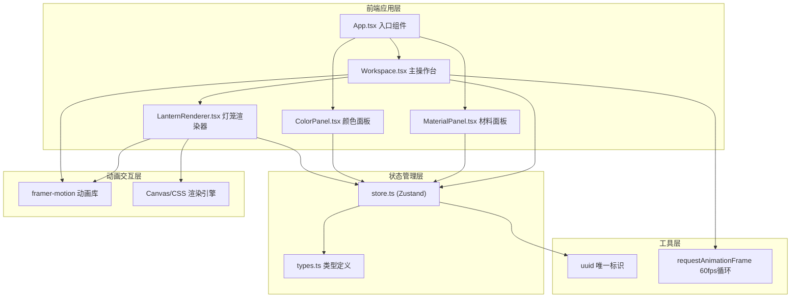

## 1. 架构设计



## 2. 技术描述

- **前端框架**：React 18 + TypeScript 5
- **构建工具**：Vite 5 + @vitejs/plugin-react 4
- **状态管理**：Zustand 4
- **动画库**：Framer Motion 11
- **工具库**：uuid 9
- **渲染方案**：Canvas 2D API + CSS3 混合渲染
- **性能优化**：requestAnimationFrame 60fps 渲染循环，局部重绘

## 3. 项目结构

```
auto99/
├── src/
│   ├── components/
│   │   ├── Workspace.tsx          # 主操作台组件
│   │   ├── MaterialPanel.tsx      # 左侧材料库面板
│   │   ├── ColorPanel.tsx         # 右侧颜色属性面板
│   │   └── LanternRenderer.tsx    # 灯笼渲染器
│   ├── types.ts                   # TypeScript 类型定义
│   ├── store.ts                   # Zustand 全局状态管理
│   ├── App.tsx                    # 应用根组件
│   ├── main.tsx                   # 应用入口
│   └── index.css                  # 全局样式
├── package.json
├── tsconfig.json
├── vite.config.js
└── index.html
```

## 4. 数据模型

### 4.1 核心类型定义

```typescript
// 灯笼类型
export type LanternType = 'palace' | 'revolving' | 'silk';

// 绢布颜色
export type SilkColor = 'moonWhite' | 'gooseYellow' | 'begoniaRed' | 'bambooGreen';

// 制作阶段
export type CraftPhase = 'skeleton' | 'pasting' | 'assembly' | 'display' | 'hanging';

// 节点坐标
export interface Node {
  id: string;
  x: number;
  y: number;
  z: number;
  isDragging: boolean;
}

// 竹篾连接
export interface BambooStrip {
  id: string;
  startNodeId: string;
  endNodeId: string;
  isConnected: boolean;
  highlighted: boolean;
}

// 骨架模板
export interface SkeletonTemplate {
  type: LanternType;
  name: string;
  nodes: Node[];
  connections: BambooStrip[];
}

// 绢布面
export interface SilkPanel {
  id: string;
  nodeIds: string[];
  color: SilkColor;
  pastingProgress: number;
  tension: number;
  isDetached: boolean;
}

// 蜡烛
export interface Candle {
  isLit: boolean;
  brightness: number;
  flickerOffset: number;
  flameHeight: number;
}

// 悬挂状态
export interface HangingState {
  isHanging: boolean;
  swingAngle: number;
  swingVelocity: number;
  hookId: string | null;
}
```

### 4.2 全局状态结构

```typescript
interface LanternStore {
  // 当前状态
  currentPhase: CraftPhase;
  lanternType: LanternType;
  
  // 骨架数据
  nodes: Node[];
  bambooStrips: BambooStrip[];
  activeMaterial: 'bamboo' | 'thread' | null;
  
  // 裱糊数据
  silkPanels: SilkPanel[];
  selectedColor: SilkColor;
  overallPastingProgress: number;
  
  // 组装数据
  isAssembled: boolean;
  topFrameColor: 'redwood' | 'ebony';
  bottomFrameColor: 'redwood' | 'ebony';
  candle: Candle;
  
  // 展示数据
  rotationAngle: number;
  rotationSpeed: number;
  
  // 悬挂数据
  hanging: HangingState;
  isNightMode: boolean;
  
  // 操作方法
  setLanternType: (type: LanternType) => void;
  updateNodePosition: (id: string, x: number, y: number) => void;
  connectBambooStrip: (startId: string, endId: string) => void;
  setActiveMaterial: (material: 'bamboo' | 'thread' | null) => void;
  setSelectedColor: (color: SilkColor) => void;
  updatePastingProgress: (panelId: string, progress: number, tension: number) => void;
  completeAssembly: () => void;
  setRotationSpeed: (speed: number) => void;
  hangLantern: (hookId: string) => void;
  detachSilkPanel: (panelId: string) => void;
  resetLantern: () => void;
}
```

## 5. 核心算法

### 5.1 骨架节点拖拽算法
- 鼠标按下时记录节点初始位置与鼠标偏移
- 鼠标移动时更新节点坐标，计算与初始位置的拉伸比例
- 拉伸度超过120%时显示红色虚线警告
- 鼠标释放时，若超出范围则弹性回弹到100%位置

### 5.2 绢布裱糊算法
- 长按鼠标时记录鼠标移动轨迹
- 根据鼠标移动速度动态调整绢布展开速度
- 使用多边形填充算法，沿骨架轮廓渐变扩展
- 计算绢布张紧力：张力>90时显示裂纹提示

### 5.3 阻尼振荡物理算法
- 悬挂灯笼摆动使用简谐运动公式：θ(t) = θ₀ * e^(-λt) * cos(ωt)
- 阻尼系数λ = 1.5，角频率ω = 2π*0.8
- 摆幅从±15度指数衰减到0度，持续约2秒

### 5.4 烛光抖动算法
- 使用正弦波叠加随机噪声模拟火焰抖动
- 径向渐变中心每0.5秒随机偏移±2px
- 亮度在0.8-1.0之间波动

## 6. 性能优化

### 6.1 渲染优化
- Canvas分层渲染：骨架层、绢布层、蜡烛层独立绘制
- 脏矩形检测：仅重绘变化区域
- 离屏Canvas预渲染静态元素

### 6.2 交互优化
- 拖拽事件使用PointerEvent统一处理
- 裱糊轨迹使用requestAnimationFrame批量处理
- 事件委托减少监听器数量

### 6.3 内存优化
- 节点对象池复用，避免频繁GC
- 主动清理动画帧和事件监听器
- 使用WeakMap存储临时状态

## 7. 路由定义

| 路由 | 页面/组件 | 功能说明 |
|------|-----------|----------|
| / | App.tsx | 主应用页面，包含所有制作功能 |

本应用为单页应用，无需多路由配置。

## 8. 构建与部署

- **开发命令**：`npm run dev` - 启动Vite开发服务器
- **构建命令**：`npm run build` - 生产环境构建
- **预览命令**：`npm run preview` - 预览生产构建
- **类型检查**：`npx tsc --noEmit` - TypeScript类型校验
