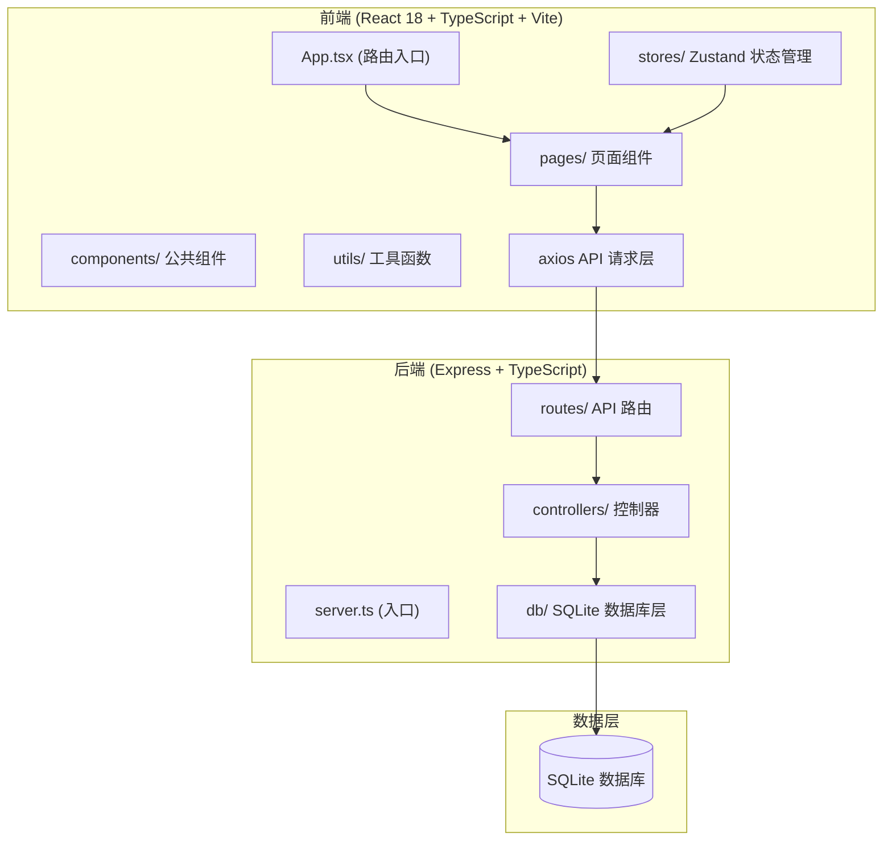
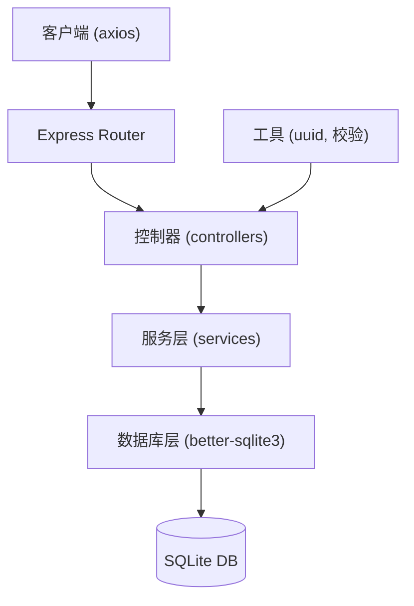
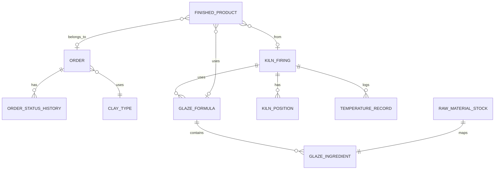

## 1. 架构设计



## 2. 技术栈说明

- **前端框架**：React 18 + TypeScript
- **构建工具**：Vite 5 + @vitejs/plugin-react
- **路由管理**：react-router-dom v6
- **状态管理**：zustand
- **HTTP 客户端**：axios
- **后端框架**：Express 4 + TypeScript
- **数据库**：better-sqlite3 (SQLite)
- **ID 生成**：uuid
- **CORS 中间件**：cors
- **包管理**：npm
- **并发启动**：concurrently

## 3. 路由定义

| 前端路由 | 页面组件 | 用途 |
|----------|----------|------|
| /front | FrontPage.tsx | 前台首页 - 提交定制订单、查看订单进度 |
| /orders | OrdersPage.tsx | 订单管理 - 订单列表、详情、状态变更 |
| /glazes | GlazesPage.tsx | 釉料配方管理 - 配方列表、创建/编辑 |
| /kiln | KilnPage.tsx | 窑炉烧制记录 - 烧制批次、仓位图、温度曲线 |
| /inventory | InventoryPage.tsx | 库存管理 - 素坯、原料、成品库存 |

## 4. API 定义

### 4.1 订单相关
```typescript
// 订单状态类型
type OrderStatus = 'pending' | 'confirmed' | 'preparing' | 'throwing' | 'trimming' | 'bisque' | 'glaze' | 'polishing' | 'completed';
type VesselType = 'cup' | 'bowl' | 'plate' | 'vase' | 'teapot' | 'decor';
type ClayType = 'white_porcelain' | 'coarse_pottery' | 'red_clay' | 'stoneware';

interface Order {
  id: string;
  customerName: string;
  customerPhone: string;
  vesselType: VesselType;
  caliber: number;      // 口径 cm
  height: number;       // 高度 cm
  baseDiameter: number; // 底径 cm
  referenceImages: string[];
  clayType: ClayType;
  notes: string;
  status: OrderStatus;
  statusHistory: { status: OrderStatus; timestamp: string }[];
  createdAt: string;
}

// GET    /api/orders            获取订单列表（支持 status 筛选）
// GET    /api/orders/:id        获取订单详情
// POST   /api/orders            前台创建订单
// PATCH  /api/orders/:id/status 更新订单状态
```

### 4.2 釉料配方相关
```typescript
type GlazeBase = 'transparent' | 'opaque' | 'crystalline' | 'metallic';
type RawMaterial = 'feldspar' | 'quartz' | 'kaolin' | 'limestone' | 'iron_oxide' | 'cobalt_oxide';

interface GlazeIngredient {
  material: RawMaterial;
  percentage: number;
}

interface GlazeFormula {
  id: string;
  name: string;
  baseType: GlazeBase;
  ingredients: GlazeIngredient[];
  targetTempMin: number;
  targetTempMax: number;
  heatingCurve: string;
  holdingTime: number; // 分钟
}

// GET    /api/glazes        获取配方列表
// GET    /api/glazes/:id    获取配方详情
// POST   /api/glazes        创建配方（校验 ingredients 总和 = 100）
// PUT    /api/glazes/:id    更新配方
// DELETE /api/glazes/:id    删除配方
```

### 4.3 窑炉烧制相关
```typescript
interface KilnPosition {
  row: number;
  col: number;
  clayType: ClayType | null;
  orderId: string | null;
}

interface TemperatureRecord {
  timestamp: string;
  temperature: number;
  remainingMinutes: number;
}

interface KilnFiring {
  id: string;
  batchNumber: string;
  glazeIds: string[];
  positions: KilnPosition[];
  startTime: string;
  targetTemperature: number;
  heatingRate: number; // °C/hour
  holdingDuration: number; // 分钟
  temperatureRecords: TemperatureRecord[];
  status: 'preparing' | 'firing' | 'cooling' | 'completed';
  report?: {
    tempDeviation: string;
    colorEffect: string;
  };
}

// GET    /api/kiln                    获取烧制记录列表
// GET    /api/kiln/:id                获取烧制详情
// POST   /api/kiln                    创建烧制批次
// POST   /api/kiln/:id/record         追加温度记录
// POST   /api/kiln/:id/complete       完成烧制并生成报告
```

### 4.4 库存相关
```typescript
type ShelfArea = 'A' | 'B' | 'C';
type QualityRating = 1 | 2 | 3 | 4 | 5;

interface GreenwareStock {
  id: string;
  clayType: ClayType;
  vesselType: VesselType;
  quantity: number;
  shelfArea: ShelfArea;
}

interface RawMaterialStock {
  id: string;
  material: RawMaterial;
  currentStock: number; // g
  minThreshold: number; // g
}

interface FinishedProduct {
  id: string;
  orderId: string | null;
  glazeId: string | null;
  firingBatchId: string | null;
  caliber: number;
  height: number;
  weight: number; // g
  qualityRating: QualityRating;
  photoUrl: string;
  createdAt: string;
}

// GET    /api/inventory/greenware       素坯库存列表
// POST   /api/inventory/greenware       新增/更新素坯库存
// GET    /api/inventory/materials       原料库存列表
// POST   /api/inventory/materials       新增/更新原料库存
// GET    /api/inventory/finished        成品列表
// POST   /api/inventory/finished        新增成品
// GET    /api/inventory/warnings        获取低于阈值的原料预警
```

## 5. 服务端架构图



## 6. 数据模型

### 6.1 实体关系图



### 6.2 数据库初始化 DDL

```sql
-- 订单表
CREATE TABLE orders (
  id TEXT PRIMARY KEY,
  customer_name TEXT NOT NULL,
  customer_phone TEXT NOT NULL,
  vessel_type TEXT NOT NULL,
  caliber REAL NOT NULL,
  height REAL NOT NULL,
  base_diameter REAL NOT NULL,
  reference_images TEXT, -- JSON array
  clay_type TEXT NOT NULL,
  notes TEXT,
  status TEXT NOT NULL DEFAULT 'pending',
  created_at TEXT NOT NULL
);

-- 订单状态历史
CREATE TABLE order_status_history (
  id INTEGER PRIMARY KEY AUTOINCREMENT,
  order_id TEXT NOT NULL,
  status TEXT NOT NULL,
  timestamp TEXT NOT NULL,
  FOREIGN KEY (order_id) REFERENCES orders(id)
);

-- 釉料配方
CREATE TABLE glaze_formulas (
  id TEXT PRIMARY KEY,
  name TEXT NOT NULL,
  base_type TEXT NOT NULL,
  target_temp_min INTEGER NOT NULL,
  target_temp_max INTEGER NOT NULL,
  heating_curve TEXT,
  holding_time INTEGER NOT NULL
);

-- 釉料配料
CREATE TABLE glaze_ingredients (
  id INTEGER PRIMARY KEY AUTOINCREMENT,
  glaze_id TEXT NOT NULL,
  material TEXT NOT NULL,
  percentage REAL NOT NULL,
  FOREIGN KEY (glaze_id) REFERENCES glaze_formulas(id)
);

-- 窑炉烧制
CREATE TABLE kiln_firings (
  id TEXT PRIMARY KEY,
  batch_number TEXT NOT NULL UNIQUE,
  glaze_ids TEXT, -- JSON array
  positions TEXT, -- JSON array
  start_time TEXT NOT NULL,
  target_temperature INTEGER NOT NULL,
  heating_rate INTEGER NOT NULL,
  holding_duration INTEGER NOT NULL,
  temperature_records TEXT, -- JSON array
  status TEXT NOT NULL DEFAULT 'preparing',
  report TEXT -- JSON
);

-- 素坯库存
CREATE TABLE greenware_stock (
  id TEXT PRIMARY KEY,
  clay_type TEXT NOT NULL,
  vessel_type TEXT NOT NULL,
  quantity INTEGER NOT NULL,
  shelf_area TEXT NOT NULL
);

-- 原料库存
CREATE TABLE raw_material_stock (
  id TEXT PRIMARY KEY,
  material TEXT NOT NULL UNIQUE,
  current_stock INTEGER NOT NULL,
  min_threshold INTEGER NOT NULL
);

-- 成品
CREATE TABLE finished_products (
  id TEXT PRIMARY KEY,
  order_id TEXT,
  glaze_id TEXT,
  firing_batch_id TEXT,
  caliber REAL NOT NULL,
  height REAL NOT NULL,
  weight INTEGER NOT NULL,
  quality_rating INTEGER NOT NULL,
  photo_url TEXT,
  created_at TEXT NOT NULL
);
```
