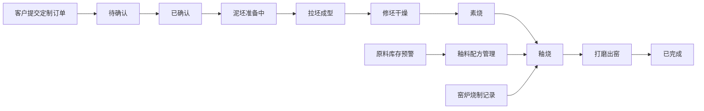

## 1. 产品概述

陶艺工作室管理系统是一款面向小型独立手作陶艺工作室的全流程管理应用，解决定制陶瓷作品从拉坯到出窑的流程跟踪混乱，以及釉料配方因批次不同带来的色差和烧制时间参数难一致的问题。

- 核心目标：提供订单全流程可视化跟踪、釉料配方标准化管理、窑炉烧制记录数字化、库存智能预警
- 目标用户：陶艺工作室经营者、陶艺师、前台客服人员
- 市场价值：提升工作室运营效率，减少因流程混乱和配方不一致导致的作品次品率

## 2. 核心功能

### 2.1 用户角色

| 角色 | 说明 | 核心权限 |
|------|------|----------|
| 工作室管理员 | 后台管理用户 | 订单管理、釉料配方管理、窑炉烧制管理、库存管理、查看预警 |
| 客户 | 前台提交订单用户 | 提交定制订单、查看订单进度时间线 |

### 2.2 功能模块

1. **前台首页**：定制订单提交表单、作品展示、工作室介绍
2. **订单管理**：订单列表、状态流转、进度时间线展示、筛选搜索
3. **釉料配方管理**：配方卡片网格展示、配方创建/编辑、配料百分比校验
4. **窑炉烧制管理**：烧制批次创建、仓位图可视化、温度曲线记录、烧制报告
5. **库存管理**：素坯库存、原料库存（含预警）、成品库存

### 2.3 页面详情

| 页面名称 | 模块名称 | 功能描述 |
|----------|----------|----------|
| 前台首页 | 定制表单 | 器型选择、尺寸输入（口径/高度/底径）、图片上传、坯体类型选择 |
| 前台首页 | 订单查询 | 客户可通过订单号查看进度时间线 |
| 订单管理 | 订单列表 | 状态标签筛选、搜索、分页、状态变更操作 |
| 订单管理 | 订单详情 | 垂直时间线展示各状态节点，颜色按状态区分，记录时间戳 |
| 釉料配方 | 配方网格 | 2列响应式布局（PC端4列），卡片渐变背景模拟釉色，悬停上浮效果 |
| 釉料配方 | 配方编辑 | 配料选择（从原料库）、百分比自动校验（总和100%）、烧制参数设置 |
| 窑炉烧制 | 仓位图 | 棋盘格展示窑内仓位（80x80px），已占仓位显示坯体纹理 |
| 窑炉烧制 | 温度监控 | 每5分钟自动记录温度，模拟升温曲线折线图 |
| 窑炉烧制 | 烧制报告 | 实际与目标温度偏差分析、发色效果评价 |
| 库存管理 | 原料库存 | 库存预警横幅（低于阈值显示红色警告，24h内不重复） |
| 库存管理 | 成品库存 | 列表展示，缩略图按器型形状区分，显示品相星级 |

## 3. 核心流程

客户在前台提交定制订单，填写器型、尺寸、坯体类型并上传参考图，提交后订单进入后台待确认状态。工作室管理员依次将订单状态更新为：已确认 → 泥坯准备中 → 拉坯成型 → 修坯干燥 → 素烧 → 釉烧 → 打磨出窑 → 已完成。每次状态变更记录时间戳，客户可通过时间线查看进度。釉料配方管理支持配料百分比校验，窑炉烧制记录温度曲线并生成报告。原料库存低于阈值时顶部显示预警横幅。

## 4. 用户界面设计

### 4.1 设计风格
- **主色调**：陶土橙 #D84315，搭配米白 #FFF3E0 页面背景
- **辅色调**：深褐色 #4E342E 用于文字和标题，青瓷绿 #80CBC4 用于按钮和链接
- **状态色**：待确认灰 #BDBDBD，制作中蓝 #42A5F5，出窑橙 #FF7043，已完成绿 #66BB6A
- **导航栏**：固定顶部，backdrop-filter: blur(8px) 半透明毛玻璃，底部 1px 阴影分隔线
- **卡片样式**：圆角设计，进入视图时从下方上浮 20px 并淡入（0.4s ease-out），悬停上浮 4px 阴影加深（0.3s ease）
- **输入框**：聚焦时边框变为青瓷绿，0.2s 过渡
- **字体**：标题使用具有人文气息的衬线或手写体风格字体，正文使用简洁易读的无衬线字体

### 4.2 页面设计概览

| 页面名称 | 模块名称 | UI 元素 |
|----------|----------|---------|
| 前台首页 | 定制表单 | 温暖米白背景，陶土橙提交按钮，青瓷绿边框聚焦效果 |
| 订单管理 | 时间线 | 垂直布局，左侧圆点标记连线，状态颜色区分 |
| 釉料配方 | 配方卡片 | 渐变背景模拟釉色（青瓷#B2DFDB→#80CBC4，天目#4E342E→#3E2723，吴须#B0BEC5→#78909C），2-4列响应式网格 |
| 窑炉烧制 | 仓位图 | 棋盘格布局，80x80px 仓位，浅灰#F5F5F5 空白位 |
| 库存管理 | 预警横幅 | 红色圆角 #FF5252 背景，白色文字，可关闭 |

### 4.3 响应式设计
- 桌面端（>1024px）：釉料卡片 4 列，完整导航栏
- 平板端（768-1024px）：釉料卡片 2 列
- 手机端（<768px）：釉料卡片单列，导航栏变为汉堡菜单

### 4.4 性能指标
- 页面初始加载后 3 秒内可交互
- 列表搜索和筛选响应时间 ≤ 200ms
