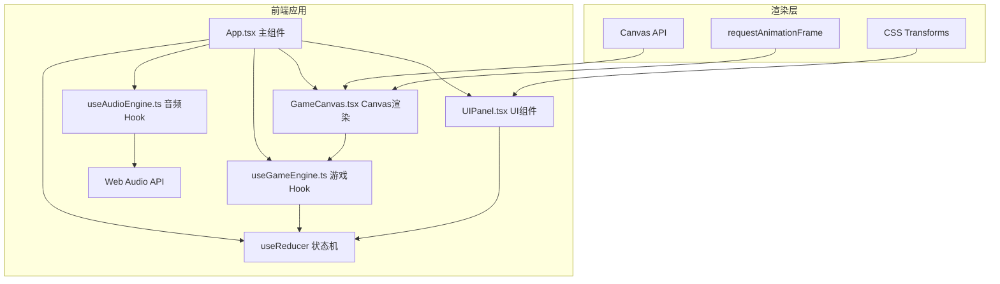

## 1. 架构设计



## 2. 技术描述
- **前端**：React@18 + TypeScript + Vite
- **构建工具**：Vite@5 + @vitejs/plugin-react
- **音频处理**：Web Audio API（BPM解析、音频播放）
- **图形渲染**：Canvas 2D API（游戏主战场、星空粒子、饼图）
- **状态管理**：React useReducer（对战状态机）
- **动画驱动**：requestAnimationFrame（60FPS游戏循环）
- **样式方案**：原生CSS（CSS变量、GPU加速transform/opacity）
- **字体**：Google Fonts - Orbitron

## 3. 状态机定义

游戏使用 useReducer 管理三态切换：

| 状态 | 描述 | 可转换至 |
|------|------|----------|
| PREPARING | 准备阶段（选曲） | COUNTDOWN |
| COUNTDOWN | 3秒准备倒计时 | PLAYING |
| PLAYING | 60秒对战中 | RESULT |
| RESULT | 结果展示 | PREPARING |

## 4. 数据模型与类型定义

```typescript
// 判定等级
type Judgment = 'Perfect' | 'Great' | 'Good' | 'Miss';

// 音符数据
interface Note {
  id: number;
  time: number;      // 出现时间戳(ms)
  lane: 0 | 1;       // 0=左轨, 1=右轨
  hit: boolean;
  judgment?: Judgment;
}

// 玩家状态
interface PlayerState {
  score: number;
  combo: number;
  maxCombo: number;
  judgments: Record<Judgment, number>;
}

// 波纹动画
interface Ripple {
  id: number;
  x: number;
  y: number;
  judgment: Judgment;
  startTime: number;
}

// 游戏全局状态
interface GameState {
  phase: 'PREPARING' | 'COUNTDOWN' | 'PLAYING' | 'RESULT';
  countdown: number;
  timeLeft: number;
  bpm: number;
  notes: Note[];
  player1: PlayerState;
  player2: PlayerState;
  ripples: Ripple[];
  winner: 0 | 1 | null; // 0=P1, 1=P2, null=平局
}
```

## 5. 性能优化策略

1. **渲染层**：
   - 游戏主战场使用 Canvas 2D，避免频繁DOM操作
   - 星空粒子预计算位置，每帧仅更新偏移
   - 使用 requestAnimationFrame 驱动，保证60FPS
   
2. **动画层**：
   - 所有UI动画使用 transform 和 opacity，触发GPU合成层
   - CSS transition 时长统一 ≥ 0.2s
   - 判定波纹使用 Canvas 绘制而非DOM元素

3. **计算层**：
   - BPM解析仅在选曲阶段执行，不阻塞对战
   - 音符位置通过时间插值计算，避免逐帧更新数组
   - 得分和连击变化通过 useReducer 批量更新

4. **内存层**：
   - 音符命中后标记而非删除，避免数组频繁splice
   - 波纹动画对象池复用，减少GC压力
