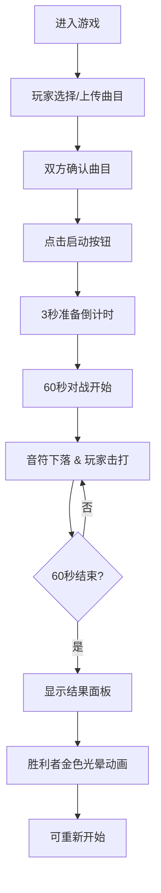

## 1. 产品概述
Rhythm Battle 是一款基于浏览器的双人音乐节奏打击对战游戏，解决传统音游需要下载安装、曲目固定无法自定义的痛点。玩家可上传自定义MP3或选择预设曲目，系统自动解析BPM生成打击音符，双方通过键盘同步对战60秒，以精准度和连击数决胜负。

- **目标用户**：音乐游戏爱好者、朋友间休闲对战
- **核心价值**：零门槛、自定义曲目、实时双人对战、霓虹美学视觉体验

## 2. 核心功能

### 2.1 用户角色
| 角色 | 注册方式 | 核心权限 |
|------|----------|----------|
| 玩家 | 无需注册 | 选曲、上传音乐、对战、查看结果 |

### 2.2 功能模块
1. **游戏准备阶段**：霓虹选曲面板、双玩家区域、曲目上传与预设、60秒倒计时启动
2. **对战对局阶段**：双轨道音符滚动、实时判定反馈、计分与连击显示、波纹动画
3. **结果展示阶段**：胜利者公告、得分统计、精准度饼图、金色光晕动画
4. **曲目解析系统**：MP3上传、BPM自动检测、音符序列生成
5. **视觉反馈系统**：星空粒子背景、霓虹发光效果、磨砂玻璃UI、数字滚动动画

### 2.3 页面详情
| 页面名称 | 模块名称 | 功能描述 |
|----------|----------|----------|
| 准备页面 | 选曲面板 | 左右玩家区域、3首预设曲目卡片、自定义上传按钮 |
| 准备页面 | 曲目信息 | 曲目名、时长、BPM值显示 |
| 准备页面 | 启动按钮 | 60秒倒计时启动按钮，渐变霓虹风格 |
| 对战页面 | 游戏画布 | Canvas渲染双轨道、菱形音符、判定线、波纹动画、星空背景 |
| 对战页面 | 计分UI | 双垂直渐变计分条、连击显示、计时器、按键提示 |
| 结果页面 | 结果面板 | 磨砂玻璃卡片、滑入动画、双方得分、最高连击、精准度饼图、金色光晕脉冲 |

## 3. 核心流程
玩家进入首页 → 左右玩家分别选择/上传曲目（需同一首） → 点击60秒倒计时启动按钮 → 3秒准备后同步开始 → 音符从轨道顶部下落 → 玩家按键击打获得Perfect/Great/Good/Miss判定 → 实时更新得分与连击 → 60秒倒计时结束 → 显示结果面板，胜利者金色光晕 → 可重新开始游戏

## 4. 用户界面设计

### 4.1 设计风格
- **主色调**：深蓝 #0f0f3a、亮青 #00f7ff、品红 #ff00ff、金色 #ffd700
- **背景色**：#0a0a2e
- **卡片背景**：半透明磨砂效果（rgba带alpha，backdrop-filter: blur(8px)）
- **按钮样式**：渐变填充（#ff00ff到#00f7ff），圆角，悬停发光，按下缩放
- **字体**：Orbitron（数字显示），等宽字体用于得分、连击等关键信息
- **图标风格**：彩色菱形音符，随BPM变色（慢绿/中黄/快红）
- **动效**：判定波纹扩散、粒子爆散、数字滚动、卡片滑入、光晕脉冲

### 4.2 页面设计概览
| 页面名称 | 模块名称 | UI元素 |
|----------|----------|--------|
| 准备页面 | 选曲面板 | 暗色渐变卡片(#1a1a4e→#2a2a6e)、圆角16px、悬停发光边框#00f7ff、亮青选中边框、过渡0.3s |
| 准备页面 | 启动按钮 | 渐变填充、白色20px字体、悬停亮度1.1倍、按下缩放0.95 |
| 对战页面 | 游戏画布 | 深蓝渐变背景、双轨道(各45%宽、10px间隙)、菱形音符、判定线、波纹动画、星空粒子(200个) |
| 对战页面 | 计分条 | 垂直渐变条(宽16px高400px)、底部红#ff3366→顶部金#ffd700、平滑过渡、粒子爆散 |
| 结果页面 | 公告牌 | 半透明遮罩opacity0.7、磨砂玻璃卡片、滑入动画(cubic-bezier)、Canvas饼图、金色光晕脉冲 |

### 4.3 响应式设计
- 桌面端：双列左右布局，轨道各占45%
- 移动端（<768px）：单列上下布局，轨道占满全屏，判定线和音符缩小25%，触控区域放大
- 所有动画使用CSS transform和opacity利用GPU加速
