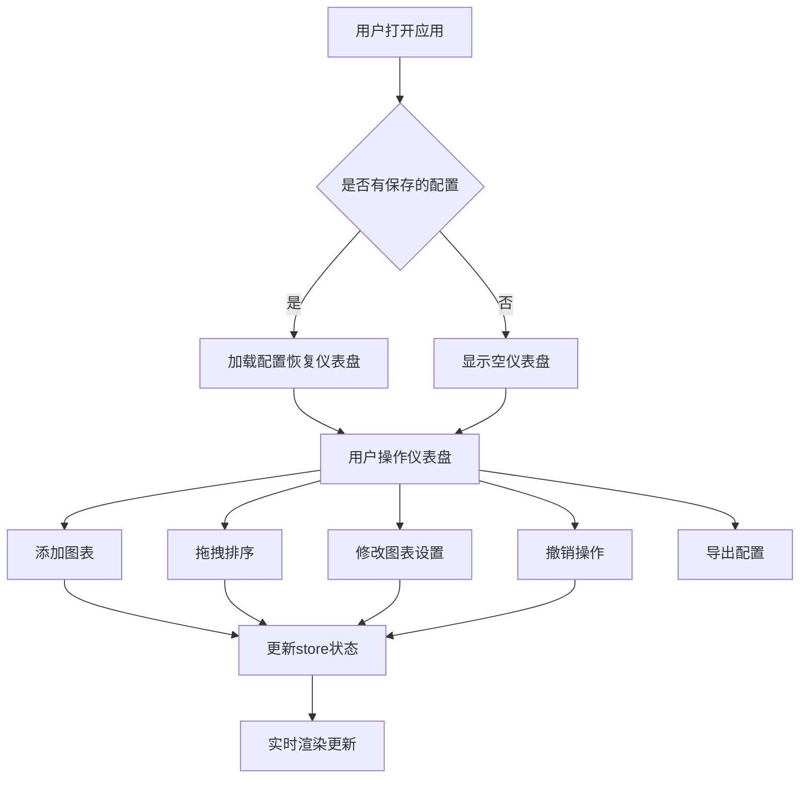

## 1. 产品概述
在线交互式数据可视化仪表盘应用，允许用户通过拖拽方式自由组合多种图表组件创建个性化工作台，支持布局与主题的实时保存与恢复。
- 主要目的：提供灵活、易用的数据可视化仪表盘构建工具，满足用户个性化数据展示需求
- 目标用户：数据分析师、业务运营人员、产品经理等需要快速构建数据看板的用户
- 产品价值：降低数据可视化门槛，让用户无需编码即可快速创建专业级数据仪表盘

## 2. 核心功能

### 2.1 功能模块
1. **仪表盘主界面**：图表卡片展示区域，支持拖拽排序
2. **顶部工具栏**：添加图表、撤销、主题切换、导出配置
3. **图表组件**：柱状图、折线图、饼图三种图表类型
4. **图表设置面板**：侧边浮窗，修改图表标题、主题、数据范围
5. **配置导入导出**：JSON格式的配置保存与恢复

### 2.2 页面详情
| 页面名称 | 模块名称 | 功能描述 |
|-----------|-------------|---------------------|
| 仪表盘主界面 | 拖拽区域 | 监听drop事件，支持图表卡片拖拽排序，平滑过渡动画 |
| 仪表盘主界面 | 图表卡片列表 | 渲染所有图表组件，支持选中、删除操作 |
| 顶部工具栏 | 添加图表按钮 | 弹出类型选择浮窗，选择柱状图/折线图/饼图 |
| 顶部工具栏 | 撤销按钮 | 回退最近5次操作，显示可撤销次数 |
| 顶部工具栏 | 主题切换按钮 | 切换整体颜色主题（浅色/深色） |
| 顶部工具栏 | 导出配置按钮 | 将当前配置导出为JSON文件下载 |
| 图表设置面板 | 标题设置 | 修改图表显示标题 |
| 图表设置面板 | 主题设置 | 修改单个图表的颜色主题 |
| 图表设置面板 | 数据范围设置 | 选择数据展示范围（最近7天/30天/全部） |

## 3. 核心流程
用户打开应用 → 查看初始仪表盘（空或加载已保存配置）→ 点击添加图表按钮 → 选择图表类型 → 新图表卡片插入到仪表盘 → 拖拽调整图表位置 → 点击图表设置图标 → 修改图表属性 → 点击撤销回退操作 → 点击导出保存配置

## 4. 用户界面设计

### 4.1 设计风格
- **主色调**：浅灰色背景 #f0f2f5，白色卡片，浅蓝色交互色 #e3f2fd
- **按钮风格**：圆角8px，悬停时背景变化
- **字体**：系统默认无衬线字体
- **布局风格**：卡片式布局，顶部固定工具栏
- **动画效果**：CSS transition 0.25s-0.3s，平滑过渡

### 4.2 页面设计详情
| 模块名称 | UI元素 | 样式描述 |
|-----------|-------------|-------------|
| 顶部工具栏 | 容器 | 固定顶部，高度64px，白色背景，底部1px浅灰色分割线 |
| 顶部工具栏 | 图标按钮 | 悬停背景浅蓝色 #e3f2fd，圆角8px |
| 图表卡片 | 容器 | 白色背景，12px圆角，浅灰色 #e0e0e0 边框，8px柔和阴影 |
| 图表卡片 | 悬停效果 | 阴影加深至16px，上移4px，过渡0.25s |
| 拖拽效果 | 跟随卡片 | 半透明显示，跟随鼠标移动 |
| 侧边设置面板 | 容器 | 宽度320px，白色背景，从右侧滑入动画（translateX 0%到100%，0.3s ease-out） |
| 添加图表浮窗 | 容器 | 居中弹出，128px宽，两个图标按钮排列，点击后收缩消失 |

### 4.3 响应式设计
- 桌面端：多列网格布局，图表卡片并排展示
- 移动端（<768px）：图表卡片占满整行，拖拽调整为上下方向
- 触摸优化：拖拽区域适配触摸手势

### 4.4 性能指标
- 拖拽响应延迟：≤ 16ms（60FPS）
- 图表重渲染延迟：≤ 100ms
- 初始加载时间：≤ 2秒
