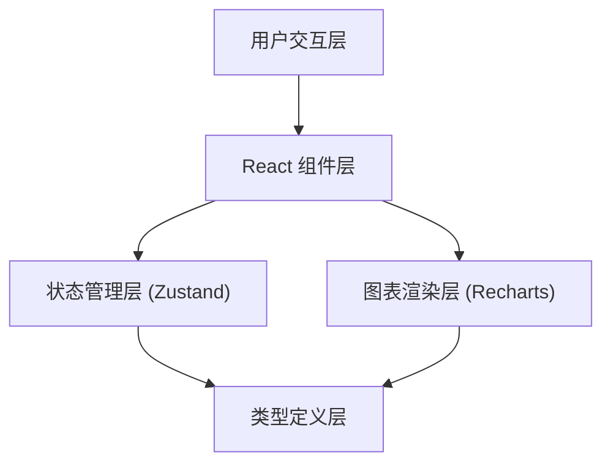

## 1. 架构设计



### 架构说明
- **用户交互层**：处理鼠标拖拽、点击等用户输入事件
- **React组件层**：包含Toolbar、Dashboard、ChartPanel等UI组件
- **状态管理层**：使用Zustand管理全局状态，支持撤销栈
- **类型定义层**：统一的TypeScript类型定义
- **图表渲染层**：使用Recharts库渲染各类图表

## 2. 技术说明
- **前端框架**：React 18 + TypeScript
- **构建工具**：Vite 5
- **状态管理**：Zustand 4
- **图表库**：Recharts 2
- **样式方案**：CSS Modules（Vite内置）
- **初始化方式**：Vite + react-ts 模板

## 3. 文件结构
```
auto101/
├── package.json
├── vite.config.js
├── tsconfig.json
├── index.html
└── src/
    ├── main.tsx              # 应用入口
    ├── App.tsx               # 根组件
    ├── types.ts              # 类型定义
    ├── store.ts              # Zustand状态管理
    ├── dashboard.tsx         # 仪表盘主容器
    ├── chartPanel.tsx        # 单个图表组件
    ├── toolbar.tsx           # 顶部工具栏
    ├── settingsPanel.tsx     # 侧边设置面板
    ├── addChartModal.tsx     # 添加图表浮窗
    └── styles/
        ├── globals.css       # 全局样式
        └── variables.css     # CSS变量
```

## 4. 模块职责
| 模块 | 职责 | 通信方式 |
|------|------|----------|
| types.ts | 定义ChartType、ChartConfig、DashboardState等接口和类型 | 被所有模块引用 |
| store.ts | 管理图表列表、布局坐标、主题色、撤销栈；暴露addChart/removeChart/moveChart/undo等操作 | 通过Zustand hooks供组件调用 |
| dashboard.tsx | 读取store中的图表列表，监听拖拽事件，控制布局，渲染图表列表 | 订阅store状态 + 调用store actions |
| chartPanel.tsx | 接收图表ID和类型，从store获取数据渲染Recharts图表，支持选中和删除 | 订阅store中特定图表数据 |
| toolbar.tsx | 渲染添加图表按钮、撤销按钮、主题切换、导出按钮 | 调用store actions |
| settingsPanel.tsx | 侧边浮窗，修改图表标题、主题、数据范围 | 更新store中对应图表配置 |
| addChartModal.tsx | 图表类型选择浮窗 | 选择后调用store.addChart |

## 5. 核心数据模型

### 5.1 类型定义
```typescript
// 图表类型
type ChartType = 'bar' | 'line' | 'pie';

// 主题类型
type ThemeMode = 'light' | 'dark';

// 数据范围
type DataRange = '7d' | '30d' | 'all';

// 单个图表配置
interface ChartItem {
  id: string;
  type: ChartType;
  title: string;
  theme: ThemeMode;
  dataRange: DataRange;
  data: ChartDataPoint[];
  position: number;
}

// 数据点
interface ChartDataPoint {
  name: string;
  value: number;
}

// 仪表盘状态
interface DashboardState {
  charts: ChartItem[];
  globalTheme: ThemeMode;
  history: DashboardState[];
  selectedChartId: string | null;
}
```

### 5.2 Store Actions
- `addChart(type: ChartType)`: 添加新图表，生成随机模拟数据
- `removeChart(id: string)`: 删除指定图表
- `moveChart(from: number, to: number)`: 移动图表位置
- `updateChart(id: string, config: Partial<ChartItem>)`: 更新图表配置
- `undo()`: 撤销最近操作（最多5步）
- `setGlobalTheme(theme: ThemeMode)`: 设置全局主题
- `selectChart(id: string | null)`: 选中/取消选中图表
- `exportConfig()`: 导出配置为JSON
- `importConfig(config: DashboardState)`: 从JSON导入配置

## 6. 关键技术实现
### 6.1 拖拽实现
- 使用HTML5 Drag and Drop API
- 拖拽时设置dragImage为半透明克隆元素
- 使用dragover事件计算插入位置
- 使用CSS transition实现平滑动画

### 6.2 撤销栈实现
- 每次操作前保存当前状态快照到history数组
- history数组最大长度为5
- undo操作时弹出最后一个快照恢复状态

### 6.3 性能优化
- 使用React.memo优化ChartPanel重渲染
- 使用Zustand的selector避免不必要的重渲染
- 拖拽操作使用requestAnimationFrame节流

### 6.4 响应式布局
- 使用CSS Grid + media queries实现
- 桌面端：grid-template-columns: repeat(auto-fill, minmax(400px, 1fr))
- 移动端（<768px）：grid-template-columns: 1fr
