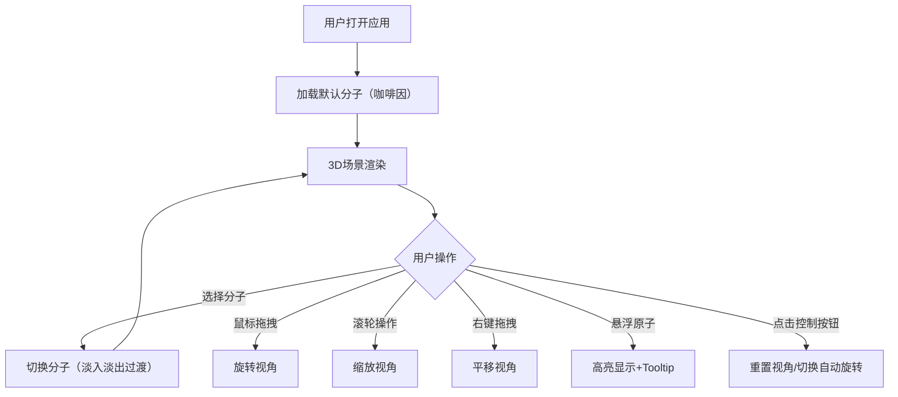

## 1. 产品概述

交互式3D分子结构查看器，用于在三维空间中可视化展示分子的原子排列与化学键连接。
- 主要用途：化学教育、分子可视化、科学展示
- 目标用户：学生、教师、化学研究人员
- 目标价值：提供直观的3D交互式分子可视化体验

## 2. 核心功能

### 2.1 功能模块

1. **主场景**：3D渲染区域、分子渲染、交互控制、自动旋转、悬浮高亮
2. **控制面板**：分子选择、分子信息展示、视角重置、自动旋转开关
3. **数据模块**：分子数据解析、原子/化学键数据管理

### 2.2 页面详情

| 页面名称 | 模块名称 | 功能描述 |
|-----------|----------|----------------------------------------|
| 主场景 | 3D渲染区域 | Canvas全屏展示分子结构，支持旋转/缩放/平移 |
| 主场景 | 分子渲染 | 原子球体（按元素着色）、化学键圆柱体 |
| 主场景 | 交互控制 | 鼠标拖拽旋转、滚轮缩放、右键平移 |
| 主场景 | 悬浮效果 | 原子高亮放大1.2倍+发光边缘+Tooltip显示元素信息 |
| 控制面板 | 分子选择器 | 下拉选择水分子、甲烷、咖啡因 |
| 控制面板 | 分子信息 | 显示原子总数、键总数、分子量 |
| 控制面板 | 控制按钮 | 重置视角、切换自动旋转开关 |

## 3. 核心流程

用户打开应用→默认加载咖啡因分子→用户可通过下拉切换分子→用户可通过鼠标交互查看分子结构→悬浮原子查看详细信息→可切换自动旋转或重置视角

## 4. 用户界面设计

### 4.1 设计风格
- 主色调：深空渐变背景（#0d1117 到 #161b22）
- 控制面板：半透明毛玻璃效果，背景#1a1a2e，圆角12px
- 按钮：32x32px，背景#2d2d5e，悬停#3d3d7e，点击缩放0.95
- 文字颜色：#e6e6e6，选项高亮#4fc3f7
- 整体风格：暗色科技感

### 4.2 页面设计概览

| 页面名称 | 模块名称 | UI元素 |
|-----------|----------|-------------|
| 主场景 | 3D场景 | 全屏Canvas，深空渐变，光泽材质，平行光+环境光 |
| 主场景 | 原子渲染 | 球体（碳灰#555555，氧红#ff0000，氮蓝#3050f8，氢白#ffffff） |
| 主场景 | 化学键 | 灰色圆柱体#cccccc，直径0.08 |
| 主场景 | Tooltip | 半透明深色#000000b3，白色文字，圆角6px |
| 控制面板 | 左侧面板 | 宽度250px，毛玻璃效果，右边框圆角 |
| 控制面板 | 下拉选择器 | 水分子/甲烷/咖啡因，蓝色高亮选项 |
| 控制面板 | 信息展示 | 原子数、键数、分子量数据 |
| 控制面板 | 控制按钮 | 重置视角、自动旋转开关图标 |

### 4.3 响应式
- 桌面端优先，全屏展示
- 控制面板固定左侧，主场景自适应窗口

### 4.4 3D场景指南
- 环境：深空渐变背景，无HDRI
- 光源：平行光强度1.2（右上角）+ 环境光强度0.4（#404060）
- 相机：OrbitControls，阻尼0.1，缩放0.5-5倍
- 原子材质：MeshPhongMaterial带光泽
- 自动旋转：0.5 rad/s
- 动画：分子切换0.5s淡入淡出过渡
