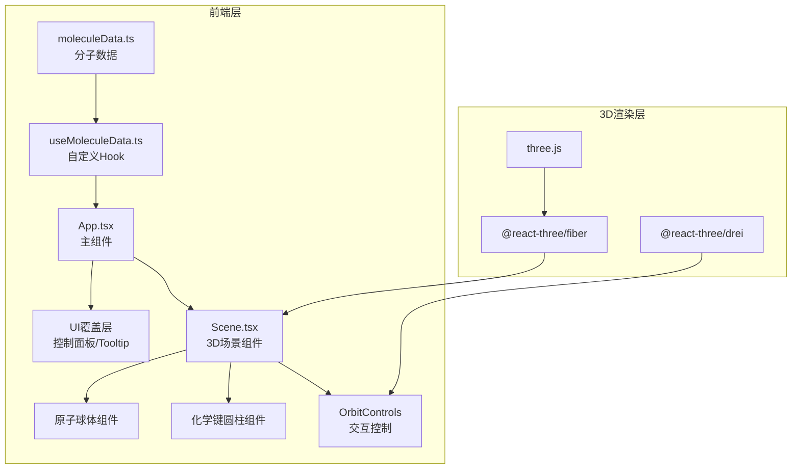

## 1. 架构设计



## 2. 技术描述

- **前端框架**：React@18 + TypeScript@5
- **构建工具**：Vite@5 + @vitejs/plugin-react
- **3D渲染**：three.js + @react-three/fiber + @react-three/drei
- **状态管理**：React Hooks（useState、useRef）+ 自定义Hook
- **样式方案**：内联CSS + 原生CSS（背景星空效果）

## 3. 项目结构

```
auto105/
├── package.json              # 项目依赖与脚本
├── vite.config.js            # Vite配置
├── tsconfig.json             # TypeScript配置
├── index.html                # 入口HTML
└── src/
    ├── App.tsx               # 主组件
    ├── Scene.tsx             # 3D场景组件
    ├── useMoleculeData.ts    # 分子数据Hook
    └── moleculeData.ts       # 分子数据定义
```

## 4. 数据模型

### 4.1 类型定义

```typescript
// 元素类型
type ElementType = 'C' | 'O' | 'N' | 'H';

// 原子接口
interface Atom {
  id: string;
  element: ElementType;
  position: [number, number, number]; // x, y, z 坐标
}

// 化学键接口
interface Bond {
  id: string;
  atom1: string; // 原子ID
  atom2: string; // 原子ID
}

// 分子接口
interface Molecule {
  name: string;
  formula: string;
  molecularWeight: number; // 分子量
  atoms: Atom[];
  bonds: Bond[];
}
```

### 4.2 预设分子数据
- **水分子 (H2O)**：1个氧原子 + 2个氢原子，2个O-H键
- **甲烷 (CH4)**：1个碳原子 + 4个氢原子，4个C-H键
- **咖啡因 (C8H10N4O2)**：8碳 + 10氢 + 4氮 + 2氧，约25个化学键

### 4.3 元素视觉属性映射

| 元素 | 颜色 | 球体半径 | 原子名称 |
|------|------|----------|----------|
| C（碳） | #555555 | 0.3 | 碳 |
| O（氧） | #ff0000 | 0.25 | 氧 |
| N（氮） | #3050f8 | 0.28 | 氮 |
| H（氢） | #ffffff | 0.15 | 氢 |

## 5. 关键实现要点

### 5.1 分子居中
- 计算所有原子坐标的中心点
- 将所有原子坐标减去中心点偏移

### 5.2 化学键渲染
- 根据两个原子的ID获取坐标
- 计算两点间距离和方向向量
- 使用CylinderGeometry连接两点，应用旋转对齐

### 5.3 悬浮交互
- 使用@react-three/drei的Html组件渲染Tooltip
- 使用useRef存储hover状态，避免重复渲染
- 发光效果通过额外添加Outline或放大发光球体实现

### 5.4 分子切换动画
- 使用CSS opacity配合transition: 0.5s
- 旧分子 opacity: 1 → 0，新分子 opacity: 0 → 1
- 通过key触发重渲染确保动画生效

### 5.5 性能优化
- 原子几何体使用缓存（共享BufferGeometry）
- Tooltip只在hover时渲染
- OrbitControls启用enableDamping平滑交互
