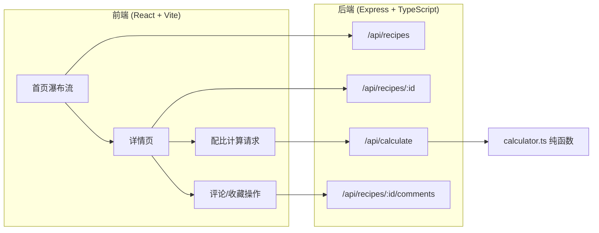

## 1. 架构设计



## 2. 技术说明

- 前端：React@18 + TypeScript + Vite
- 后端：Express@4 + TypeScript + ts-node
- 状态管理：Zustand
- 样式方案：Tailwind CSS
- 图标：lucide-react
- 数据存储：内存Mock数据（无数据库）
- 前后端通信：RESTful API，Vite代理/api到后端3001端口

## 3. 路由定义

| 路由 | 用途 |
|------|------|
| / | 首页，瀑布流食谱展示 |
| /recipe/:id | 食谱详情页，含配比计算与评论 |

## 4. API定义

### 4.1 获取食谱列表

```
GET /api/recipes
Response: Recipe[]
```

### 4.2 获取食谱详情

```
GET /api/recipes/:id
Response: RecipeDetail
```

### 4.3 智能配比计算

```
POST /api/calculate
Body: { ingredients: Ingredient[], targetServings: number, originalServings: number }
Response: { ingredients: Ingredient[] }
```

### 4.4 获取/添加评论

```
GET /api/recipes/:id/comments
Response: Comment[]

POST /api/recipes/:id/comments
Body: { content: string }
Response: Comment
```

### 4.5 TypeScript类型定义

```typescript
interface Recipe {
  id: string;
  title: string;
  image: string;
  totalTime: string;
  difficulty: "简单" | "中等" | "困难";
  servings: number;
  likes: number;
  comments: number;
  createdAt: string;
}

interface RecipeDetail extends Recipe {
  ingredients: Ingredient[];
  steps: Step[];
}

interface Ingredient {
  name: string;
  amount: number;
  unit: string;
}

interface Step {
  number: number;
  description: string;
}

interface Comment {
  id: string;
  avatar: string;
  content: string;
  createdAt: string;
  likes: number;
}
```

## 5. 服务端架构

```mermaid
flowchart TD
    "Express路由层" --> "控制器处理请求"
    "控制器处理请求" --> "计算服务 calculator.ts"
    "计算服务 calculator.ts" --> "返回调整后配比"
    "控制器处理请求" --> "Mock数据"
```

## 6. 数据模型

本项目采用内存Mock数据，无需数据库。数据结构定义如上TypeScript接口。

### Mock数据

- 预置6-8个烘焙食谱（蛋糕、饼干、面包等）
- 每个食谱包含完整配料列表和步骤说明
- 预置部分评论数据用于展示
