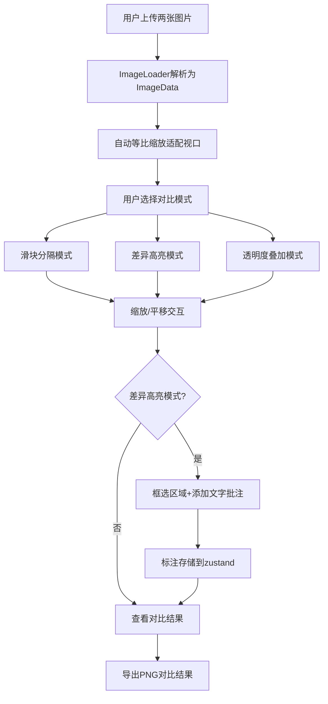

## 1. 产品概述

像素级设计稿比对工具是一款面向设计师和前端开发者的在线协作工具，解决手动对比设计稿与页面像素差异效率低、易遗漏细节的痛点。用户上传设计稿PNG和页面截图后，系统提供多种对比模式、缩放平移、差异标注和导出功能，帮助快速发现和定位视觉偏差。

- 目标用户：UI设计师、前端开发者、产品QA
- 核心价值：将反复截图、叠图、调透明度的手动流程自动化，提升协作效率和视觉还原精度

## 2. 核心功能

### 2.1 用户角色
| 角色 | 注册方式 | 核心权限 |
|------|----------|----------|
| 普通用户 | 无需注册，直接使用 | 上传图片、使用所有对比功能、标注差异、导出结果 |

### 2.2 功能模块
1. **图片上传模块**：双图上传、分辨率检测、自动适配视口
2. **对比视图模块**：三种对比模式（滑块分隔、差异高亮、透明度叠加）
3. **画布交互模块**：滚轮缩放、空格拖拽平移、缩放值实时显示
4. **标注模块**：矩形框选、文字批注、批注管理（增删）
5. **导出模块**：PNG导出，自动命名

### 2.3 页面详情
| 页面名称 | 模块名称 | 功能描述 |
|----------|----------|----------|
| 主应用页 | 图片上传区 | 支持拖拽/点击上传两张图片，显示文件名和分辨率，最大支持4096px |
| 主应用页 | 画布区域 | 左侧70%区域，浅灰棋盘格背景，20px留白，渲染对比结果和标注 |
| 主应用页 | 控制面板 | 右侧30%区域，模式切换、阈值调节、透明度控制、导出/清空按钮 |

## 3. 核心流程

用户上传两张图片 → 系统自动等比缩放适配视口 → 用户选择对比模式 → 通过滑块/阈值调整对比效果 → 滚轮缩放+空格平移查看细节 → 在差异高亮模式下框选区域添加文字批注 → 导出带有标注的PNG对比结果图

## 4. 用户界面设计

### 4.1 设计风格
- **主色调**：蓝色 #1976d2（激活状态、主按钮）
- **辅助色**：绿色 #43a047（导出按钮）、红色 #e53935（清空按钮、差异高亮）
- **背景**：画布区域使用浅灰棋盘格（#ccc与#fff交替，20x20px格子）
- **控件背景**：未激活 #e0e0e0，滑块轨道 #bdbdbd
- **文字**：深灰 #333，激活状态白色
- **字体**：Inter
- **圆角**：按钮6px
- **动效**：按钮点击缩放0.95，过渡0.2s，悬停加深20%

### 4.2 页面设计概述
| 页面名称 | 模块名称 | UI元素 |
|----------|----------|--------|
| 主应用页 | 画布区域(70%) | Canvas画布、右上角缩放值显示、白色虚线分隔滑块(4px宽)、黄色圆角批注标签(#ffeb3b, 透明度0.8, 5px内边距) |
| 主应用页 | 控制面板(30%) | 当前模式/缩放值显示、三个等宽模式切换标签、阈值滑块(5-50)、透明度滑块(仅叠加模式)、导出按钮、清空标注按钮 |

### 4.3 响应式
桌面端优先，双栏固定布局（左70%画布，右30%控制面板），最小宽度支持1280px。

### 4.4 性能指标
- 图像处理在Web Worker中执行，避免阻塞UI
- 对比计算 ≤ 100ms
- 首次图片加载和转换 ≤ 500ms
- 缩放范围：0.25x - 4x
