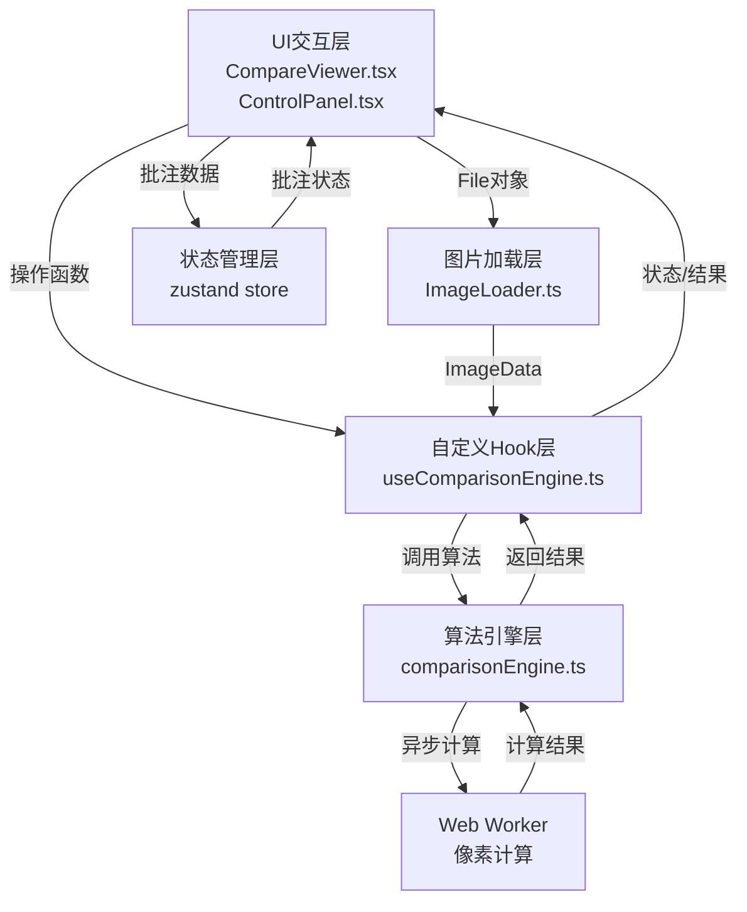

## 1. 架构设计



**数据流向说明**：
1. 用户上传图片 → `ControlPanel` → `ImageLoader.fileToImageData()` → `useComparisonEngine.setImage()` → 存储为 ImageData
2. 用户切换模式/调节参数 → `ControlPanel` → `useComparisonEngine.setMode/setThreshold()` → 调用 `comparisonEngine` 对应函数 → 返回 Canvas/像素坐标数组 → `CompareViewer` 渲染
3. 用户滚轮/拖拽 → `CompareViewer` 事件监听 → `useComparisonEngine.setZoom/setPan()` → 状态更新 → Canvas 重绘
4. 用户框选标注 → `CompareViewer` 鼠标事件 → zustand `useAnnotationStore.addAnnotation()` → 状态更新 → 渲染标注标签

## 2. 技术描述
- **前端框架**：React@18 + TypeScript@5
- **构建工具**：Vite@5 + @vitejs/plugin-react
- **状态管理**：zustand@4
- **图像处理**：原生 Canvas API + Web Worker
- **样式方案**：原生 CSS（不使用Tailwind，按需求实现精确像素级样式）

## 3. 项目文件结构与调用关系

```
project-root/
├── package.json
├── vite.config.js
├── tsconfig.json
├── index.html
└── src/
    ├── main.tsx                      [入口] 挂载React应用
    ├── App.tsx                       [根组件] 双栏布局，组合CompareViewer和ControlPanel
    ├── ImageLoader.ts                [图片加载] 被App.tsx调用，File→ImageData
    ├── comparisonEngine.ts           [算法引擎] 被useComparisonEngine调用，纯函数
    ├── comparison.worker.ts          [Web Worker] 被comparisonEngine.ts异步调用
    ├── useComparisonEngine.ts        [自定义Hook] 被CompareViewer和ControlPanel调用
    ├── store.ts                      [zustand状态] 被App/组件调用，存储批注和全局状态
    ├── styles/
    │   └── global.css                [全局样式] 棋盘格背景、字体、控件样式
    └── components/
        ├── CompareViewer.tsx         [主视图] 调用useComparisonEngine，渲染Canvas和标注
        ├── ControlPanel.tsx          [控制面板] 调用useComparisonEngine，处理用户输入
        └── ImageUploader.tsx         [图片上传] 调用ImageLoader，处理上传交互
```

**调用关系**：
- `App.tsx` → `ImageUploader.tsx`, `CompareViewer.tsx`, `ControlPanel.tsx`
- `ImageUploader.tsx` → `ImageLoader.ts` → `useComparisonEngine.ts`
- `CompareViewer.tsx` → `useComparisonEngine.ts`, `store.ts`
- `ControlPanel.tsx` → `useComparisonEngine.ts`, `store.ts`
- `useComparisonEngine.ts` → `comparisonEngine.ts` → `comparison.worker.ts`

## 4. 核心数据类型定义

```typescript
// 对比模式
type ComparisonMode = 'slider' | 'diff' | 'overlay';

// 批注数据
interface Annotation {
  id: string;
  x: number;           // 图像原始坐标
  y: number;
  width: number;
  height: number;
  text: string;
}

// 图片数据
interface ImageInfo {
  imageData: ImageData;
  fileName: string;
  width: number;
  height: number;
}

// 视图变换状态
interface ViewTransform {
  zoom: number;        // 0.25 - 4
  panX: number;
  panY: number;
}

// 对比引擎状态
interface ComparisonState {
  mode: ComparisonMode;
  threshold: number;   // 5 - 50
  opacity: number;     // 0 - 100, overlay模式使用
  sliderPosition: number; // 0 - 100, slider模式使用
}
```

## 5. 算法设计

### 5.1 像素差异计算
- 对两张ImageData逐像素比较RGB值
- 差异公式：`diff = sqrt((r1-r2)² + (g1-g2)² + (b1-b2)²)`
- 超过阈值的像素坐标收集为差异区域
- 在Web Worker中执行，避免阻塞主线程

### 5.2 差异高亮渲染
- 低于阈值的像素：转换为灰度 `gray = 0.299*r + 0.587*g + 0.114*b`
- 高于阈值的像素：原图基础上叠加红色半透明 `rgba(229, 57, 53, 0.5)`

### 5.3 缩放中心计算
- 以鼠标位置为中心缩放：`newPan = mousePos - (mousePos - oldPan) * (newZoom / oldZoom)`

## 6. 状态管理（zustand）

```typescript
// useComparisonStore - 对比引擎状态（由useComparisonEngine内部管理）
// useAnnotationStore - 批注数据全局状态
interface AnnotationStore {
  annotations: Annotation[];
  addAnnotation: (a: Omit<Annotation, 'id'>) => void;
  removeAnnotation: (id: string) => void;
  clearAnnotations: () => void;
}
```
