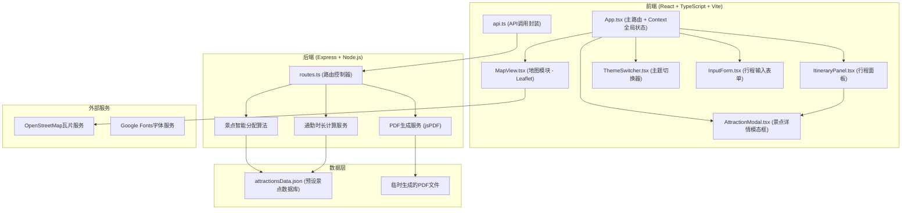
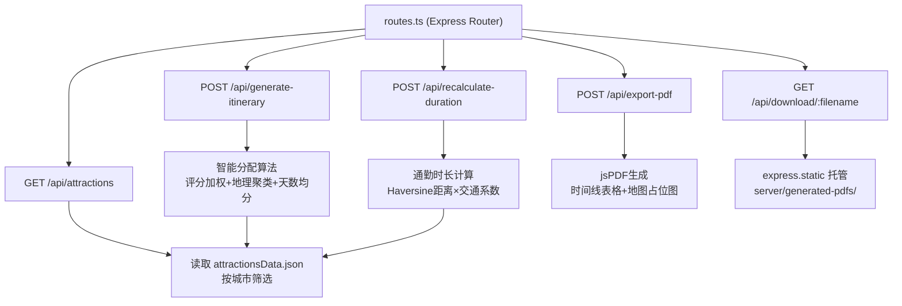
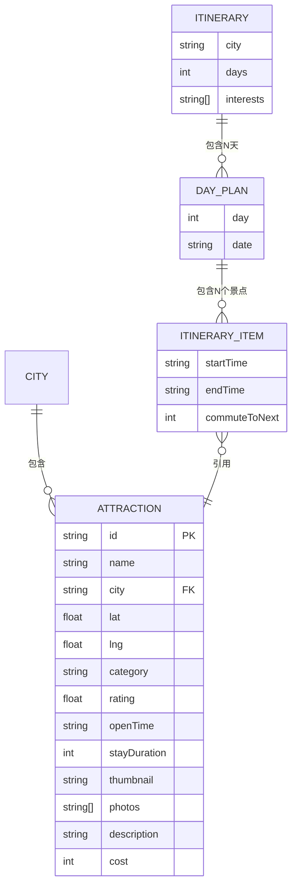

## 1. 架构设计



## 2. 技术描述
- **前端框架**：React@18 + TypeScript@5 严格模式
- **构建工具**：Vite@5 + @vitejs/plugin-react
- **路由**：react-router-dom@6
- **地图引擎**：leaflet@1.9 + react-leaflet@4
- **HTTP客户端**：axios@1
- **PDF处理**：jspdf@2（后端生成）
- **状态管理**：React Context + useReducer（不使用Zustand，按用户要求）
- **后端框架**：Express@4 + cors@2
- **数据库**：JSON文件模拟（attractionsData.json）
- **代码规范**：TypeScript strict: true，ES2020语法

## 3. 路由定义
| 路由 (前端) | 用途 |
|-------------|------|
| / | 主页面，包含输入表单、地图、行程面板 |

| 路由 (后端API) | 方法 | 用途 |
|----------------|------|------|
| /api/attractions | GET | 根据城市获取景点列表 ?city=xxx |
| /api/generate-itinerary | POST | 智能生成每日行程规划 |
| /api/recalculate-duration | POST | 调整景点后重新计算通勤时长 |
| /api/export-pdf | POST | 生成PDF行程单并返回下载URL |
| /api/download/:filename | GET | 下载生成的PDF文件 |

## 4. API定义

### 4.1 类型定义
```typescript
// 兴趣偏好类型
type InterestTag = 'nature' | 'culture' | 'food' | 'shopping';

// 景点数据结构
interface Attraction {
  id: string;
  name: string;
  city: string;
  lat: number;
  lng: number;
  category: InterestTag;
  rating: number;       // 1-5星级
  openTime: string;     // "08:00-18:00"
  stayDuration: number; // 推荐停留小时数 (1-3)
  thumbnail: string;    // 缩略图URL
  photos: string[];     // 3张详情照片
  description: string;  // AI生成的介绍文字
  cost: number;         // 预估花费(元)
}

// 每日行程项
interface DayItineraryItem {
  attractionId: string;
  attraction: Attraction;
  startTime: string;    // "09:00"
  endTime: string;      // "11:00"
  commuteToNext: number; // 到下一景点通勤分钟数
}

// 单日行程
interface DayItinerary {
  day: number;
  date: string;
  items: DayItineraryItem[];
  totalDuration: number;   // 当日总小时数
  totalCost: number;       // 当日总花费
}

// 完整行程
interface Itinerary {
  city: string;
  days: number;
  interests: InterestTag[];
  dayPlans: DayItinerary[];
  summary: {
    totalDuration: number;
    totalCost: number;
    totalAttractions: number;
  };
}

// 生成行程请求
interface GenerateItineraryRequest {
  city: string;
  days: number;
  interests: InterestTag[];
}

// 重新计算请求
interface RecalculateRequest {
  itinerary: Itinerary;
}

// PDF导出请求
interface ExportPdfRequest {
  itinerary: Itinerary;
}

// PDF导出响应
interface ExportPdfResponse {
  success: boolean;
  downloadUrl: string;
  filename: string;
}
```

### 4.2 请求/响应示例
**POST /api/generate-itinerary**
```json
// Request
{
  "city": "北京",
  "days": 3,
  "interests": ["culture", "food"]
}

// Response (200 OK)
{
  "city": "北京",
  "days": 3,
  "interests": ["culture", "food"],
  "dayPlans": [...],
  "summary": {
    "totalDuration": 24,
    "totalCost": 1280,
    "totalAttractions": 12
  }
}
```

## 5. 服务端架构



## 6. 数据模型

### 6.1 实体关系


### 6.2 attractionsData.json 初始数据结构
```json
{
  "北京": [
    {
      "id": "bj-gugong",
      "name": "故宫博物院",
      "city": "北京",
      "lat": 39.9163,
      "lng": 116.3972,
      "category": "culture",
      "rating": 4.9,
      "openTime": "08:30-17:00",
      "stayDuration": 3,
      "thumbnail": "...",
      "photos": ["...", "...", "..."],
      "description": "明清两代皇家宫殿，世界上现存规模最大的木质结构建筑群...",
      "cost": 60
    }
  ],
  "上海": [...],
  "成都": [...],
  "杭州": [...],
  "西安": [...]
}
```

## 7. 项目文件结构

```
auto108/
├── package.json          # 前端依赖 + 脚本
├── vite.config.ts        # Vite配置
├── tsconfig.json         # TS严格模式
├── index.html            # 入口HTML + Google Fonts
├── src/
│   ├── App.tsx           # 主应用 + Context + Router
│   ├── main.tsx          # 入口文件
│   ├── index.css         # 全局样式 + CSS变量主题
│   ├── types/
│   │   └── index.ts      # 共享类型定义
│   ├── context/
│   │   └── AppContext.tsx # React Context状态管理
│   ├── components/
│   │   ├── MapView.tsx        # 地图模块（用户指定）
│   │   ├── ItineraryPanel.tsx # 行程面板（用户指定）
│   │   ├── AttractionCard.tsx # 景点卡片子组件
│   │   ├── AttractionModal.tsx# 详情模态框
│   │   ├── InputForm.tsx      # 输入表单
│   │   ├── ThemeSwitcher.tsx  # 主题切换器
│   │   ├── SummaryBar.tsx     # 汇总条
│   │   └── ImageLoader.tsx    # 带加载动画的图片组件
│   └── services/
│       └── api.ts        # API封装（用户指定）
└── server/
    ├── package.json      # 后端依赖
    ├── routes.ts         # Express路由（用户指定）
    ├── attractionsData.json # 景点数据库（用户指定）
    ├── utils/
    │   ├── itineraryGenerator.ts # 行程生成算法
    │   ├── durationCalculator.ts # 通勤计算
    │   └── pdfGenerator.ts       # PDF生成
    └── generated-pdfs/   # 临时PDF输出目录
```
