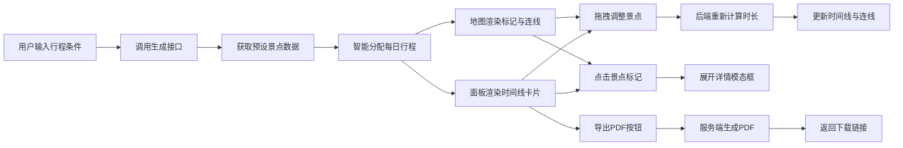

## 1. 产品概述
个性化旅行路线图生成工具，帮助自由行游客智能制定行程、直观预览路线、灵活调整安排，解决景点取舍困难和路线合理性难以判断的痛点。
- 核心目标：降低自由行行程规划门槛，提供可视化、可交互、可导出的一站式行程制定体验
- 目标用户：18-45岁自由行爱好者、城市短途旅行者、家庭出游规划者

## 2. 核心功能

### 2.1 用户角色
| 角色 | 注册方式 | 核心权限 |
|------|----------|----------|
| 普通用户 | 无需注册，直接使用 | 生成行程、调整路线、查看详情、导出PDF |

### 2.2 功能模块
1. **行程生成模块**：输入出发城市、天数、兴趣偏好，智能生成每日行程
2. **地图交互模块**：Leaflet中国地图，景点标记、路线连线、拖拽排序
3. **行程面板模块**：每日时间线卡片、主题切换、统计汇总
4. **景点详情模块**：缩略图加载动画、星级评分、展开模态框、照片轮播
5. **PDF导出模块**：服务端生成PDF行程单，包含时间线和地图缩略图
6. **主题系统模块**：三套预设配色方案（阳光海岸、森林秘境、都市霓虹），渐入切换动画

### 2.3 页面详情
| 页面名称 | 模块名称 | 功能描述 |
|----------|----------|----------|
| 主页面 | 输入表单区 | 出发城市选择、天数滑块（1-14天）、兴趣多选标签、生成按钮 |
| 主页面 | 地图视图区 | 65%宽度Leaflet地图，彩色圆形标记（16px，选中24px外发光），路线连接线，拖拽交互 |
| 主页面 | 行程面板区 | 35%宽度垂直时间线卡片，12px圆角，左侧主题色边框，8px间距，底部汇总条 |
| 主页面 | 景点详情模态框 | 缩略图占位动画、星级评分、开放时间、停留时长、AI介绍、3张轮播照片 |
| 主页面 | 主题切换器 | 三个主题按钮，0.5s渐入切换动画 |

## 3. 核心流程
用户在输入区填写出发城市、选择天数和兴趣偏好后点击生成，系统调用后端接口获取景点数据并智能分配每日行程，地图渲染标记与连线，右侧面板展示时间线卡片。用户可通过拖拽地图标记或面板卡片调整景点顺序，每次调整触发后端重新计算通勤时长，前端更新时间线与路线连线（0.4s ease-out动画）。点击景点卡片或标记可展开详情模态框查看AI介绍与照片轮播。最后点击导出PDF按钮，后端生成行程单并提供下载。

## 4. 用户界面设计

### 4.1 设计风格
- **主色调默认**：清新暖色 #ff7e67（珊瑚橙），辅色 #fadc6f（暖金黄）
- **三套主题**：
  - 阳光海岸：主色 #ff7e67，辅色 #fadc6f，背景渐变暖橙沙滩感
  - 森林秘境：主色 #2d7a4f，辅色 #9cc5a1，背景渐变森林绿
  - 都市霓虹：主色 #6c5ce7，辅色 #00cec9，背景渐变深紫蓝
- **卡片样式**：白色背景、12px圆角、左侧4px主题色竖边、柔和阴影（0 2px 12px rgba(0,0,0,0.08)）
- **按钮风格**：圆角8px、渐变填充、悬停微放大（scale 1.02）、0.2s过渡
- **字体方案**：Google Fonts - 标题 "Playfair Display" 衬线体，正文 "Noto Sans SC" 无衬线
- **图标风格**：Lucide React线性图标，尺寸统一18px，颜色随主题变化

### 4.2 页面设计概述
| 页面名称 | 模块名称 | UI元素 |
|----------|----------|----------|
| 主页面 | 输入表单区 | 顶部横向输入栏，城市输入框带自动补全，天数滑块带刻度显示，兴趣标签胶囊按钮，渐变主色生成按钮 |
| 主页面 | 地图视图区 | Leaflet OpenStreetMap底图，自定义彩色圆形标记（按兴趣分类着色），选中标记外发光+scale 1.5动画，贝塞尔曲线连接线带箭头动画 |
| 主页面 | 行程面板区 | 可滚动容器，Day 1/2/3... 标题带主题色圆点，每张卡片内照片缩略图（灰底#e0e0e0占位+旋转脉冲加载）、星级★、时间标签、拖拽手柄 |
| 主页面 | 景点详情模态框 | 全屏遮罩+backdrop-blur，顶部3图轮播带指示器，AI介绍文字打字机效果，底部信息标签云 |
| 主页面 | 底部汇总条 | 固定底部，半透明毛玻璃背景，总时长/总花费/景点数三个统计块，右侧渐变导出按钮 |
| 主页面 | 主题切换器 | 右上角悬浮圆形色板，三个色块预览，点击时整站CSS变量过渡0.5s |

### 4.3 响应式
- **桌面端（>1024px）**：左右两栏65%/35%布局
- **平板端（768px-1024px）**：左栏55%/右栏45%，卡片间距略缩
- **移动端（<768px）**：上下堆叠，地图50vh高度固定顶部，面板下方可滚动，汇总条改为浮于面板底部
- **触控优化**：景点标记点击区域扩大至40px，拖拽卡片长按200ms触发，滚动惯性流畅

### 4.4 动画与微交互
- 地图标记悬停：scale 1.2 + 外发光扩散涟漪
- 路线连线：虚线流动动画（stroke-dashoffset）
- 卡片拖拽：原位置幽灵占位，目标位置插入动画
- 模态框打开：backdrop 0.3s fade-in，内容scale 0.9→1 spring回弹
- 景点图片加载：灰底#e0e0e0 + 旋转脉冲圆（1.5s infinite ease-in-out）
- 跨侧高亮脉冲：悬停标记时对应卡片outline闪烁2次，反之亦然
