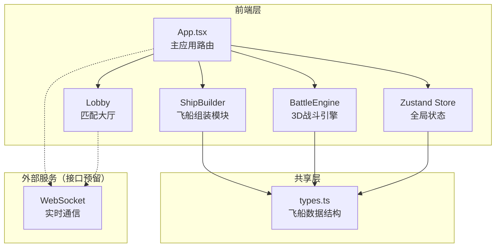
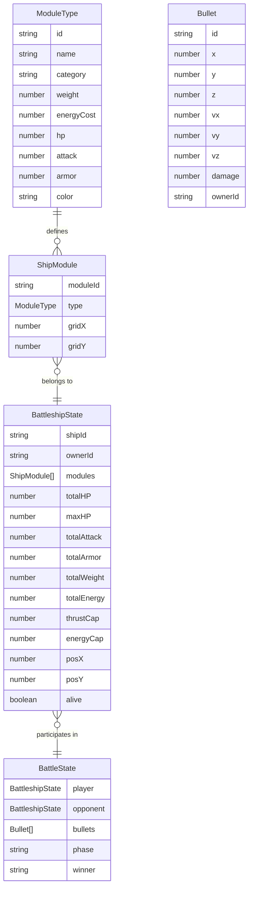

## 1. 架构设计



## 2. 技术说明
- **前端**：React@18 + TypeScript + Vite
- **初始化工具**：vite-init（react-ts模板）
- **3D渲染**：Three.js + @react-three/fiber + @react-three/drei
- **状态管理**：Zustand
- **样式方案**：CSS Modules + CSS变量（科幻主题）
- **后端**：无（WebSocket通信接口预留，当前为本地双人对战模拟）
- **数据库**：无

## 3. 路由定义
| 路由 | 用途 |
|------|------|
| / | 主页面，根据游戏阶段切换组装/大厅/战斗界面 |

## 4. API定义

无后端API，WebSocket接口预留：

```typescript
interface WSMessage {
  type: 'challenge' | 'accept' | 'reject' | 'battle_state' | 'player_list';
  payload: unknown;
}
```

## 5. 文件结构

```
├── package.json
├── vite.config.js
├── tsconfig.json
├── index.html
└── src/
    ├── types.ts           # 飞船模块与飞船实例数据类型
    ├── shipBuilder.ts     # 飞船组装模块（模块数据、拖拽逻辑、属性核算）
    ├── battleEngine.ts    # 3D战斗引擎（渲染、弹道、碰撞、伤害）
    ├── useGameStore.ts    # Zustand全局状态管理
    ├── App.tsx            # 主应用组件
    └── lobby.ts           # 匹配大厅组件
```

## 6. 数据模型

### 6.1 数据模型定义



### 6.2 核心数据定义

```typescript
interface ModuleType {
  id: string;
  name: string;
  category: 'cockpit' | 'engine' | 'weapon' | 'shield' | 'cargo';
  weight: number;
  energyCost: number;
  hp: number;
  attack: number;
  armor: number;
  color: string;
  icon: string;
}

interface ShipModule {
  moduleId: string;
  type: ModuleType;
  gridX: number;
  gridY: number;
}

interface BattleshipState {
  shipId: string;
  ownerId: string;
  modules: ShipModule[];
  totalHP: number;
  maxHP: number;
  totalAttack: number;
  totalArmor: number;
  totalWeight: number;
  totalEnergy: number;
  thrustCap: number;
  energyCap: number;
  posX: number;
  posY: number;
  alive: boolean;
}

interface Bullet {
  id: string;
  x: number;
  y: number;
  z: number;
  vx: number;
  vy: number;
  vz: number;
  damage: number;
  ownerId: string;
}

interface BattleState {
  player: BattleshipState;
  opponent: BattleshipState;
  bullets: Bullet[];
  phase: 'idle' | 'fighting' | 'ended';
  winner: string | null;
}
```
