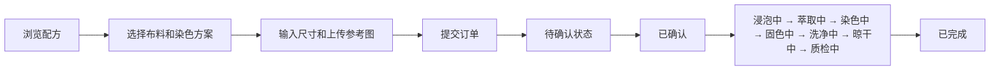

## 1. 产品概述

手工印染工坊管理系统是一款面向小型独立手工印染工坊的综合管理应用，帮助工坊主高效管理染料配方、布匹订单和天然原料库存，同时为客户提供在线定制服务入口。

- 核心目标：简化工坊日常运营流程，提升客户定制体验，优化原料库存管理
- 目标用户：小型独立手工印染工坊主、定制客户

## 2. 核心功能

### 2.1 用户角色

| 角色 | 注册方式 | 核心权限 |
|------|----------|----------|
| 工坊主 | 系统默认管理员 | 订单管理、配方管理、原料库存管理、查看补货建议、更新订单状态 |
| 客户 | 无需注册，直接使用 | 浏览染色配方、提交定制订单、查看订单状态 |

### 2.2 功能模块

1. **客户门户页面**：配方浏览、订单提交表单
2. **管理后台仪表盘**：订单列表看板、库存概览、补货建议列表
3. **订单管理系统**：订单CRUD、状态追踪、进度展示、拖拽更新状态
4. **配方管理系统**：染料配方创建、配方卡片网格展示、成本预估
5. **原料库存系统**：库存追踪、低库存警告、自动补货建议、采购单生成

### 2.3 页面详情

| 页面名称 | 模块名称 | 功能描述 |
|----------|----------|----------|
| 客户门户 | 配方浏览区 | 展示所有可用染色方案，包含颜色预览和配方名称 |
| 客户门户 | 订单提交表单 | 布料选择（棉布/亚麻/真丝/混纺）、染色方案选择、尺寸输入（宽30-200cm，长30-300cm）、参考图上传 |
| 管理仪表盘 | 订单看板 | 按状态分组的订单列表，支持拖拽更新状态，展示进度条和预计完成时间 |
| 管理仪表盘 | 库存概览 | 原料库存卡片网格，低库存红色警告徽章，显示当前库存和阈值 |
| 管理仪表盘 | 补货建议 | 原料补货建议列表，显示当前库存、建议补货量、生成采购单按钮 |

## 3. 核心流程

### 3.1 客户订单流程

客户在门户页面浏览染色配方 → 选择布料种类和染色方案 → 输入布料尺寸 → 上传参考图片 → 提交订单 → 系统生成唯一订单编号并设为"待确认"状态 → 工坊主在后台确认订单 → 订单状态随生产进度逐步更新 → 最终完成

### 3.2 库存与补货流程

系统实时监控原料库存 → 库存低于阈值10%时触发警告 → 根据未完成订单配方用量和月均消耗量计算补货量 → 展示补货建议 → 工坊主点击生成采购单

## 4. 用户界面设计

### 4.1 设计风格

- **主色调**：茜草红 #B22222、栀子黄 #FFD700
- **背景色**：米白 #F5F0E6
- **文字色**：深棕 #4A3728
- **辅助色**：浅蓝 #87CEEB、深蓝 #000080（进度条渐变）、浅黄 #FFFACD（拖拽高亮）
- **按钮样式**：圆角按钮，hover时背景透明度变化并轻微上移2px，transition 0.2s ease
- **字体**：选用优雅的衬线字体展示品牌感，配合清晰的无衬线正文字体
- **布局风格**：顶部导航栏 + 左侧侧边栏 + 主内容区三栏布局
- **整体气质**：温暖、手工感、自然有机，体现传统印染工艺的美学

### 4.2 页面设计概览

| 页面名称 | 模块名称 | UI元素 |
|----------|----------|--------|
| 客户门户 | 顶部导航 | Logo、页面切换（配方浏览/订单提交）、温暖色调渐变背景 |
| 客户门户 | 配方卡片 | 圆形颜色预览、配方名称、悬停放大效果 |
| 客户门户 | 表单区域 | 布料选择卡片、染色方案色卡选择器、滑动条尺寸输入、图片拖拽上传区 |
| 管理仪表盘 | 侧边栏 | 仪表盘/订单/配方/原料菜单图标、暖色调渐变背景 |
| 管理仪表盘 | 订单看板 | 按状态分列的卡片布局、进度条渐变动画、拖拽时卡片跟随移动、目标区域高亮 |
| 管理仪表盘 | 库存卡片 | 网格布局、右上角红色警告徽章、库存进度条 |
| 管理仪表盘 | 补货建议 | 列表布局、行动按钮、数量醒目显示 |

### 4.3 响应式设计

- **桌面端**（≥1280px）：三栏布局（导航+侧边栏+主内容）
- **平板端**（768px-1279px）：两栏布局，侧边栏折叠为汉堡菜单，点击展开（动画0.3s ease）
- **手机端**（<768px）：单栏全宽布局，导航栏简化，内容垂直排列

### 4.4 交互动效

- 输入框聚焦：边框从#D2B48C变为茜草红#B22222，transition 0.3s
- 按钮hover：背景透明度变化 + 上移2px，transition 0.2s ease
- 订单进度条：从浅蓝#87CEEB渐变到深蓝#000080，动画过渡0.5s ease
- 卡片拖拽：卡片跟随鼠标，目标区域背景变为#FFFACD，松手后0.3s cubic-bezier滑入
- 侧边栏展开/折叠：0.3s ease动画
