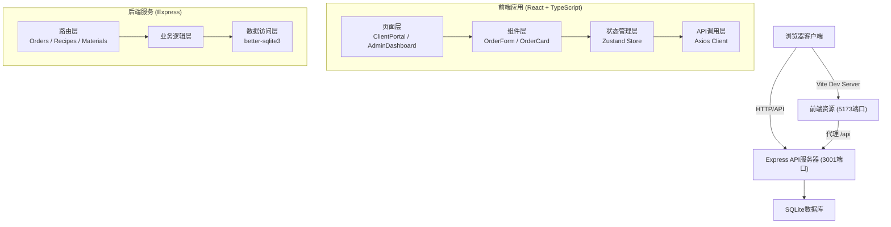
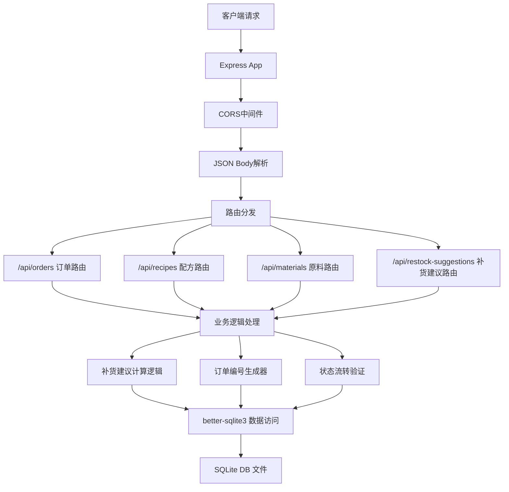
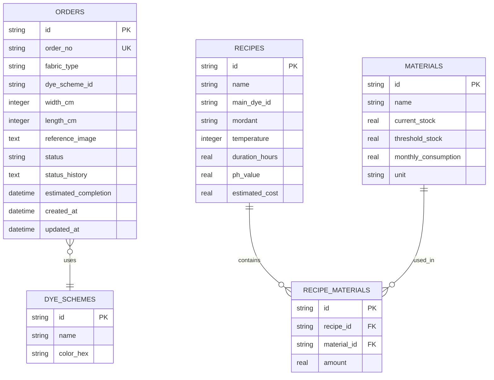

## 1. 架构设计



## 2. 技术描述

- **前端框架**：React 18 + TypeScript
- **构建工具**：Vite 5
- **状态管理**：Zustand
- **路由管理**：React Router DOM 6
- **HTTP客户端**：Axios
- **后端框架**：Express 4
- **数据库**：SQLite (better-sqlite3)
- **跨域处理**：cors
- **初始化方式**：使用 Vite 脚手架创建 react-ts 项目，手动添加后端 Express 服务

## 3. 路由定义

| 前端路由 | 页面组件 | 用途 |
|----------|----------|------|
| / | ClientPortal | 客户门户首页（配方浏览+订单提交） |
| /admin | AdminDashboard | 管理后台仪表盘 |

| 后端API路由 | HTTP方法 | 用途 |
|-------------|----------|------|
| /api/orders | GET | 获取订单列表（分页，每页10条） |
| /api/orders | POST | 创建新订单 |
| /api/orders/:id | GET | 获取单个订单详情 |
| /api/orders/:id | PUT | 更新订单（含状态更新） |
| /api/orders/:id | DELETE | 删除订单 |
| /api/recipes | GET | 获取所有染色配方 |
| /api/recipes | POST | 创建新配方 |
| /api/recipes/:id | PUT | 更新配方 |
| /api/materials | GET | 获取所有原料库存 |
| /api/materials/:id | PUT | 更新原料库存 |
| /api/restock-suggestions | GET | 获取补货建议列表 |

## 4. API 定义

### 4.1 类型定义

```typescript
// 订单状态枚举
enum OrderStatus {
  PENDING = '待确认',
  CONFIRMED = '已确认',
  SOAKING = '浸泡中',
  EXTRACTING = '萃取中',
  DYEING = '染色中',
  FIXING = '固色中',
  WASHING = '洗净中',
  DRYING = '晾干中',
  QC = '质检中',
  COMPLETED = '已完成'
}

// 布料类型
type FabricType = '棉布' | '亚麻' | '真丝' | '混纺';

// 染色方案
interface DyeScheme {
  id: string;
  name: string;
  colorHex: string;
}

// 订单
interface Order {
  id: string;
  orderNo: string;
  fabricType: FabricType;
  dyeSchemeId: string;
  widthCm: number;
  lengthCm: number;
  referenceImage?: string;
  status: OrderStatus;
  statusHistory: { status: OrderStatus; timestamp: string }[];
  estimatedCompletion: string;
  createdAt: string;
  updatedAt: string;
}

// 染料配方
interface Recipe {
  id: string;
  name: string;
  mainDyeId: string;
  mordant: string;
  temperature: number;
  durationHours: number;
  phValue: number;
  estimatedCost: number;
  materials: { materialId: string; amount: number }[];
}

// 原料
interface Material {
  id: string;
  name: string;
  currentStock: number;
  thresholdStock: number;
  monthlyConsumption: number;
  unit: string;
}

// 补货建议
interface RestockSuggestion {
  materialId: string;
  materialName: string;
  currentStock: number;
  suggestedAmount: number;
  unit: string;
}
```

### 4.2 请求/响应示例

**创建订单请求**
```json
POST /api/orders
{
  "fabricType": "棉布",
  "dyeSchemeId": "madder-red",
  "widthCm": 150,
  "lengthCm": 200,
  "referenceImage": "base64或图片URL"
}
```

**创建订单响应**
```json
{
  "id": "ord_123",
  "orderNo": "DY20260612001",
  "status": "待确认",
  "createdAt": "2026-06-12T10:00:00Z"
}
```

## 5. 服务器架构图



## 6. 数据模型

### 6.1 ER图



### 6.2 DDL 语句

```sql
-- 染色方案表
CREATE TABLE IF NOT EXISTS dye_schemes (
  id TEXT PRIMARY KEY,
  name TEXT NOT NULL,
  color_hex TEXT NOT NULL
);

-- 原料表
CREATE TABLE IF NOT EXISTS materials (
  id TEXT PRIMARY KEY,
  name TEXT NOT NULL,
  current_stock REAL NOT NULL DEFAULT 0,
  threshold_stock REAL NOT NULL DEFAULT 10,
  monthly_consumption REAL NOT NULL DEFAULT 0,
  unit TEXT NOT NULL DEFAULT 'g'
);

-- 配方表
CREATE TABLE IF NOT EXISTS recipes (
  id TEXT PRIMARY KEY,
  name TEXT NOT NULL,
  main_dye_id TEXT,
  mordant TEXT,
  temperature INTEGER NOT NULL DEFAULT 60,
  duration_hours REAL NOT NULL DEFAULT 2,
  ph_value REAL NOT NULL DEFAULT 7,
  estimated_cost REAL NOT NULL DEFAULT 0,
  FOREIGN KEY (main_dye_id) REFERENCES materials(id)
);

-- 配方-原料关联表
CREATE TABLE IF NOT EXISTS recipe_materials (
  id TEXT PRIMARY KEY,
  recipe_id TEXT NOT NULL,
  material_id TEXT NOT NULL,
  amount REAL NOT NULL,
  FOREIGN KEY (recipe_id) REFERENCES recipes(id),
  FOREIGN KEY (material_id) REFERENCES materials(id)
);

-- 订单表
CREATE TABLE IF NOT EXISTS orders (
  id TEXT PRIMARY KEY,
  order_no TEXT UNIQUE NOT NULL,
  fabric_type TEXT NOT NULL,
  dye_scheme_id TEXT NOT NULL,
  width_cm INTEGER NOT NULL,
  length_cm INTEGER NOT NULL,
  reference_image TEXT,
  status TEXT NOT NULL DEFAULT '待确认',
  status_history TEXT NOT NULL DEFAULT '[]',
  estimated_completion TEXT,
  created_at TEXT NOT NULL,
  updated_at TEXT NOT NULL,
  FOREIGN KEY (dye_scheme_id) REFERENCES dye_schemes(id)
);

-- 创建索引
CREATE INDEX IF NOT EXISTS idx_orders_status ON orders(status);
CREATE INDEX IF NOT EXISTS idx_orders_created_at ON orders(created_at);
```

### 6.3 初始化示例数据

```sql
-- 染色方案
INSERT INTO dye_schemes (id, name, color_hex) VALUES
('madder-red', '茜草红', '#B22222'),
('gardenia-yellow', '栀子黄', '#FFD700'),
('sappanwood-purple', '苏木紫', '#8A2BE2'),
('indigo-blue', '蓝草蓝', '#4169E1');

-- 原料
INSERT INTO materials (id, name, current_stock, threshold_stock, monthly_consumption, unit) VALUES
('madder-root', '茜草根', 500, 100, 200, 'g'),
('gardenia-fruit', '栀子果', 300, 80, 150, 'g'),
('sappanwood', '苏木', 200, 60, 100, 'g'),
('indigo-leaf', '蓝草叶', 400, 100, 180, 'g'),
('alum', '明矾（媒染剂）', 150, 50, 80, 'g'),
('iron-mordant', '铁媒染剂', 80, 30, 40, 'g');

-- 配方
INSERT INTO recipes (id, name, main_dye_id, mordant, temperature, duration_hours, ph_value, estimated_cost) VALUES
('recipe-madder-red', '经典茜草红染', 'madder-root', 'alum', 60, 2.5, 6.5, 45.0),
('recipe-gardenia-yellow', '淡雅栀子黄染', 'gardenia-fruit', 'alum', 50, 2, 6, 35.0),
('recipe-sappan-purple', '深郁苏木紫染', 'sappanwood', 'iron-mordant', 70, 3, 5.5, 55.0),
('recipe-indigo-blue', '传统蓝草蓝染', 'indigo-leaf', 'alum', 45, 4, 8, 50.0);
```
