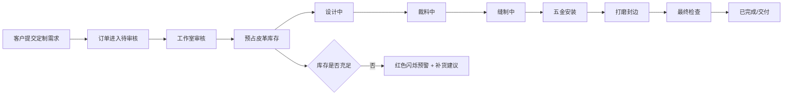

## 1. 产品概述
本产品是面向小型独立手工皮具工作室的全流程管理应用，解决定制皮具从接单到交付的全流程跟踪问题，以及客户偏好记录因手工操作容易丢失的痛点。
- 主要用户：皮具工作室主理人、定制客户
- 核心价值：数字化订单流程管理、智能库存预警、客户偏好自动记忆

## 2. 核心功能

### 2.1 用户角色
| 角色 | 注册方式 | 核心权限 |
|------|----------|----------|
| 客户 | 无需注册，通过身份标识访问 | 提交定制订单、查看订单进度、订单历史 |
| 工作室 | 后台管理员 | 审核订单、更新状态、管理库存、查看客户偏好 |

### 2.2 功能模块
1. **客户订单页面**：订单列表展示、提交新订单表单、订单详情进度查看
2. **工作室仪表盘**：订单管理、库存管理、客户偏好展示、订单统计图表

### 2.3 页面详情
| 页面名称 | 模块名称 | 功能描述 |
|----------|----------|----------|
| 客户订单 | 订单列表 | 卡片展示所有订单，显示皮具类型图标、客户头像、状态徽章 |
| 客户订单 | 新订单表单 | 选择皮具类型、上传参考图、填写刻字/五金/交付日期 |
| 客户订单 | 订单详情 | 进度条展示制作流程，状态时间戳记录 |
| 工作室仪表盘 | 订单统计 | Canvas环形图展示各状态订单数量 |
| 工作室仪表盘 | 订单管理 | 审核列表、状态切换（8个阶段） |
| 工作室仪表盘 | 库存管理 | 皮革库存CRUD、低库存预警闪烁、补货建议 |
| 工作室仪表盘 | 客户偏好 | 自动记录客户历史偏好、再次下单时自动预填 |

## 3. 核心流程
客户选择皮具类型并填写定制需求→提交订单进入待审核→工作室审核通过→状态依次流转（设计中→裁料中→缝制中→五金安装→打磨封边→最终检查→已完成）→客户实时查看进度。每次接单自动预占皮革库存，库存不足时触发预警和补货建议。

## 4. 用户界面设计
### 4.1 设计风格
- 主背景色：#F5F0E1（暖米色木纹风格）
- 侧边栏/导航：#5D4037（深棕色）配 #D4A574（金色文字）
- 进度条渐变：#D2B48C → #8B4513
- 卡片风格：圆角、悬浮上浮3px + 阴影动画（0.5s ease）
- 头像：直径40px圆形，基于姓名哈希生成渐变色
- 状态徽章配色：待审核#FFB74D、设计中#64B5F6、裁料中#81C784、缝制中#4DB6AC、五金安装#BA68C8、打磨封边#FF8A65、最终检查#A1887F、已完成#9E9E9E

### 4.2 页面设计概述
| 页面名称 | 模块名称 | UI元素 |
|----------|----------|--------|
| 客户订单 | 订单列表 | 网格卡片布局、hover上浮动画、状态徽章 |
| 客户订单 | 订单详情 | 渐变进度条（0.5s ease-in-out填充动画）、时间轴 |
| 客户订单 | 偏好卡片 | 右侧浮动、#FFF8E7背景、#D2B48C边框、从右滑入0.3s ease-out |
| 仪表盘 | 环形图 | Canvas绘制、数据更新0.6s动画 |
| 仪表盘 | 库存列表 | 低库存红色背景闪烁（1s间隔） |

### 4.3 响应式设计
- 桌面端：多列卡片网格、侧边栏展开
- 移动端（<768px）：汉堡菜单、单列卡片（宽度100%、上下间距12px）
- 性能要求：订单列表滚动帧率≥50fps
