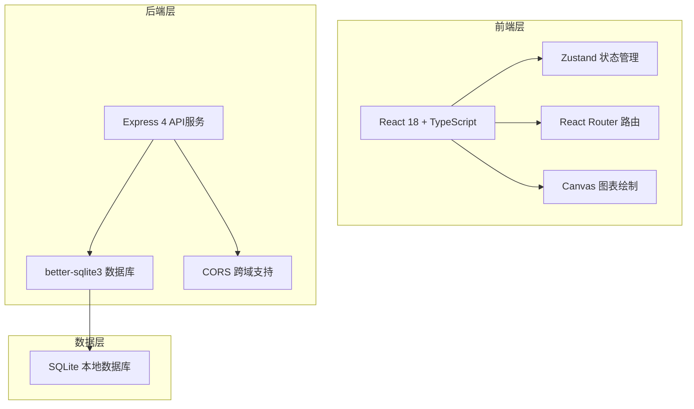
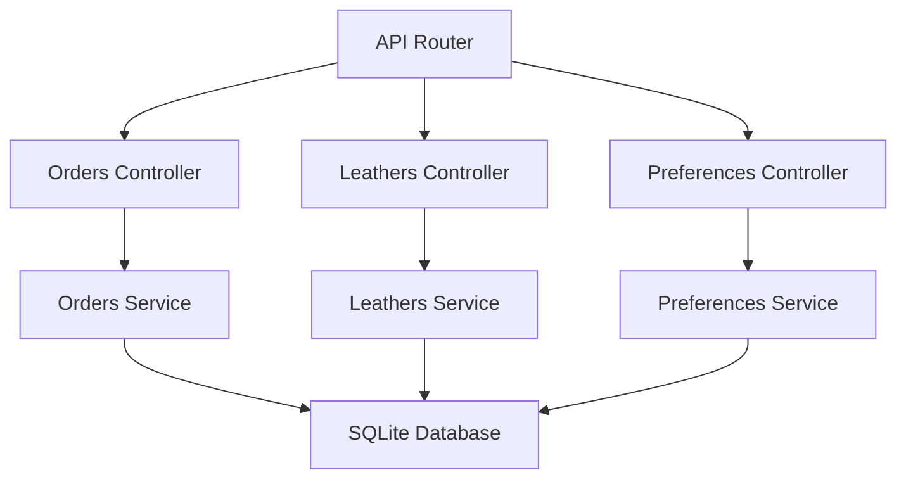
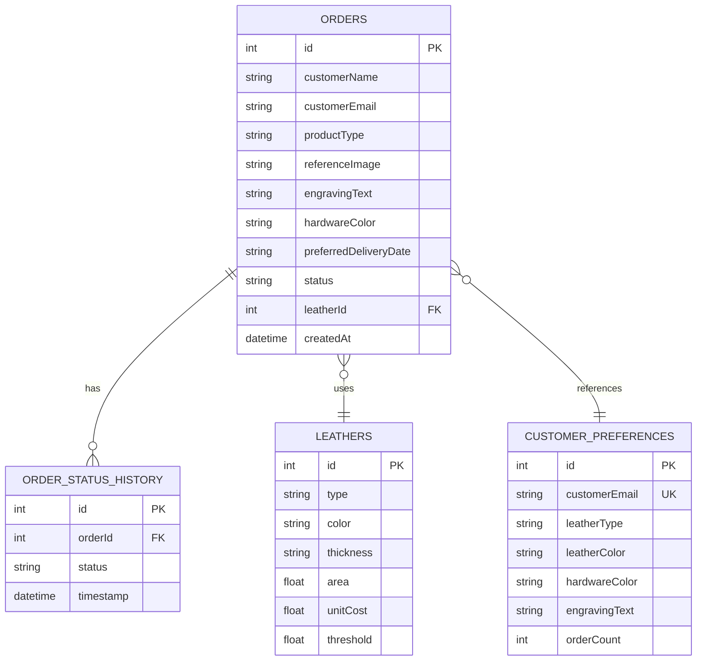

## 1. 架构设计



## 2. 技术说明
- 前端：React 18 + TypeScript 5 + Vite 5 + React Router 6 + Zustand 4 + Axios
- 后端：Express 4 + better-sqlite3 + CORS
- 构建工具：Vite 5 + @vitejs/plugin-react
- 启动方式：`npm install && npm run dev`（前后端同时启动）

## 3. 路由定义
| 路由 | 用途 |
|------|------|
| / | 客户订单页面（订单列表 + 新订单表单） |
| /dashboard | 工作室仪表盘（订单/库存/客户偏好管理） |
| /orders/:id | 订单详情页（进度查看） |

## 4. API 定义
```typescript
// 订单类型
interface Order {
  id: number;
  customerName: string;
  customerEmail: string;
  productType: 'wallet' | 'cardholder' | 'keychain' | 'bracelet' | 'belt';
  referenceImage?: string;
  engravingText: string;
  hardwareColor: 'bronze' | 'silver' | 'black';
  preferredDeliveryDate: string;
  status: OrderStatus;
  statusHistory: { status: OrderStatus; timestamp: string }[];
  leatherId?: number;
  createdAt: string;
}

type OrderStatus = 'pending' | 'designing' | 'cutting' | 'sewing' | 'hardware' | 'polishing' | 'finalcheck' | 'completed';

// 皮革库存类型
interface Leather {
  id: number;
  type: 'cowhide' | 'sheepskin' | 'veg-tanned' | 'croc-embossed';
  color: 'brown' | 'black' | 'navy' | 'red' | 'green';
  thickness: '1.0mm' | '1.2mm' | '1.5mm' | '2.0mm';
  area: number; // 平方英尺
  unitCost: number;
  threshold: number; // 预警阈值，默认5
}

// 客户偏好类型
interface CustomerPreference {
  customerEmail: string;
  leatherType?: Leather['type'];
  leatherColor?: Leather['color'];
  hardwareColor?: Order['hardwareColor'];
  engravingText?: string;
  orderCount: number;
}
```

**API 端点：**
- GET /api/orders - 获取所有订单
- POST /api/orders - 创建新订单
- GET /api/orders/:id - 获取订单详情
- PUT /api/orders/:id/status - 更新订单状态
- GET /api/leathers - 获取皮革库存
- POST /api/leathers - 添加皮革
- PUT /api/leathers/:id - 更新皮革
- GET /api/preferences/:email - 获取客户偏好

## 5. 服务端架构图



## 6. 数据模型

### 6.1 ER图



### 6.2 DDL

```sql
CREATE TABLE IF NOT EXISTS leathers (
  id INTEGER PRIMARY KEY AUTOINCREMENT,
  type TEXT NOT NULL,
  color TEXT NOT NULL,
  thickness TEXT NOT NULL,
  area REAL NOT NULL DEFAULT 0,
  unitCost REAL NOT NULL DEFAULT 0,
  threshold REAL NOT NULL DEFAULT 5
);

CREATE TABLE IF NOT EXISTS orders (
  id INTEGER PRIMARY KEY AUTOINCREMENT,
  customerName TEXT NOT NULL,
  customerEmail TEXT NOT NULL,
  productType TEXT NOT NULL,
  referenceImage TEXT,
  engravingText TEXT,
  hardwareColor TEXT NOT NULL,
  preferredDeliveryDate TEXT,
  status TEXT NOT NULL DEFAULT 'pending',
  leatherId INTEGER,
  createdAt DATETIME DEFAULT CURRENT_TIMESTAMP,
  FOREIGN KEY (leatherId) REFERENCES leathers(id)
);

CREATE TABLE IF NOT EXISTS order_status_history (
  id INTEGER PRIMARY KEY AUTOINCREMENT,
  orderId INTEGER NOT NULL,
  status TEXT NOT NULL,
  timestamp DATETIME DEFAULT CURRENT_TIMESTAMP,
  FOREIGN KEY (orderId) REFERENCES orders(id)
);

CREATE TABLE IF NOT EXISTS customer_preferences (
  id INTEGER PRIMARY KEY AUTOINCREMENT,
  customerEmail TEXT UNIQUE NOT NULL,
  leatherType TEXT,
  leatherColor TEXT,
  hardwareColor TEXT,
  engravingText TEXT,
  orderCount INTEGER NOT NULL DEFAULT 0
);

-- 初始化库存数据
INSERT INTO leathers (type, color, thickness, area, unitCost, threshold) VALUES
('cowhide', 'brown', '1.5mm', 20, 25, 5),
('cowhide', 'black', '1.5mm', 15, 25, 5),
('veg-tanned', 'brown', '2.0mm', 8, 35, 5),
('sheepskin', 'red', '1.0mm', 3, 40, 5),
('croc-embossed', 'navy', '1.2mm', 4, 50, 5);
```

## 7. 文件结构
```
auto14/
├── package.json
├── index.html
├── vite.config.ts
├── tsconfig.json
├── server/
│   └── index.js
└── src/
    ├── App.tsx
    ├── pages/
    │   ├── CustomerOrders.tsx
    │   └── VendorDashboard.tsx
    └── store/
        └── useStore.ts
```
