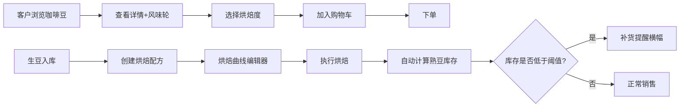

## 1. 产品概述

本项目是面向小型独立手工咖啡烘焙工作室的一体化管理系统，整合客户在线选购、烘焙配方管理与生豆库存管理三大核心功能，解决工作室手工记账、库存不清、配方难追溯的痛点。

- 面向两类用户：终端咖啡消费者（浏览选购）和工作室运营者（后台管理）
- 核心价值：实现从生豆入库→配方烘焙→熟豆销售的全链路数字化管理，自动计算库存并预警补货

## 2. 核心功能

### 2.1 用户角色

| 角色 | 注册方式 | 核心权限 |
|------|----------|----------|
| 客户 | 无需注册（浏览模式） | 浏览咖啡豆、查看详情、选择烘焙度、加入购物车 |
| 工作室管理员 | 后台登录 | 管理生豆库存、创建编辑烘焙配方、查看订单、补货提醒 |

### 2.2 功能模块

1. **客户浏览模块**：咖啡豆列表卡片展示、风味轮详情页、烘焙度选择、购物车侧边栏
2. **烘焙配方管理模块**：配方卡片网格、可视化烘焙曲线编辑器、控制点拖拽、参数实时显示
3. **生豆库存管理模块**：批次表格、多维度排序、低库存高亮、补货提醒横幅

### 2.3 页面详情

| 页面名称 | 模块名称 | 功能描述 |
|----------|----------|----------|
| 咖啡豆列表页 | 咖啡卡片展示 | 280px宽卡片，#FFF8E1渐变背景，悬停上浮4px，展示产地/处理法/风味 |
| 咖啡详情页 | 风味轮 + 烘焙度选择 | Canvas绘制六边形风味轮（酸度/苦度/甜度/醇厚度/干净度/余韵），中心向外渐变填充，烘焙度单选按钮，加入购物车 |
| 购物车侧边栏 | 购物车操作 | 右侧滑入（0.3s cubic-bezier），修改数量/删除商品，总价计算 |
| 配方列表页 | 配方卡片网格 | 展示配方名称、豆种来源、关键参数摘要 |
| 配方编辑页 | 烘焙曲线编辑器 | 20分钟×220℃坐标系，贝塞尔曲线平滑连接，12px控制点拖拽（激活时#FF6F00），实时显示入豆温/一爆时间/出豆温 |
| 生豆库存页 | 库存表格 | 批次列表，支持产地/处理法/入库日期排序，低于阈值行背景#FFEBEE，顶部补货横幅 |

## 3. 核心流程

### 客户选购流程
客户浏览咖啡豆列表 → 点击卡片查看详情（风味轮、烘焙信息）→ 选择浅/中/深烘焙度 → 加入购物车 → 侧边栏查看并调整 → 下单

### 工作室管理流程
生豆批次入库 → 创建烘焙配方（拖拽编辑温度曲线）→ 执行烘焙 → 系统按出豆率自动计算熟豆库存 → 库存不足时触发补货提醒

## 4. 界面设计

### 4.1 设计风格
- **主色调**：#6D4C41（深咖啡）
- **辅色调**：#A1887F（浅咖啡）
- **强调色**：#FF6F00（活力橙）
- **背景色**：#FFF8E1（米白咖啡）交替 #FFFFFF
- **按钮风格**：圆角6px，padding 10px 24px，点击缩放0.97
- **字体**：Noto Sans SC，简洁现代
- **布局**：左侧240px深棕侧边栏（#4E342E，悬停#8D6E63高亮）+ 右侧主内容区
- **图标**：Feather图标集，统一线性风格

### 4.2 页面设计概览

| 页面名称 | 模块名称 | UI元素 |
|----------|----------|----------|
| 咖啡豆列表页 | 卡片网格 | 280px宽卡片，12px圆角，顶部产地色块，悬停translateY(-4px) + 阴影加深，0.2s ease-out |
| 咖啡详情页 | 风味轮Canvas | 六边形雷达图，6项指标，色彩从中心向外径向渐变 |
| 配方编辑页 | 曲线编辑器 | SVG/Canvas坐标系，贝塞尔曲线，控制点拖拽50ms内响应 |
| 生豆库存页 | 数据表格 | 斑马纹背景，低库存红底高亮，顶部滑入式横幅 |

### 4.3 响应式设计
- **桌面优先**设计，768px以下断点适配
- 表格在移动端支持横向滚动
- 侧边栏可折叠
- 触控设备优化按钮点击区域

### 4.4 动效规范
- 页面切换：0.2s fade-in 过渡
- 购物车侧边栏：0.3s cubic-bezier(0.4, 0, 0.2, 1) 滑入
- 卡片悬停：transform: translateY(-4px)，box-shadow 加深
- 按钮点击：transform: scale(0.97)
- 补货横幅：从顶部滑入动画

## 5. 性能指标

| 指标 | 阈值 |
|------|------|
| 页面数据加载（20条/页） | ≤ 500ms |
| 烘焙曲线控制点拖拽响应 | ≤ 50ms |
| 首屏渲染 | ≤ 1.5s |
| 购物车操作响应 | ≤ 100ms |
