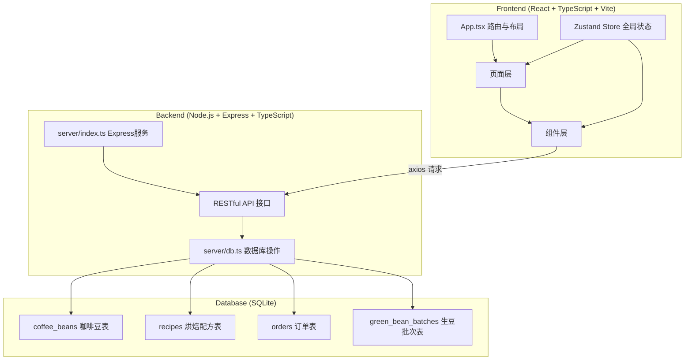
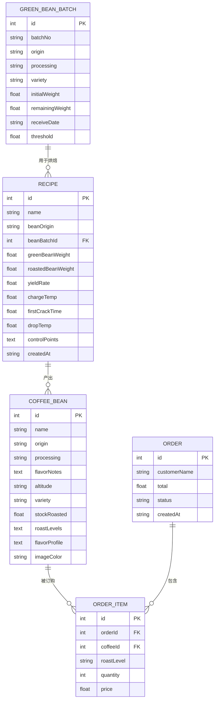

## 1. 架构设计



## 2. 技术栈说明

- **前端框架**：React 18 + TypeScript
- **构建工具**：Vite 5
- **路由**：react-router-dom 6
- **状态管理**：zustand 4
- **HTTP客户端**：axios 1
- **图标**：feather-icons / react-feather
- **后端**：Express 4 + TypeScript
- **数据库**：SQLite + better-sqlite3
- **CORS**：cors 中间件
- **开发脚本**：npm install && npm run dev（同时启动前后端）

## 3. 路由定义

| 路由 | 用途 |
|------|------|
| / | 咖啡豆列表页（客户浏览） |
| /coffee/:id | 咖啡详情页（风味轮+烘焙度选择） |
| /admin/recipes | 烘焙配方列表页 |
| /admin/recipes/new | 新建烘焙配方 |
| /admin/recipes/:id/edit | 编辑烘焙配方 |
| /admin/inventory | 生豆库存管理页 |

## 4. API 接口定义

### 4.1 TypeScript 类型定义

```typescript
// 咖啡豆
interface CoffeeBean {
  id: number;
  name: string;
  origin: string;
  processing: string;
  flavorNotes: string[];
  altitude: string;
  variety: string;
  stockRoasted: number;
  roastLevels: ('light' | 'medium' | 'dark')[];
  flavorProfile: {
    acidity: number;
    bitterness: number;
    sweetness: number;
    body: number;
    cleanliness: number;
    aftertaste: number;
  };
  imageColor: string;
}

// 烘焙配方控制点
interface ControlPoint {
  time: number;
  temperature: number;
}

// 烘焙配方
interface Recipe {
  id: number;
  name: string;
  beanOrigin: string;
  beanBatchId: number;
  greenBeanWeight: number;
  roastedBeanWeight: number;
  yieldRate: number;
  chargeTemp: number;
  firstCrackTime: number;
  dropTemp: number;
  controlPoints: ControlPoint[];
  createdAt: string;
}

// 生豆批次
interface GreenBeanBatch {
  id: number;
  batchNo: string;
  origin: string;
  processing: string;
  variety: string;
  initialWeight: number;
  remainingWeight: number;
  receiveDate: string;
  threshold: number;
}

// 购物车项
interface CartItem {
  coffeeId: number;
  coffeeName: string;
  roastLevel: 'light' | 'medium' | 'dark';
  quantity: number;
  price: number;
}

// 订单
interface Order {
  id: number;
  items: CartItem[];
  total: number;
  customerName: string;
  status: 'pending' | 'roasting' | 'shipped' | 'completed';
  createdAt: string;
}
```

### 4.2 API 接口清单

| 方法 | 路径 | 描述 |
|------|------|------|
| GET | /api/coffee-beans | 获取咖啡豆列表（分页，20条/页） |
| GET | /api/coffee-beans/:id | 获取单款咖啡豆详情 |
| GET | /api/recipes | 获取烘焙配方列表 |
| GET | /api/recipes/:id | 获取单条配方详情 |
| POST | /api/recipes | 创建烘焙配方 |
| PUT | /api/recipes/:id | 更新烘焙配方 |
| DELETE | /api/recipes/:id | 删除烘焙配方 |
| GET | /api/green-bean-batches | 获取生豆批次列表 |
| POST | /api/green-bean-batches | 新增生豆批次 |
| PUT | /api/green-bean-batches/:id | 更新生豆批次 |
| GET | /api/orders | 获取订单列表 |
| POST | /api/orders | 创建订单 |

## 5. 服务端架构图


## 6. 数据模型

### 6.1 ER 图



### 6.2 DDL 建表语句

```sql
-- 生豆批次表
CREATE TABLE IF NOT EXISTS green_bean_batches (
  id INTEGER PRIMARY KEY AUTOINCREMENT,
  batchNo TEXT NOT NULL UNIQUE,
  origin TEXT NOT NULL,
  processing TEXT NOT NULL,
  variety TEXT NOT NULL,
  initialWeight REAL NOT NULL,
  remainingWeight REAL NOT NULL,
  receiveDate TEXT NOT NULL,
  threshold REAL NOT NULL DEFAULT 10
);

-- 烘焙配方表
CREATE TABLE IF NOT EXISTS recipes (
  id INTEGER PRIMARY KEY AUTOINCREMENT,
  name TEXT NOT NULL,
  beanOrigin TEXT NOT NULL,
  beanBatchId INTEGER,
  greenBeanWeight REAL NOT NULL,
  roastedBeanWeight REAL NOT NULL,
  yieldRate REAL NOT NULL,
  chargeTemp REAL NOT NULL,
  firstCrackTime REAL NOT NULL,
  dropTemp REAL NOT NULL,
  controlPoints TEXT NOT NULL,
  createdAt TEXT DEFAULT CURRENT_TIMESTAMP,
  FOREIGN KEY (beanBatchId) REFERENCES green_bean_batches(id)
);

-- 咖啡豆表（熟豆可售）
CREATE TABLE IF NOT EXISTS coffee_beans (
  id INTEGER PRIMARY KEY AUTOINCREMENT,
  name TEXT NOT NULL,
  origin TEXT NOT NULL,
  processing TEXT NOT NULL,
  flavorNotes TEXT NOT NULL,
  altitude TEXT,
  variety TEXT,
  stockRoasted REAL DEFAULT 0,
  roastLevels TEXT NOT NULL,
  flavorProfile TEXT NOT NULL,
  imageColor TEXT NOT NULL
);

-- 订单表
CREATE TABLE IF NOT EXISTS orders (
  id INTEGER PRIMARY KEY AUTOINCREMENT,
  customerName TEXT,
  total REAL NOT NULL,
  status TEXT DEFAULT 'pending',
  createdAt TEXT DEFAULT CURRENT_TIMESTAMP
);

-- 订单项表
CREATE TABLE IF NOT EXISTS order_items (
  id INTEGER PRIMARY KEY AUTOINCREMENT,
  orderId INTEGER NOT NULL,
  coffeeId INTEGER NOT NULL,
  roastLevel TEXT NOT NULL,
  quantity INTEGER NOT NULL,
  price REAL NOT NULL,
  FOREIGN KEY (orderId) REFERENCES orders(id),
  FOREIGN KEY (coffeeId) REFERENCES coffee_beans(id)
);

-- 初始化测试数据
INSERT OR IGNORE INTO green_bean_batches (batchNo, origin, processing, variety, initialWeight, remainingWeight, receiveDate, threshold) VALUES
('GB-2026-001', '埃塞俄比亚 耶加雪菲', '水洗', 'Heirloom', 50, 45, '2026-05-01', 10),
('GB-2026-002', '哥伦比亚 慧兰', '水洗', 'Castillo', 60, 8, '2026-05-10', 10),
('GB-2026-003', '肯尼亚 AA', '水洗', 'SL28/SL34', 40, 35, '2026-05-15', 10),
('GB-2026-004', '危地马拉 安提瓜', '水洗', 'Bourbon', 45, 42, '2026-05-20', 10);

INSERT OR IGNORE INTO coffee_beans (name, origin, processing, flavorNotes, altitude, variety, stockRoasted, roastLevels, flavorProfile, imageColor) VALUES
('耶加雪菲 科契尔', '埃塞俄比亚', '水洗', '["柑橘","茉莉","蜂蜜","红茶"]', '1950-2100m', 'Heirloom', 15, '["light","medium"]', '{"acidity":8,"bitterness":3,"sweetness":7,"body":5,"cleanliness":9,"aftertaste":7}', '#87CEEB'),
('哥伦比亚 慧兰', '哥伦比亚', '水洗', '["焦糖","坚果","巧克力","柑橘"]', '1700-1900m', 'Castillo', 5, '["medium","dark"]', '{"acidity":5,"bitterness":5,"sweetness":7,"body":7,"cleanliness":8,"aftertaste":6}', '#DEB887'),
('肯尼亚 AA Top', '肯尼亚', '水洗', '["黑醋栗","番茄","百香果","明亮酸质"]', '1700-1900m', 'SL28/SL34', 12, '["light","medium"]', '{"acidity":9,"bitterness":4,"sweetness":6,"body":6,"cleanliness":8,"aftertaste":8}', '#CD5C5C'),
('危地马拉 安提瓜', '危地马拉', '水洗', '["可可","焦糖","橙花","温和"]', '1500-1700m', 'Bourbon', 20, '["medium","dark"]', '{"acidity":6,"bitterness":6,"sweetness":7,"body":8,"cleanliness":7,"aftertaste":7}', '#6B8E23'),
('曼特宁 G1', '印度尼西亚', '湿刨', '["草本","黑巧克力","木质","低酸"]', '1200-1500m', 'Typica/Bourbon', 0, '["medium","dark"]', '{"acidity":2,"bitterness":7,"sweetness":5,"body":9,"cleanliness":6,"aftertaste":6}', '#2F4F4F');
```

## 7. 项目文件结构

```
auto15/
├── package.json              # 前后端依赖与启动脚本
├── index.html                # 入口HTML
├── vite.config.js            # Vite配置（API代理）
├── tsconfig.json             # TypeScript配置
├── server/
│   ├── index.ts              # Express服务器，路由定义
│   └── db.ts                 # SQLite连接与初始化
└── src/
    ├── App.tsx               # 根组件，路由与全局布局
    ├── store.ts              # Zustand全局状态
    ├── main.tsx              # 入口文件
    ├── index.css             # 全局样式
    ├── components/           # 可复用组件
    │   ├── Sidebar.tsx
    │   ├── CoffeeCard.tsx
    │   ├── FlavorWheel.tsx
    │   ├── CartSidebar.tsx
    │   ├── RoastCurveEditor.tsx
    │   ├── RecipeCard.tsx
    │   └── InventoryTable.tsx
    ├── pages/                # 页面组件
    │   ├── CoffeeList.tsx
    │   ├── CoffeeDetail.tsx
    │   ├── RecipeList.tsx
    │   ├── RecipeEditor.tsx
    │   └── Inventory.tsx
    └── types/
        └── index.ts          # 类型定义
```

## 8. 性能优化策略

1. **前端状态管理**：使用 Zustand 细粒度订阅，避免不必要的重渲染
2. **烘焙曲线渲染**：使用 Canvas/SVG 离屏渲染，控制点拖拽使用 requestAnimationFrame 确保 60fps
3. **分页加载**：后端 LIMIT/OFFSET 分页，每页20条
4. **数据缓存**：使用 React Query 或 Zustand 内置缓存，避免重复请求
5. **懒加载**：路由级代码分割，非首屏组件按需加载
6. **动画优化**：优先使用 CSS transform 和 opacity 动画，避免布局抖动
7. **数据库索引**：为常用查询字段（origin, processing, receiveDate）建立索引
