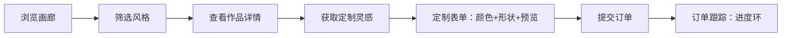
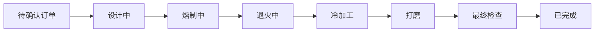

## 1. 产品概述

玻璃吹制工作室在线管理系统，为小型独立手工玻璃吹制工作室提供作品展示、定制订单管理和炉温记录功能。帮助艺术家高效管理创作流程，同时为客户提供沉浸式的作品浏览与定制体验。

- 目标用户：玻璃吹制艺术家（工作室主）和玻璃艺术爱好者（客户）
- 产品价值：将传统玻璃工艺与数字化管理结合，提升工作室运营效率和客户体验

## 2. 核心功能

### 2.1 用户角色

| 角色 | 注册方式 | 核心权限 |
|------|----------|----------|
| 客户 | 无需注册，直接浏览 | 浏览作品画廊、提交定制订单、跟踪订单进度 |
| 工作室主 | 默认后台入口 | 管理作品、处理订单、记录炉温、查看统计数据 |

### 2.2 功能模块

1. **作品画廊模块**：作品卡片网格展示、作品详情页（多角度轮播+工艺参数）
2. **定制订单模块**：三栏流式定制表单（颜色选择/手绘形状/3D预览）、订单跟踪（进度环+状态时间线）
3. **炉温管理模块**：升温降温曲线记录、当前炉膛状态、出炉提醒、异常告警统计

### 2.3 页面详情

| 页面名称 | 模块名称 | 功能描述 |
|----------|----------|----------|
| 画廊首页 | 作品卡片网格 | 按风格筛选、毛玻璃卡片、悬停浮起发光效果、图片懒加载 |
| 作品详情页 | 轮播+参数表 | 多角度照片轮播、工艺参数表格、冷却曲线图（5分钟采样间隔）、定制灵感备注 |
| 定制表单页 | 三栏流式布局 | 左侧颜色渐变拖拽、中间Canvas手绘板、右侧Three.js玻璃球预览 |
| 订单跟踪页 | 进度环+时间线 | 进度环动画、状态时间戳列表（ISO 8601格式） |
| 炉温管理页 | 折线图+状态面板 | 温度曲线（X轴分钟刻度）、当前订单、出炉提醒、异常告警统计 |

## 3. 核心流程

### 3.1 客户浏览与定制流程
客户进入画廊首页，按风格筛选作品，点击查看详情，获取灵感后点击"定制类似作品"进入定制表单，选择颜色渐变、绘制形状草图、预览3D效果后提交订单，通过订单号跟踪制作进度。

### 3.2 工作室主管理流程
工作室主登录后台，管理作品上下架，处理待确认订单，更新订单状态（从待确认到已完成共8个阶段），记录每次开炉的温度曲线，查看异常告警统计。

## 4. 用户界面设计

### 4.1 设计风格

- **主色调**：暖玻璃色系 — 主色 `#FDF2E9`（暖杏色背景）、辅色 `#AAB7B8`（灰蓝）、强调色 `#E67E22`（琉璃橙）
- **卡片风格**：半透明毛玻璃效果 `backdrop-filter: blur(10px)`，圆角20px，轻微阴影
- **按钮风格**：圆角设计，点击缩放0.95倍，0.15s缓动反馈，悬停光晕过渡
- **字体**：Noto Sans SC，中文优化字体
- **布局风格**：卡片式网格布局，桌面端三栏、平板双栏、手机单栏堆叠

### 4.2 页面设计概览

| 页面名称 | 模块名称 | UI元素 |
|----------|----------|--------|
| 画廊首页 | 作品卡片网格 | 毛玻璃卡片、悬停浮起8px+外发光#E67E22、0.3s ease-out过渡、图片懒加载 |
| 作品详情页 | 轮播+参数表 | 照片轮播、参数表格、Recharts折线图（冷却曲线，5分钟采样间隔） |
| 定制表单页 | 三栏流式布局 | 左侧圆形渐变块水平拖拽、中间Canvas手绘板、右侧Three.js玻璃球（roughness:0.2, metalness:0.1, clearcoat:1.0） |
| 订单跟踪页 | 进度环组件 | 直径48px、颜色#F1948A→#82E0AA渐变、旋转动画0.3s、时间戳ISO 8601 |
| 炉温管理页 | 折线图面板 | Y轴0-1200°C、X轴分钟刻度、异常点高亮（±30°C）、顶部置顶告警横幅 |

### 4.3 响应式设计

- **桌面端**（> 768px）：三栏布局，画廊卡片宽度280px，每行4-5张
- **平板端**（≤ 768px）：双栏布局，画廊卡片宽度45% / max-width: 280px，每行2张
- **移动端**（≤ 480px）：单栏堆叠，画廊卡片宽度100% / max-width: 100%，每行1张
- 触控优化：手绘板支持触屏拖拽，按钮最小触控区域44px
- 断点使用 `max-width` 移动优先策略

### 4.4 异常告警设计

- **触发条件**：实际温度与预设曲线偏差超过 ±30°C
- **前端展示**：页面顶部置顶横幅，背景色 `#F1948A`，文字白色，带闪烁动画
- **横幅内容**：异常时间点、当前温度、偏离值、关闭按钮
- **关闭行为**：点击关闭后本次告警不再显示，但新异常仍会触发新横幅
- **统计展示**：炉温管理页显示本周异常次数和异常详情列表

### 4.5 3D场景指导

- **环境**：暖色调柔和环境光，模拟玻璃工作室光照氛围
- **光照**：主光+补光+环境光，突出玻璃的折射和反光质感
- **相机**：透视视角，可轻微旋转展示玻璃质感
- **材质**：Three.js MeshPhysicalMaterial
  - `roughness: 0.2`
  - `metalness: 0.1`
  - `clearcoat: 1.0`
  - `transmission: 0.9`
  - `thickness: 0.5`
- **动画**：缓慢自转，颜色随用户选择实时更新

## 5. 性能优化

- **图片懒加载**：使用 `loading="lazy"` 和 Intersection Observer 实现
- **虚拟列表**：画廊作品超过50件时启用虚拟滚动
- **请求缓存**：GET 请求结果缓存（axios 缓存 + 内存缓存），有效期5分钟
- **代码分割**：路由级别的代码分割
- **帧率保证**：3D场景降级策略，低性能设备自动降低渲染质量
