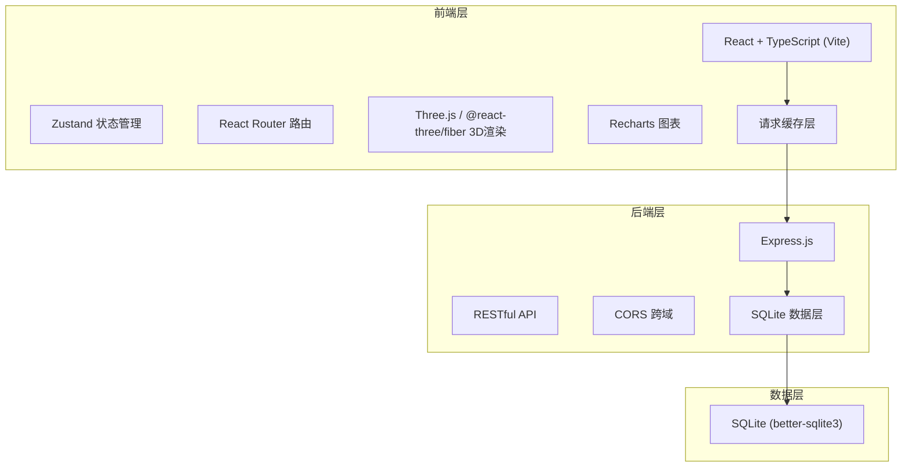
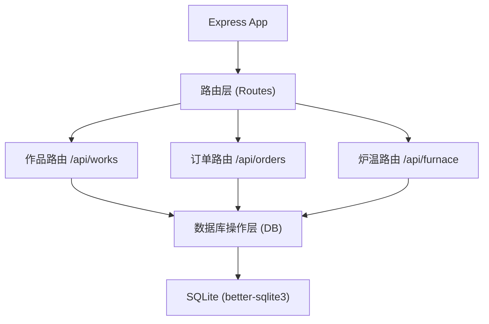
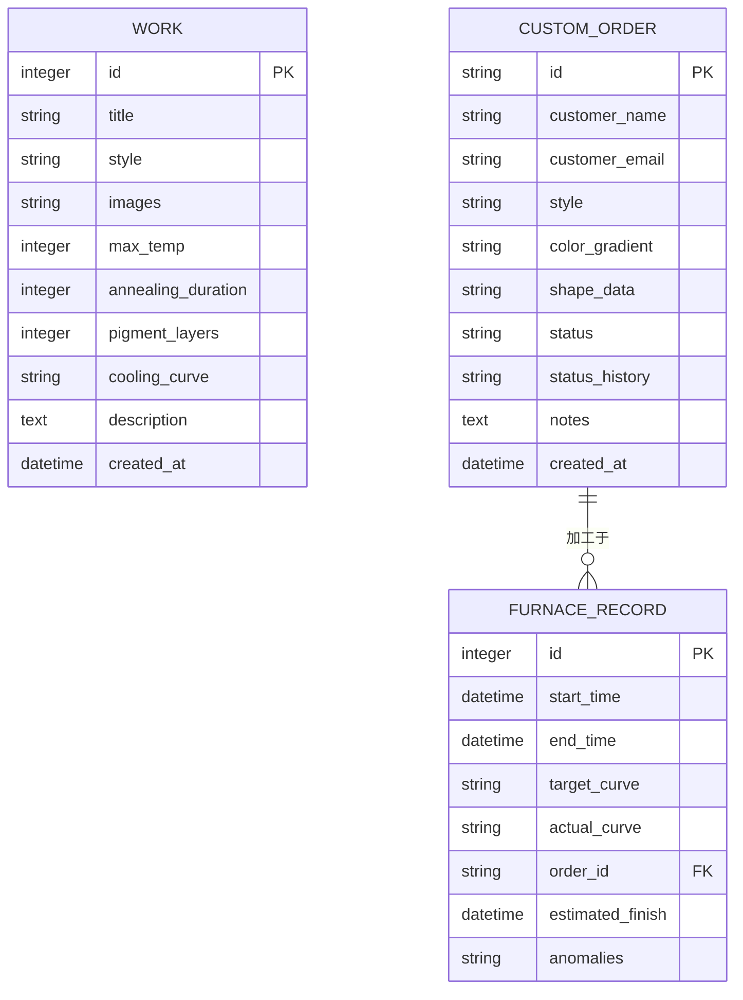

## 1. 架构设计



## 2. 技术栈说明

- **前端**：React 18 + TypeScript + Vite 5
- **状态管理**：Zustand（轻量级）
- **路由**：react-router-dom v6
- **HTTP客户端**：axios + 请求缓存
- **3D渲染**：three + @react-three/fiber
- **图表**：recharts
- **后端**：Express 4 + Node.js
- **数据库**：SQLite (better-sqlite3)
- **样式**：CSS Modules + 全局CSS变量
- **构建工具**：Vite（开发代理到3001端口）

## 3. 路由定义

| 路由路径 | 页面名称 | 说明 |
|----------|----------|------|
| `/` | 作品画廊 | 首页，展示所有作品卡片 |
| `/work/:id` | 作品详情 | 轮播图 + 工艺参数 + 冷却曲线 |
| `/custom` | 定制表单 | 三栏布局：颜色 / 手绘 / 3D预览 |
| `/orders/:id` | 订单跟踪 | 进度环 + 状态时间线 |
| `/furnace` | 炉温管理 | 温度曲线 + 炉膛状态 + 异常统计 |

## 4. API接口定义

### 4.1 作品接口

```typescript
interface Work {
  id: number;
  title: string;
  style: 'classic' | 'modern' | 'abstract' | 'botanical';
  images: string[];
  maxTemp: number;
  annealingDuration: number;
  pigmentLayers: number;
  coolingCurve: { time: number; temp: number }[];
  description: string;
  createdAt: string;
}

// GET /api/works?style=xxx
// Response: Work[]
// 缓存策略：5分钟内存缓存

// GET /api/works/:id
// Response: Work
// 缓存策略：5分钟内存缓存
```

### 4.2 订单接口

```typescript
type OrderStatus = 'pending' | 'designing' | 'melting' | 'annealing' | 'coldworking' | 'polishing' | 'finalcheck' | 'completed';

interface OrderStatusLog {
  status: OrderStatus;
  timestamp: string;
  note?: string;
}

interface Order {
  id: string;
  customerName: string;
  customerEmail: string;
  style: string;
  colorGradient: { hue: number; saturation: number; lightness: number }[];
  shapeData: string;
  status: OrderStatus;
  statusHistory: OrderStatusLog[];
  notes?: string;
  createdAt: string;
}

// POST /api/orders
// Request: Partial<Order>
// Response: Order

// GET /api/orders/:id
// Response: Order

// PATCH /api/orders/:id
// Request: { status: OrderStatus; note?: string }
// Response: Order

// GET /api/orders?status=pending
// Response: Order[]
```

### 4.3 炉温接口

```typescript
interface FurnaceRecord {
  id: number;
  startTime: string;
  endTime?: string;
  targetCurve: { time: number; temp: number }[];
  actualCurve: { time: number; temp: number }[];
  orderId?: string;
  estimatedFinish?: string;
  anomalies: { time: number; temp: number; deviation: number }[];
}

// GET /api/furnace/current
// Response: FurnaceRecord | null

// POST /api/furnace/start
// Request: { targetCurve: [...], orderId?: string, estimatedFinish?: string }
// Response: FurnaceRecord

// POST /api/furnace/record
// Request: { id: number; time: number; temp: number }
// Response: FurnaceRecord
// 说明：服务端自动计算偏差，超过±30°C计入异常

// POST /api/furnace/end
// Request: { id: number }
// Response: FurnaceRecord

// GET /api/furnace/weekly-anomalies
// Response: { total: number; details: FurnaceRecord[] }
```

## 5. 服务端架构



## 6. 数据模型

### 6.1 ER图



### 6.2 数据库建表语句

```sql
CREATE TABLE IF NOT EXISTS works (
  id INTEGER PRIMARY KEY AUTOINCREMENT,
  title TEXT NOT NULL,
  style TEXT NOT NULL,
  images TEXT NOT NULL,
  max_temp INTEGER NOT NULL,
  annealing_duration INTEGER NOT NULL,
  pigment_layers INTEGER NOT NULL,
  cooling_curve TEXT NOT NULL,
  description TEXT,
  created_at DATETIME DEFAULT CURRENT_TIMESTAMP
);

CREATE TABLE IF NOT EXISTS custom_orders (
  id TEXT PRIMARY KEY,
  customer_name TEXT NOT NULL,
  customer_email TEXT NOT NULL,
  style TEXT NOT NULL,
  color_gradient TEXT,
  shape_data TEXT,
  status TEXT NOT NULL DEFAULT 'pending',
  status_history TEXT,
  notes TEXT,
  created_at DATETIME DEFAULT CURRENT_TIMESTAMP
);

CREATE TABLE IF NOT EXISTS furnace_records (
  id INTEGER PRIMARY KEY AUTOINCREMENT,
  start_time DATETIME NOT NULL,
  end_time DATETIME,
  target_curve TEXT,
  actual_curve TEXT,
  order_id TEXT,
  estimated_finish DATETIME,
  anomalies TEXT,
  FOREIGN KEY (order_id) REFERENCES custom_orders(id)
);
```

## 7. 项目目录结构

```
auto18/
├── package.json
├── vite.config.js
├── tsconfig.json
├── index.html
├── src/
│   ├── main.tsx
│   ├── App.tsx
│   ├── api/
│   │   └── index.ts
│   ├── gallery/
│   │   ├── Gallery.tsx
│   │   ├── GalleryCard.tsx
│   │   └── WorkDetail.tsx
│   ├── order/
│   │   ├── CustomForm.tsx
│   │   └── OrderTracker.tsx
│   ├── furnace/
│   │   └── FurnaceManager.tsx
│   ├── components/
│   │   ├── ProgressRing.tsx
│   │   └── AlertBanner.tsx
│   ├── hooks/
│   │   ├── useLazyImage.ts
│   │   └── useCache.ts
│   ├── store/
│   │   └── index.ts
│   └── styles/
│       └── global.css
└── server/
    └── index.js
```

## 8. 性能优化措施

| 优化措施 | 实现方式 | 目标 |
|----------|----------|------|
| 图片懒加载 | `loading="lazy"` + Intersection Observer | 减少首屏加载时间 |
| 请求缓存 | axios 拦截器 + 内存缓存 Map | 响应延迟 ≤ 300ms |
| 虚拟列表 | 画廊超过50件时启用 | 画廊帧率 ≥ 45fps |
| 代码分割 | React.lazy + Suspense 路由级 | 首屏加载 < 2s |
| 3D降级 | 检测设备性能，自动降低渲染质量 | 3D场景 ≥ 30fps |
| 防抖节流 | 手绘板、筛选输入等高频操作 | 减少重渲染 |

## 9. 响应式断点

| 断点 | 设备类型 | 布局方式 | 画廊卡片宽度 |
|------|----------|----------|--------------|
| > 768px | 桌面端 | 多列网格 | 280px 固定 |
| ≤ 768px | 平板端 | 双列网格 | 45% / max-width: 280px |
| ≤ 480px | 移动端 | 单列堆叠 | 100% / max-width: 100% |
