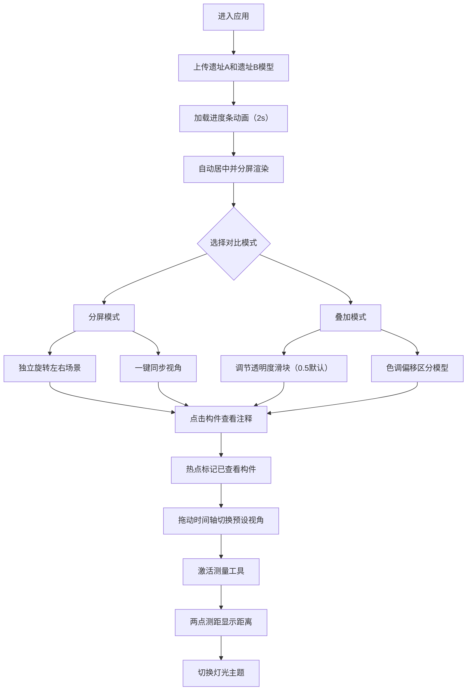

## 1. 产品概述

一款面向博物馆策展人和历史爱好者的交互式考古遗址三维重建对比查看器，支持用户同时载入两个时期的三维遗址模型，在分屏或叠加模式下自由切换视角、拖拽查看细节，并通过构件注释、时间轴、测量工具等功能深入理解遗址演变历程。

- 核心价值：解决传统考古资料难以直观对比不同时期建筑形态的痛点，提供沉浸式、可交互的三维对比体验
- 目标用户：博物馆策展人、考古研究人员、历史爱好者、教育工作者

## 2. 核心特性

### 2.1 用户角色
| 角色 | 注册方式 | 核心权限 |
|------|---------|---------|
| 普通用户 | 无需注册，直接使用 | 加载模型、对比查看、标注测量、导出截图 |

### 2.2 功能模块
1. **主查看界面**：双模型分屏/叠加渲染、OrbitControls视角控制
2. **模型加载模块**：GLTF文件拖拽上传、加载进度显示、自动居中缩放
3. **对比交互模块**：分屏/叠加切换、视角同步、透明度调节
4. **构件标注系统**：射线拾取、信息弹出卡、热点标记
5. **时间轴模块**：年代滑块、预设视角切换、渐变色带
6. **测量工具模块**：点选测距、虚线绘制、多组测量管理
7. **主题切换模块**：暮色/日光/夜景灯光主题、背景渐变过渡

### 2.3 页面详情
| 页面名称 | 模块名称 | 功能描述 |
|---------|---------|---------|
| 主查看页面 | 顶部工具栏 | 对比模式切换、视角同步、测量模式开关、主题切换下拉 |
| 主查看页面 | 文件上传区 | 双文件选择面板、拖拽上传、加载进度条（2s缓动） |
| 主查看页面 | 分屏渲染区 | 左右独立Canvas子场景、垂直分隔线（悬停显示双向箭头↔） |
| 主查看页面 | 叠加渲染区 | 双模型重叠显示、透明度滑块（步长0.05）、色调偏移 |
| 主查看页面 | 图例标识 | 左屏左上角"遗址A"暖色图例、右屏右上角"遗址B"冷色图例 |
| 主查看页面 | 构件信息卡 | 从点击位置向屏幕中央平滑弹出（0.4s cubic-bezier）、显示构件名/年代/描述 |
| 主查看页面 | 时间轴滑块 | 底部水平滑块（BC200-AD600）、色带渐变、预设视角 |
| 主查看页面 | 测量标注层 | 白色虚线测量线（线宽2px）、实时距离（米，两位小数）、点击清除 |

## 3. 核心流程

用户打开应用 → 上传两个GLTF模型文件（或使用内置示例）→ 加载进度动画 → 自动居中分屏显示 → 选择分屏/叠加模式 → 拖拽旋转对比视角 → 点击建筑构件查看注释 → 拖动时间轴切换时期视角 → 激活测量工具进行测距 → 切换灯光主题查看效果

## 4. 用户界面设计

### 4.1 设计风格

**整体主题**：深色科技感博物馆风格

- **主背景色**：#121212（深邃炭黑，营造沉浸感）
- **卡片面板**：#1E1E1E（深灰，层次分明）
- **文字颜色**：#E0E0E0（浅灰白，高可读性）
- **主强调色**：渐变 #FF6B35 → #FF4B1F（暖橙红，考古火焰感）
- **辅助色**：遗址A #FFAB91（暖色边缘光）、遗址B #81D4FA（冷色边缘光）、热点 #FF5252（深红）
- **圆角**：统一 8px
- **阴影**：柔和内阴影+外发光，营造科技感

**按钮与交互**：
- 渐变色按钮（#FF6B35到#FF4B1F）
- 悬停：亮度提升15%，阴影加深
- 点击：缩放0.97，按下感
- 所有过渡：0.2s ease-out

**字体方案**：
- 标题：Space Grotesk（几何科技感）
- 正文：Inter（清晰易读）
- 数字/年代：JetBrains Mono（等宽精准感）

### 4.2 页面设计概览
| 页面名称 | 模块名称 | UI元素 |
|---------|---------|--------|
| 主查看页 | 顶部工具栏 | 固定高度56px，背景#1A1A1A，左侧Logo，中间模式图标组（分屏/叠加），右侧主题下拉+测量开关 |
| 主查看页 | 文件上传面板 | 居中模态，双上传区域，虚线边框+拖拽提示，文件图标+名称列表 |
| 主查看页 | 加载进度条 | 全宽底部，渐变填充，2s缓动，百分比数字 |
| 主查看页 | 分屏渲染容器 | flex布局，左右各50%，中间3px分隔线（#FF6B35），悬停显示↔箭头图标 |
| 主查看页 | 叠加渲染容器 | 单Canvas全屏，右上角透明度滑块条+标签 |
| 主查看页 | 图例标签 | 左屏左上角absolute定位，圆角小卡片+暖色竖条+文字"遗址A"；右屏右上角+冷色竖条+文字"遗址B" |
| 主查看页 | 构件信息卡 | 居中弹出，阴影增强，标题16px粗体，年代标签12px等宽，描述13px，0.4s入场动画 |
| 主查看页 | 热点标记 | 6px圆点，#FF5252，呼吸动画2s无限循环，悬停放大1.5倍 |
| 主查看页 | 时间轴 | 底部固定50px高度，轨道渐变背景（深蓝→暖黄），拖动把手#FF6B35圆形，两端年代标签 |
| 主查看页 | 测量线 | 白色虚线，线宽2px，端点小方块，距离标签半透明黑底白字 |

### 4.3 响应式设计
- 设计优先：桌面端（≥1280px），全屏沉浸式体验
- 平板端（768-1279px）：分屏改为上下分屏，工具栏图标缩小
- 移动端（<768px）：仅叠加模式可用，工具栏折叠为汉堡菜单
- 窗口缩放：Canvas等比例缩放保持宽高比，UI层flex自适应

### 4.4 3D场景指引
- **环境/HDRI氛围**：默认暮色主题使用暖色定向光模拟夕阳，阴影柔和；夜景主题加点光源模拟火炬
- **光照设置**：
  - 暮色：环境光#2C3E50 + 定向光#F5B041强度1.2，开启柔和阴影
  - 日光：环境光#FFFDE7 + 定向光#FFFFFF强度1.5
  - 夜景：环境光#1A237E + 点光源#FFD54F强度2.0，位置偏移模拟火炬
- **相机设置**：PerspectiveCamera，fov=50，near=0.1，far=1000，初始距离模型包围球半径3倍
- **相机运动**：OrbitControls，启用阻尼（dampingFactor=0.08），禁止进入模型内部（minDistance），最大仰角限制避免翻转
- **构图焦点**：模型自动居中，初始视角45°俯角，突出建筑全貌
- **交互动画**：视角切换1s缓动过渡，模型加载时从透明渐入（0.6s）
- **后处理效果**：边缘光效果实现模型高亮（遗址A暖色#FFAB91，遗址B冷色#81D4FA），OutlinePass或自定义Shader实现0.3px发光边
- **性能预算**：单模型顶点≤5万，双模型累计≤10万，目标帧率≥45fps，每帧渲染指令≤200次draw call
