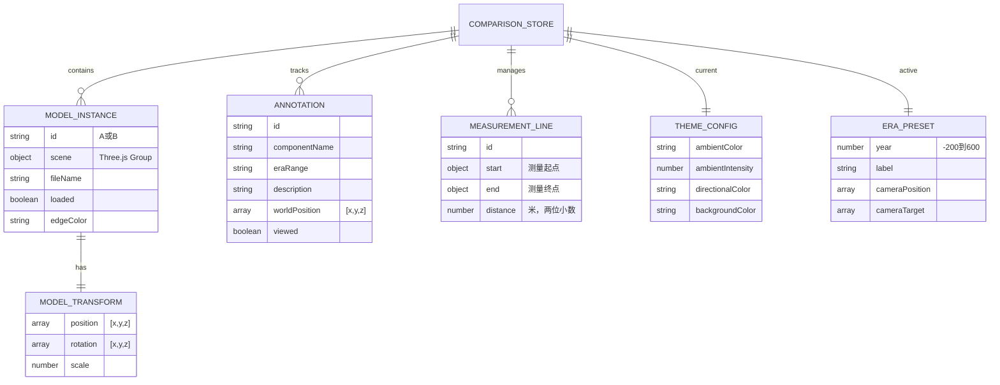

## 1. 架构设计

```mermaid
graph TD
    subgraph "UI 表现层 (src/ui)"
        A["UILayer.tsx 顶层UI组件"]
        A1["FileUploader.tsx 文件上传面板"]
        A2["TopToolbar.tsx 顶部工具栏"]
        A3["TimelineSlider.tsx 时间轴滑块"]
        A4["AnnotationCard.tsx 构件信息卡"]
        A5["MeasurementOverlay.tsx 测量标注层"]
        A6["ThemeSwitcher.tsx 主题切换器"]
    end

    subgraph "状态管理层 (src/store)"
        B["useComparisonStore Zustand状态中心"]
        B1["模型状态切片 加载/变换/实例"]
        B2["对比状态切片 模式/同步/透明度"]
        B3["标注状态切片 热点/信息卡/构件数据"]
        B4["测量状态切片 测量点/测量线组"]
        B5["主题状态切片 当前主题/灯光参数"]
    end

    subgraph "对比交互层 (src/comparison)"
        C["ComparisonController.ts 对比控制器"]
        C1["视角同步逻辑 相机矩阵同步"]
        C2["模式切换逻辑 分屏↔叠加过渡"]
        C3["AnnotationSystem.ts 标注系统 Raycaster拾取"]
        C4["MeasurementSystem.ts 测量系统 距离计算"]
    end

    subgraph "模型管理层 (src/models)"
        D["ModelLoader.ts GLTF加载器"]
        D1["解析进度 百分比回调"]
        D2["自动居中 包围球计算+归一化"]
        D3["ModelManager.ts 模型实例管理器"]
        D4["变换矩阵维护 位置/旋转/缩放"]
        D5["边缘光材质 发光效果注入"]
    end

    subgraph "渲染层 (src/renderer)"
        E["ThreeRenderer.tsx Three.js渲染根组件"]
        E1["SceneBuilder 场景构建器"]
        E2["LightManager 光照管理器 主题切换"]
        E3["DualViewport 分屏视口管理"]
        E4["OrbitControlsGroup 双控制器"]
        E5["MeasurementLines 虚线渲染器"]
    end

    A -->|事件派发/状态订阅| B
    A1 -->|文件路径| D
    A2 -->|模式切换| C
    A3 -->|年代值| B
    A4 -->|展示/隐藏| C3
    A5 -->|点选坐标| C4
    A6 -->|主题配置| E2

    B -->|变换指令| D3
    B -->|渲染参数| E
    C -->|相机同步| E4
    C3 -->|射线检测| E1
    C4 -->|坐标计算| E5
    D -->|Scene对象| D3
    D3 -->|两个实例| E3
```



## 2. 技术选型说明

| 技术 | 版本 | 用途说明 |
|------|------|---------|
| React | ^18.2.0 | UI组件化框架，使用函数组件+Hooks |
| TypeScript | ^5.3.0 | 静态类型检查，所有模块严格模式 |
| Vite | ^5.0.0 | 构建工具，HMR热更新，路径别名@配置 |
| Three.js | ^0.160.0 | 3D渲染引擎核心，WebGL抽象层 |
| @react-three/fiber | ^8.15.0 | React+Three.js声明式桥接，Canvas组件 |
| @react-three/drei | ^9.92.0 | 常用R3F辅助组件（OrbitControls、Edges等） |
| zustand | ^4.4.0 | 轻量级状态管理，对比状态集中管理 |
| lucide-react | ^0.294.0 | 图标库（分屏、叠加、测量、主题等图标） |

- **前端**：React 18 + TypeScript 5 + Vite 5（构建启动）
- **初始化工具**：vite-init react-ts 模板（预配置zustand）
- **后端**：无需后端，纯前端加载本地GLTF文件
- **数据库**：无需数据库，构件标注数据内置mock JSON

## 3. 路由定义
| 路由 | 用途 |
|------|------|
| / | 主查看页面，包含完整3D对比查看器 |

## 4. API定义（无后端，仅TypeScript类型）

```typescript
// src/types/index.ts
export interface ModelTransform {
  position: [number, number, number];
  rotation: [number, number, number];
  scale: number;
}

export interface ModelInstance {
  id: 'A' | 'B';
  scene: THREE.Group | null;
  transform: ModelTransform;
  loaded: boolean;
  fileName: string;
  edgeColor: string;
}

export type ComparisonMode = 'split' | 'overlay';

export interface Annotation {
  id: string;
  componentName: string;
  eraRange: string;
  description: string;
  worldPosition: [number, number, number];
  viewed: boolean;
}

export interface MeasurementPoint {
  position: [number, number, number];
  screenPosition: { x: number; y: number };
}

export interface MeasurementLine {
  id: string;
  start: MeasurementPoint;
  end: MeasurementPoint;
  distance: number;
}

export type ThemeType = 'dusk' | 'daylight' | 'night';

export interface ThemeConfig {
  ambientColor: string;
  ambientIntensity: number;
  directionalColor: string;
  directionalIntensity: number;
  backgroundColor: string;
  hasPointLight?: boolean;
  pointLightColor?: string;
  pointLightPosition?: [number, number, number];
}

export interface EraPreset {
  year: number;
  label: string;
  cameraPosition: [number, number, number];
  cameraTarget: [number, number, number];
}
```

## 5. 服务器架构（无后端，纯前端）

纯前端架构，所有逻辑运行在浏览器端。GLTF模型通过FileReader API读取本地文件或使用内置示例模型URL（通过fetch加载）。

## 6. 数据模型

### 6.1 数据模型关系



### 6.2 内置Mock数据（构件标注+年代预设）

```json
// src/data/mockAnnotations.json
[
  {
    "id": "wall-north",
    "componentName": "北城墙",
    "eraRange": "公元100年 - 公元300年",
    "description": "遗址北部防御工事，采用石灰岩砌筑，厚度达3.5米，公元4世纪战乱中严重损毁。",
    "meshNamePattern": "Wall_North_\\d+"
  },
  {
    "id": "dome-main",
    "componentName": "中央穹顶",
    "eraRange": "公元120年建造",
    "description": "采用十字拱技术建造的标志性穹顶建筑，直径24米，顶部饰有太阳纹浮雕，是当时建筑技艺的巅峰代表。",
    "meshNamePattern": "Dome_Main"
  },
  {
    "id": "columns-east",
    "componentName": "东侧柱廊",
    "eraRange": "公元80年 - 公元150年",
    "description": "科林斯式柱廊，共12根立柱支撑上层回廊，柱身刻有献祭铭文，柱础保留完整。",
    "meshNamePattern": "Column_East_\\d+"
  }
]

// src/data/eraPresets.json
[
  { "year": -200, "label": "BC 200", "cameraPosition": [15, 12, 15], "cameraTarget": [0, 3, 0] },
  { "year": 100, "label": "AD 100", "cameraPosition": [10, 8, 10], "cameraTarget": [0, 3, 0] },
  { "year": 300, "label": "AD 300", "cameraPosition": [8, 6, 8], "cameraTarget": [0, 2, 0] },
  { "year": 500, "label": "AD 500", "cameraPosition": [12, 10, 12], "cameraTarget": [0, 1, 0] },
  { "year": 600, "label": "AD 600", "cameraPosition": [18, 14, 18], "cameraTarget": [0, 0, 0] }
]
```
