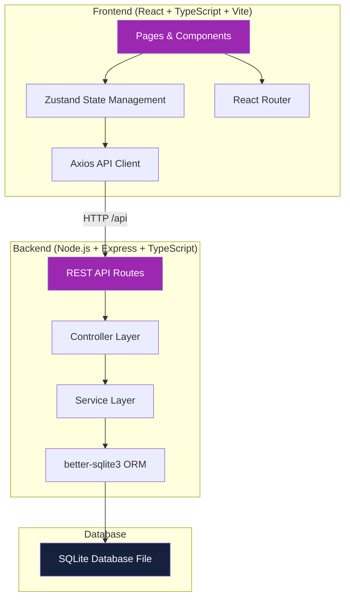
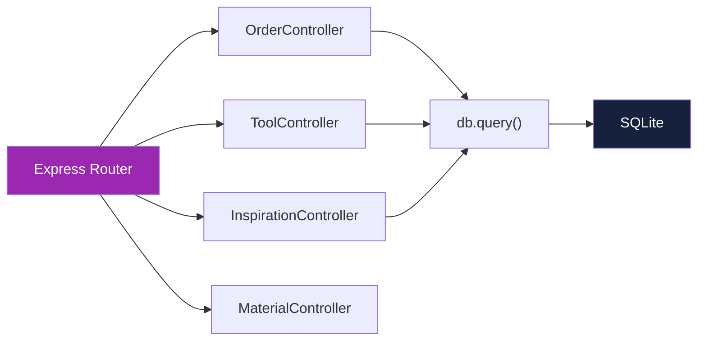
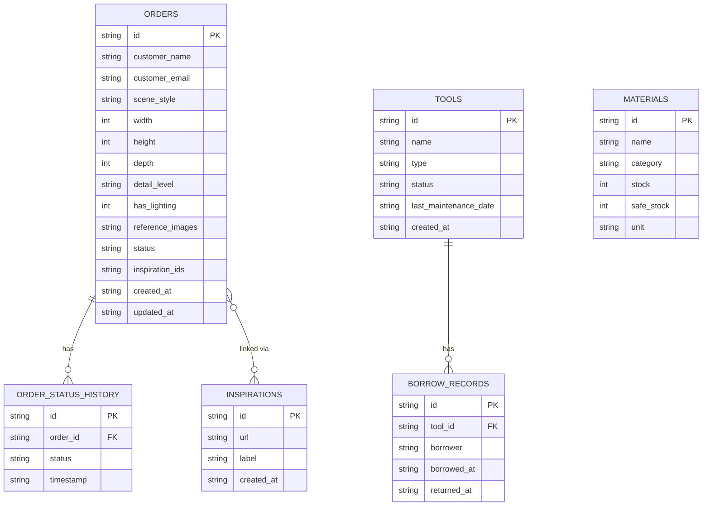

## 1. 架构设计



## 2. 技术描述
- **前端框架**：React 18 + TypeScript（严格模式）
- **构建工具**：Vite 5，配置本地 API 代理
- **路由管理**：React Router DOM 6
- **状态管理**：Zustand
- **HTTP 客户端**：Axios
- **后端框架**：Express 4 + TypeScript
- **数据库**：SQLite（通过 better-sqlite3 同步操作）
- **ID 生成**：uuid
- **跨域处理**：cors 中间件
- **图标库**：lucide-react

## 3. 路由定义
| 路由 | 用途 |
|------|------|
| `/` | 跳转至 `/submit` 订单提交页 |
| `/submit` | 前台订单提交页 |
| `/order/:id` | 前台订单详情页（含进度时间轴） |
| `/admin` | 后台仪表盘（Tab 切换：概览/订单/工具/材料/灵感） |

后端 API 路由前缀 `/api`：
| 方法 | 路由 | 用途 |
|------|------|------|
| GET/POST | `/api/orders` | 获取订单列表 / 创建订单 |
| GET/PUT/DELETE | `/api/orders/:id` | 获取/更新/删除单个订单 |
| POST | `/api/orders/:id/status` | 更新订单状态（记录时间戳） |
| GET/POST | `/api/tools` | 获取工具列表 / 新增工具 |
| GET/PUT/DELETE | `/api/tools/:id` | 获取/更新/删除工具 |
| POST | `/api/tools/:id/borrow` | 登记工具借用 |
| POST | `/api/tools/:id/return` | 登记工具归还 |
| GET/POST | `/api/inspirations` | 获取灵感图 / 新增灵感图 |
| DELETE | `/api/inspirations/:id` | 删除灵感图 |
| POST | `/api/orders/:id/inspirations` | 将灵感图关联至订单 |
| GET/POST | `/api/materials` | 获取材料列表 / 新增材料 |
| GET/PUT/DELETE | `/api/materials/:id` | 获取/更新/删除材料 |
| GET | `/api/materials/low-stock` | 获取低于安全库存阈值的材料列表 |

## 4. API 类型定义

```typescript
// 订单相关
export type OrderStatus =
  | 'pending'
  | 'confirmed'
  | 'concept'
  | 'materials'
  | 'skeleton'
  | 'painting'
  | 'aging'
  | 'lighting'
  | 'composition'
  | 'qc'
  | 'completed';

export type SceneStyle = 'fantasy_forest' | 'british_corner' | 'japanese_garden' | 'steampunk' | 'underwater';
export type DetailLevel = 'normal' | 'high' | 'ultra';

export interface Order {
  id: string;
  customerName: string;
  customerEmail: string;
  sceneStyle: SceneStyle;
  width: number;
  height: number;
  depth: number;
  detailLevel: DetailLevel;
  hasLighting: boolean;
  referenceImages: string[];
  status: OrderStatus;
  statusHistory: { status: OrderStatus; timestamp: string }[];
  inspirationIds: string[];
  createdAt: string;
  updatedAt: string;
}

// 工具相关
export type ToolType = 'brush' | 'carving_knife' | 'tweezer' | 'airbrush' | 'magnifier' | 'other';
export type ToolStatus = 'idle' | 'borrowed' | 'maintenance';

export interface Tool {
  id: string;
  name: string;
  type: ToolType;
  status: ToolStatus;
  lastMaintenanceDate: string | null;
  borrowRecords: { borrower: string; borrowedAt: string; returnedAt: string | null }[];
  createdAt: string;
}

// 灵感图相关
export interface Inspiration {
  id: string;
  url: string;
  label: SceneStyle;
  createdAt: string;
}

// 材料相关
export type MaterialCategory =
  | 'resin' | 'clay' | 'paint' | 'wood' | 'metal'
  | 'lighting_electronics' | 'vegetation' | 'other';

export interface Material {
  id: string;
  name: string;
  category: MaterialCategory;
  stock: number;
  safeStock: number;
  unit: string;
  createdAt: string;
  updatedAt: string;
}
```

## 5. 服务端架构



服务端采用单层 Express Router + 直接数据库操作的简化架构，通过 better-sqlite3 同步读写 SQLite，确保小团队场景下的开发效率和数据一致性。

## 6. 数据模型

### 6.1 ER 图



### 6.2 DDL

```sql
CREATE TABLE IF NOT EXISTS orders (
  id TEXT PRIMARY KEY,
  customer_name TEXT NOT NULL,
  customer_email TEXT NOT NULL,
  scene_style TEXT NOT NULL,
  width REAL NOT NULL,
  height REAL NOT NULL,
  depth REAL NOT NULL,
  detail_level TEXT NOT NULL,
  has_lighting INTEGER NOT NULL DEFAULT 0,
  reference_images TEXT NOT NULL DEFAULT '[]',
  status TEXT NOT NULL DEFAULT 'pending',
  inspiration_ids TEXT NOT NULL DEFAULT '[]',
  created_at TEXT NOT NULL,
  updated_at TEXT NOT NULL
);

CREATE TABLE IF NOT EXISTS order_status_history (
  id TEXT PRIMARY KEY,
  order_id TEXT NOT NULL,
  status TEXT NOT NULL,
  timestamp TEXT NOT NULL,
  FOREIGN KEY (order_id) REFERENCES orders(id) ON DELETE CASCADE
);

CREATE TABLE IF NOT EXISTS tools (
  id TEXT PRIMARY KEY,
  name TEXT NOT NULL,
  type TEXT NOT NULL,
  status TEXT NOT NULL DEFAULT 'idle',
  last_maintenance_date TEXT,
  created_at TEXT NOT NULL
);

CREATE TABLE IF NOT EXISTS borrow_records (
  id TEXT PRIMARY KEY,
  tool_id TEXT NOT NULL,
  borrower TEXT NOT NULL,
  borrowed_at TEXT NOT NULL,
  returned_at TEXT,
  FOREIGN KEY (tool_id) REFERENCES tools(id) ON DELETE CASCADE
);

CREATE TABLE IF NOT EXISTS inspirations (
  id TEXT PRIMARY KEY,
  url TEXT NOT NULL,
  label TEXT NOT NULL,
  created_at TEXT NOT NULL
);

CREATE TABLE IF NOT EXISTS materials (
  id TEXT PRIMARY KEY,
  name TEXT NOT NULL,
  category TEXT NOT NULL,
  stock REAL NOT NULL DEFAULT 0,
  safe_stock REAL NOT NULL DEFAULT 0,
  unit TEXT NOT NULL DEFAULT '件',
  created_at TEXT NOT NULL,
  updated_at TEXT NOT NULL
);
```
