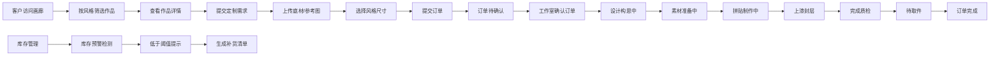

## 1. 产品概述

蝶古巴特拼贴艺术工作室在线平台，为小型独立手工工作室提供作品展示、定制订单管理和素材库存管理的一站式解决方案。帮助艺术家高效展示创作成果，承接客户定制项目，并精细化管理工作室物料库存。

- 目标用户：独立手工艺术家、小型艺术工作室经营者、喜爱手工拼贴艺术的客户群体
- 核心价值：提升工作室专业形象，简化订单管理流程，降低库存管理成本

## 2. 核心功能

### 2.1 用户角色

| 角色 | 登录方式 | 核心权限 |
|------|----------|----------|
| 访客/客户 | 无需登录 | 浏览作品画廊、提交定制订单、追踪订单进度 |
| 工作室主 | 后台管理入口 | 管理作品、处理订单、维护素材库存、查看数据统计 |

### 2.2 功能模块

1. **作品画廊模块**：作品卡片展示、风格分类筛选、作品详情浏览、同风格作品切换
2. **定制订单模块**：客户定制需求提交、订单状态追踪、时间轴进度展示、进展照片互动
3. **素材库存模块**：拼贴纸/底漆/保护漆分类管理、库存预警提示、补货清单生成
4. **后台管理模块**：订单状态流转、作品管理、库存维护

### 2.3 页面详情

| 页面名称 | 模块名称 | 功能描述 |
|---------|---------|----------|
| 画廊首页 | 顶部筛选栏 | 按风格标签筛选作品（复古花卉/田园风光/海洋主题/异域风情） |
| 画廊首页 | 作品网格 | 瀑布流布局展示作品卡片，支持悬停动画效果 |
| 作品详情页 | 主图展示 | Framer Motion布局动画展开，左右滑动切换同风格作品 |
| 作品详情页 | 信息面板 | 素材清单、拼贴手法、配色方案、创作时间线 |
| 定制提交页 | 表单区域 | 上传底材照片、参考图，选择风格和尺寸，填写特殊要求 |
| 订单追踪页 | 纵向时间轴 | 展示订单状态流转，节点动画效果，进展照片预览 |
| 后台首页 | 库存预警 | 右上角红色圆点提示，点击展开短缺素材列表 |
| 后台订单页 | 订单列表 | 待确认/进行中/已完成订单分类管理 |
| 后台库存页 | 素材管理 | 拼贴纸、底漆、保护漆分类列表，支持编辑库存 |

## 3. 核心流程

### 3.1 客户浏览与定制流程

客户访问网站 → 浏览作品画廊 → 按风格筛选心仪作品 → 查看作品详情 → 进入定制页面 → 上传底材照片和参考图 → 选择风格和尺寸 → 填写细节要求 → 提交订单 → 获取订单号 → 追踪订单进度 → 查看进展照片并点赞

### 3.2 工作室管理流程

工作室主登录后台 → 查看新订单提醒 → 确认订单并更新状态 → 上传各阶段进展照片 → 系统自动扣减库存 → 收到库存预警 → 查看短缺素材 → 生成补货清单 → 完成订单交付

### 3.3 流程图

## 4. 用户界面设计

### 4.1 设计风格

- **整体风格**：手工日记簿质感，温暖文艺的手作氛围
- **主背景色**：#FFF8F0 柔和米色
- **卡片背景色**：#FAF0E6 米白色
- **文字主色**：#3E2723 深褐色
- **风格标签色**：
  - 复古花卉：#D4A574 棕粉色
  - 田园风光：#A8D5BA 莫兰迪绿
  - 海洋主题：#6A9CBE 静谧蓝
  - 异域风情：#D4A0A0 玫瑰粉
- **按钮样式**：圆角10px，背景为对应素材颜色，悬停加深
- **导航字体**：Caveat 手写风格字体，字号22px
- **阴影效果**：多重阴影模拟纸页边缘的仿旧纹路
- **输入框焦点**：手绘涂鸦风格波状下划线（SVG实现）

### 4.2 页面设计概览

| 页面名称 | 模块名称 | UI元素 |
|---------|---------|--------|
| 画廊首页 | 作品卡片 | 宽280px，圆角18px，米白背景，左上角风格标签，水彩泼溅主图区域，底部标题日期，悬停上浮6px+纸纹阴影 |
| 画廊首页 | 筛选标签栏 | 横向滚动风格标签，选中态背景加深 |
| 作品详情页 | 主图区域 | Framer Motion布局动画展开，左右滑动切换，圆形指示器 |
| 作品详情页 | 信息侧栏 | 素材清单列表、拼贴手法段落、配色方案色卡、时间轴 |
| 订单追踪页 | 纵向时间轴 | 风格色圆点，已完成节点勾选动画，当前节点脉动光晕 |
| 后台首页 | 库存预警 | 右上角红色圆点+抖动动画，下拉列表显示短缺项 |
| 后台库存页 | 素材卡片 | 分类标签展示，库存数量进度条，低库存红色警示 |

### 4.3 响应式设计

- 桌面端（1920px）：侧栏导航+主内容区，画廊多列网格
- 平板端（768px）：导航收缩，画廊三列布局
- 移动端（320px）：汉堡菜单，画廊两列瀑布流，内容垂直堆叠
- 触控优化：增大按钮点击区域，支持滑动手势操作

### 4.4 动效设计

- 卡片悬停：向上浮动6px，0.3s cubic-bezier(0.4, 0, 0.2, 1)
- 页面切换：Framer Motion布局动画，平滑过渡
- 时间轴节点：已完成节点勾选动画，当前节点0.6s循环脉冲光晕
- 库存预警：红色圆点抖动动画，持续2秒
- 滑动指示器：当前点放大并颜色加深
