## 1. 架构设计

```mermaid
flowchart TD
    A["前端 React 应用"] --> B["状态管理 Zustand"]
    A --> C["路由 React Router"]
    A --> D["动画 Framer Motion"]
    A --> E["样式 CSS Modules / 内联样式"]
    B --> F["Gallery Store 作品数据"]
    B --> G["Order Store 订单数据"]
    B --> H["Inventory Store 库存数据"]
    A --> I["API 层 Axios 封装"]
    I --> J["Mock 数据 / 本地存储"]
    
    K["组件层"] --> L["GalleryCard 作品卡片"]
    K --> M["OrderTimeline 订单时间轴"]
    K --> N["StyleTag 风格标签"]
    K --> O["InventoryAlert 库存预警"]
    
    P["页面层"] --> Q["GalleryPage 画廊首页"]
    P --> R["ArtworkDetailPage 作品详情"]
    P --> S["CustomOrderPage 定制提交"]
    P --> T["OrderTrackingPage 订单追踪"]
    P --> U["AdminDashboard 后台首页"]
    P --> V["AdminOrdersPage 订单管理"]
    P --> W["AdminInventoryPage 库存管理"]
```



## 2. 技术选型说明

- **前端框架**：React 18 + TypeScript，类型安全的组件开发
- **构建工具**：Vite，快速的开发体验和热更新
- **状态管理**：Zustand，轻量级、简洁的状态管理方案
- **路由管理**：React Router DOM，单页应用路由
- **动画库**：Framer Motion，流畅的布局动画和交互动效
- **HTTP 客户端**：Axios，统一的请求拦截和错误处理
- **字体**：@fontsource/caveat，手写风格字体
- **图标**：lucide-react，轻量级图标库

## 3. 路由定义

| 路由路径 | 页面组件 | 功能说明 |
|---------|---------|----------|
| `/` | GalleryPage | 作品画廊首页，网格展示所有作品 |
| `/artwork/:id` | ArtworkDetailPage | 作品详情页，展示详细信息和同风格作品 |
| `/custom-order` | CustomOrderPage | 定制需求提交页面 |
| `/order-tracking/:orderId` | OrderTrackingPage | 订单进度追踪页面 |
| `/admin` | AdminDashboardPage | 后台管理首页，库存预警和数据概览 |
| `/admin/orders` | AdminOrdersPage | 订单管理页面 |
| `/admin/inventory` | AdminInventoryPage | 素材库存管理页面 |

## 4. 数据模型

### 4.1 作品 (Artwork)

```typescript
interface Artwork {
  id: string;
  title: string;
  style: 'vintage-floral' | 'pastoral' | 'ocean' | 'exotic';
  imageUrl: string;
  createdAt: string;
  description: string;
  materials: string[];
  technique: string;
  colorPalette: string[];
  timeline: { date: string; event: string }[];
}
```

### 4.2 订单 (Order)

```typescript
interface Order {
  id: string;
  customerName: string;
  customerEmail: string;
  style: 'vintage-floral' | 'pastoral' | 'ocean' | 'exotic';
  size: 'small' | 'medium' | 'large';
  baseMaterial: string;
  referenceImages: string[];
  baseMaterialImage: string;
  detailLevel: string;
  specialRequirements: string;
  status: OrderStatus;
  statusHistory: { status: OrderStatus; timestamp: string; note?: string; photos?: string[] }[];
  createdAt: string;
  likes: number;
}

type OrderStatus = 
  | 'pending'
  | 'confirmed'
  | 'designing'
  | 'preparing'
  | 'crafting'
  | 'varnishing'
  | 'quality-check'
  | 'ready-pickup';
```

### 4.3 库存 (Inventory)

```typescript
interface DecoupagePaper {
  id: string;
  batchNumber: string;
  name: string;
  style: 'vintage-floral' | 'pastoral' | 'ocean' | 'exotic';
  remainingSheets: number;
  threshold: number;
}

interface Primer {
  id: string;
  type: string;
  brand: string;
  remainingMl: number;
  threshold: number;
}

interface Varnish {
  id: string;
  finish: 'matte' | 'gloss' | 'semi-matte';
  brand: string;
  remainingMl: number;
  threshold: number;
}
```

## 5. Store 设计

### 5.1 Gallery Store

- `artworks: Artwork[]` - 作品列表
- `selectedStyle: string | null` - 当前筛选风格
- `loading: boolean` - 加载状态
- `fetchArtworks()` - 获取作品列表
- `setSelectedStyle(style)` - 设置筛选风格
- `getArtworkById(id)` - 根据ID获取作品
- `getArtworksByStyle(style)` - 按风格获取作品

### 5.2 Order Store

- `orders: Order[]` - 订单列表
- `currentOrder: Order | null` - 当前查看订单
- `submitOrder(orderData)` - 提交新订单
- `updateOrderStatus(orderId, status)` - 更新订单状态
- `addProgressPhoto(orderId, status, photoUrl)` - 添加进展照片
- `likeProgress(orderId)` - 点赞进展

### 5.3 Inventory Store

- `decoupagePapers: DecoupagePaper[]` - 拼贴纸库存
- `primers: Primer[]` - 底漆库存
- `varnishes: Varnish[]` - 保护漆库存
- `lowStockItems: InventoryItem[]` - 低库存预警列表
- `deductMaterials(orderId)` - 扣减订单使用材料
- `restockItem(itemId, type, quantity)` - 补货操作
- `checkLowStock()` - 检查低库存

## 6. 项目目录结构

```
src/
├── api/
│   └── apiClient.ts          # Axios 实例封装
├── store/
│   ├── galleryStore.ts       # 作品状态管理
│   ├── orderStore.ts         # 订单状态管理
│   └── inventoryStore.ts     # 库存状态管理
├── components/
│   ├── GalleryCard.tsx       # 作品卡片组件
│   ├── StyleTag.tsx          # 风格标签组件
│   ├── OrderTimeline.tsx     # 订单时间轴组件
│   ├── InventoryAlert.tsx    # 库存预警组件
│   ├── Sidebar.tsx           # 侧边栏导航
│   └── MobileMenu.tsx        # 移动端汉堡菜单
├── pages/
│   ├── GalleryPage.tsx       # 画廊首页
│   ├── ArtworkDetailPage.tsx # 作品详情页
│   ├── CustomOrderPage.tsx   # 定制提交页
│   ├── OrderTrackingPage.tsx # 订单追踪页
│   ├── AdminDashboardPage.tsx # 后台首页
│   ├── AdminOrdersPage.tsx   # 订单管理页
│   └── AdminInventoryPage.tsx # 库存管理页
├── types/
│   └── index.ts              # TypeScript 类型定义
├── utils/
│   ├── constants.ts          # 常量配置
│   └── helpers.ts            # 工具函数
├── data/
│   └── mockData.ts           # Mock 数据
├── App.tsx
├── main.tsx
└── index.css
```

## 7. 性能优化策略

- 使用 `React.memo` 优化画廊卡片组件渲染
- 使用 `useMemo` 缓存筛选后的作品列表
- 图片懒加载优化首屏性能
- CSS 动画使用 `transform` 和 `opacity` 保证 60fps
- 合理拆分组件，避免不必要的重渲染
- Zustand 选择器优化订阅粒度

## 8. 响应式断点

- 移动端：320px - 767px
- 平板端：768px - 1023px
- 桌面端：1024px - 1920px
- 超大屏：1920px+
