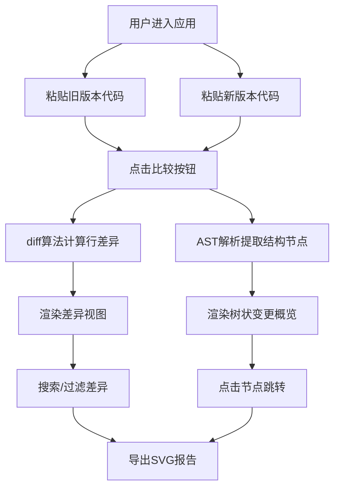

## 1. 产品概述
代码差异可视化对比工具，帮助前端开发者在线对比任意两个 JavaScript/TypeScript 代码片段差异并生成可视化的树状变更概览图。
- 解决代码审查或版本升级时，逐行对比两份代码差异后难以直观把握整体结构变化的问题
- 目标用户为前端开发者、代码审查人员，提升代码评审效率和变更理解能力

## 2. 核心功能

### 2.1 用户角色
| 角色 | 注册方式 | 核心权限 |
|------|----------|----------|
| 开发者 | 无需注册，直接使用 | 粘贴代码、对比差异、查看树状概览、导出报告 |

### 2.2 功能模块
1. **代码输入与差异计算**：左右双栏代码编辑器，支持 JS/TS，基于 LD 算法计算编辑距离并高亮差异
2. **树状结构变更概览图**：基于 AST 对比的可折叠树形结构，展示函数/类/模块变更
3. **差异导出与共享**：导出 SVG 格式对比报告，支持拖拽分享
4. **搜索与过滤功能**：关键词搜索高亮、按变更类型过滤

### 2.3 页面详情
| 页面名称 | 模块名称 | 功能描述 |
|----------|----------|----------|
| 主应用页 | 侧边栏导航 | 深色侧边栏，包含工具logo和功能入口 |
| 主应用页 | 顶部工具栏 | 毛玻璃效果工具栏，比较按钮、导出按钮、搜索框、过滤下拉 |
| 主应用页 | 代码编辑区 | 左右双栏编辑器，左侧旧版本，右侧新版本，可拖动分隔条 |
| 主应用页 | 差异视图区 | 高亮显示新增/删除/修改/未修改行，带行号和变更符号 |
| 主应用页 | 树状概览图 | 可折叠树形结构，展示 AST 级别的结构变更 |

## 3. 核心流程
用户进入应用 → 在左右编辑器粘贴新旧代码 → 点击比较按钮 → 系统计算差异并生成 AST 树状图 → 用户可搜索/过滤差异 → 点击树节点跳转到对应差异行 → 导出 SVG 报告

## 4. 用户界面设计

### 4.1 设计风格
- 主色调：Indigo (#6366F1) 靛蓝色
- 差异高亮色：新增绿色 (#D4EDDA)、删除红色 (#F8D7DA)、修改橙色 (#FFF3CD)
- 布局：深色侧边栏 (#1E1E2E) + 浅色内容区 (#FAFAFA) 分栏布局
- 按钮：圆角 8px，主按钮靛蓝色，次要按钮浅灰色
- 字体：JetBrains Mono 等宽字体用于代码区域
- 毛玻璃效果：顶部工具栏使用 backdrop-filter: blur(12px)

### 4.2 页面设计概述
| 页面名称 | 模块名称 | UI 元素 |
|----------|----------|---------|
| 主应用页 | 侧边栏 | 深色背景、Logo、简洁导航、垂直布局 |
| 主应用页 | 顶部工具栏 | 毛玻璃半透明、比较按钮、导出按钮、搜索框、类型过滤下拉 |
| 主应用页 | 代码编辑区 | 左右分栏 45%/55%、可拖动分隔条、Monaco 编辑器 |
| 主应用页 | 差异视图区 | 行号列 (#F8F9FA 背景)、变更符号列、高亮行、等宽字体 |
| 主应用页 | 树状概览图 | 可折叠节点、圆形状态图标、展开/收起动画、点击交互 |

### 4.3 响应式设计
- 桌面端：左右分栏布局，侧边栏常驻
- 移动端 (<768px)：上下堆叠布局，侧边栏隐藏为汉堡菜单
- 触摸优化：按钮和可点击区域增大，适配手指操作

### 4.4 动效设计
- 树节点展开/收起：0.25s ease-in-out 弹性过渡
- 行过滤淡出：0.2s ease-out
- 闪烁高亮：3 次闪烁，每次 0.3 秒
- 视图切换：渐变蒙版动画 0.3s ease
- 分隔条拖动：实时响应，流畅过渡
