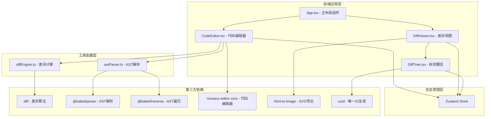

## 1. 架构设计



## 2. 技术描述
- 前端框架：React 18 + TypeScript
- 构建工具：Vite + @vitejs/plugin-react
- 代码编辑器：monaco-editor-core
- 差异算法：diff (npm包)
- AST 解析：@babel/parser + @babel/traverse
- 状态管理：Zustand
- 导出工具：html-to-image
- 工具库：uuid

## 3. 目录结构
```
src/
├── main.tsx          # 应用入口
├── App.tsx           # 主应用布局
├── components/
│   ├── CodeEditor.tsx   # 代码编辑器组件
│   ├── DiffViewer.tsx   # 差异视图组件
│   └── DiffTree.tsx     # 树状概览组件
├── utils/
│   ├── diffEngine.ts    # 差异计算工具
│   └── astParser.ts     # AST解析工具
└── store/
    └── useDiffStore.ts  # Zustand状态管理
```

## 4. 核心数据模型

### 4.1 差异行类型
```typescript
type ChangeType = 'added' | 'removed' | 'modified' | 'unchanged';

interface DiffLine {
  id: string;
  type: ChangeType;
  content: string;
  lineNumberOld: number | null;
  lineNumberNew: number | null;
}
```

### 4.2 树节点类型
```typescript
interface TreeNode {
  id: string;
  name: string;
  type: 'module' | 'class' | 'function';
  changeType: ChangeType;
  children: TreeNode[];
  startLine: number;
  endLine: number;
  expanded: boolean;
}
```

### 4.3 差异统计
```typescript
interface DiffStats {
  added: number;
  removed: number;
  modified: number;
  unchanged: number;
}
```

## 5. 状态管理 (Zustand Store)

```typescript
interface DiffState {
  oldCode: string;
  newCode: string;
  diffLines: DiffLine[];
  treeNodes: TreeNode[];
  stats: DiffStats;
  searchKeyword: string;
  filterType: ChangeType | 'all';
  isComparing: boolean;
  
  setOldCode: (code: string) => void;
  setNewCode: (code: string) => void;
  compare: () => void;
  setSearchKeyword: (keyword: string) => void;
  setFilterType: (type: ChangeType | 'all') => void;
  toggleNode: (nodeId: string) => void;
  scrollToLine: (lineNumber: number) => void;
}
```

## 6. 性能指标
- 3000行代码差异计算：≤ 1秒
- 树状变更图生成：≤ 1秒
- 搜索过滤响应：≤ 100ms
- SVG 导出：≤ 2秒
