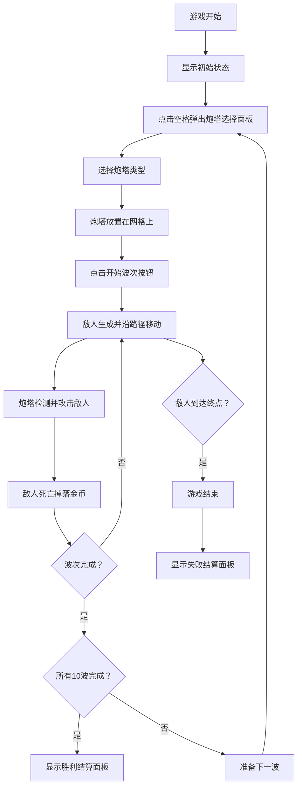

## 1. 产品概述

基于Canvas的塔防游戏原型，玩家在六边形网格地图上布置炮塔抵御波次敌人进攻，击杀敌人获取金币用于升级炮塔。

- 核心玩法：策略性炮塔布置 + 资源管理 + 波次防御
- 目标市场：休闲策略游戏玩家，展示Canvas渲染技术能力

## 2. 核心特性

### 2.1 用户角色
| 角色 | 注册方式 | 核心权限 |
|------|----------|----------|
| 玩家 | 无需注册 | 完整游戏体验 |

### 2.2 功能模块
1. **游戏主界面**：Canvas游戏画布、UI信息面板、操作按钮
2. **六边形网格系统**：20x15网格、棋盘格配色、路径绘制
3. **炮塔系统**：三种炮塔类型、扇形选择面板、攻击逻辑、弹丸系统
4. **敌人系统**：10波敌人、属性递增、路径跟随、血条显示
5. **游戏状态管理**：金币/分数系统、波次控制、游戏结算

### 2.3 页面详情
| 页面名称 | 模块名称 | 功能描述 |
|----------|----------|----------|
| 游戏主界面 | 网格渲染 | 深浅绿色交替六边形、砖红色路径、浅灰色路沿 |
| 游戏主界面 | 炮塔系统 | 扇形选择面板（半径80px，120度）、三种炮塔、攻击动画 |
| 游戏主界面 | 敌人系统 | 圆形敌人、血条显示、颜色渐变、低血量警告闪烁 |
| 游戏主界面 | UI面板 | 分数/金币显示、波次信息、开始/加速/重置按钮 |
| 游戏主界面 | 结算面板 | 半透明遮罩、最终分数、击杀数、存活波次、重开按钮 |

## 3. 核心流程

玩家进入游戏 → 查看初始金币和波次信息 → 点击空格布置炮塔 → 点击开始波次 → 敌人沿路径前进 → 炮塔自动攻击 → 击杀敌人获得金币 → 继续布置/升级炮塔 → 完成10波或失败 → 显示结算面板

## 4. 用户界面设计

### 4.1 设计风格
- **主色调**：米黄色背景 #F5E6C8，深绿色 #2D5A27，砖红色 #B54E3E
- **辅助色**：深褐色箭塔、紫色魔法塔、橙红色炮塔、金黄色金币
- **按钮风格**：深色木质纹理边框（多层box-shadow模拟），悬停放大1.05倍（0.2s过渡）
- **字体**：复古serif字体，白色文字带深色描边
- **图标**：箭塔=深褐色箭头、魔法塔=紫色闪电、炮塔=橙红色炮弹

### 4.2 页面设计概述
| 页面名称 | 模块名称 | UI元素 |
|----------|----------|--------|
| 游戏主界面 | 顶部信息栏 | 左侧：分数（24px白色带描边）、金币（金黄色硬币图标+数字）；右侧：波次信息"Wave X/10" |
| 游戏主界面 | 底部操作栏 | 开始波次按钮（深绿色白字）、加速按钮（双右箭头图标）、重置按钮（红色白字） |
| 游戏主界面 | 炮塔选择面板 | 半圆扇形（半径80px，120度向上展开），三个炮塔图标均匀分布 |
| 游戏主界面 | 结算面板 | 半透明黑色遮罩，中央白色面板，显示最终分数/击杀数/存活波次，重新开始按钮 |

### 4.3 响应性
- 桌面端优先设计，Canvas固定尺寸适配网格大小
- 交互元素足够大确保可点击性
- 支持鼠标悬停和点击反馈

### 4.4 视觉特效
- 炮塔选中：基座下方金色半透明圆环脉动动画（周期1s）
- 弹丸命中：6个白色粒子随机方向扩散，0.3s后消失
- 敌人低血量：黄色闪烁警告（生命值<50%）
- 炮口旋转：追踪最近敌人时平滑旋转
