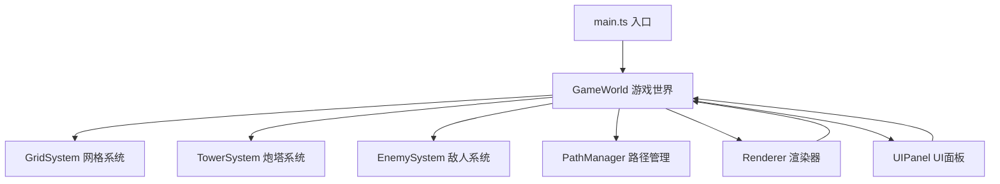

## 1. 架构设计



## 2. 技术描述
- **前端框架**：原生 TypeScript + Vite（无React/Vue框架，纯Canvas实现）
- **构建工具**：Vite 5.x
- **语言**：TypeScript 5.x（严格模式）
- **渲染**：HTML5 Canvas 2D API
- **状态管理**：GameWorld 类集中管理
- **UI层**：HTML + CSS（div#ui-layer）

## 3. 文件结构

```
├── package.json
├── vite.config.js
├── tsconfig.json
├── index.html
└── src/
    ├── main.ts                    # 应用入口，游戏循环
    ├── game/
    │   ├── GameWorld.ts           # 游戏全局状态管理
    │   ├── GridSystem.ts          # 六边形网格管理
    │   ├── TowerSystem.ts         # 炮塔管理
    │   ├── EnemySystem.ts         # 敌人管理
    │   └── PathManager.ts         # 路径定义和跟随
    ├── renderer/
    │   └── Renderer.ts            # Canvas渲染器
    └── ui/
        └── UIPanel.ts             # UI管理
```

## 4. 核心类定义

### 4.1 类型定义

```typescript
// 六边形坐标
interface HexCoord {
  q: number;  // 列
  r: number;  // 行
}

// 像素坐标
interface Point {
  x: number;
  y: number;
}

// 炮塔类型
type TowerType = 'arrow' | 'magic' | 'cannon';

// 炮塔配置
interface TowerConfig {
  type: TowerType;
  name: string;
  damage: number;
  range: number;
  attackSpeed: number;  // 攻击间隔秒数
  cost: number;
  color: string;
}

// 炮塔实例
interface Tower {
  id: number;
  type: TowerType;
  hexCoord: HexCoord;
  position: Point;
  damage: number;
  range: number;
  attackSpeed: number;
  lastAttackTime: number;
  angle: number;  // 炮口角度
  targetId: number | null;
}

// 敌人实例
interface Enemy {
  id: number;
  health: number;
  maxHealth: number;
  speed: number;
  pathProgress: number;  // 路径进度 0-1
  position: Point;
  color: string;
  wave: number;
  isLowHealth: boolean;
  lastFlashTime: number;
}

// 弹丸实例
interface Projectile {
  id: number;
  position: Point;
  targetId: number;
  damage: number;
  speed: number;
  color: string;
  towerType: TowerType;
}

// 粒子特效
interface Particle {
  id: number;
  position: Point;
  velocity: Point;
  life: number;
  maxLife: number;
  color: string;
  size: number;
}

// 游戏状态
type GameState = 'idle' | 'waveActive' | 'paused' | 'gameOver' | 'victory';
```

### 4.2 类接口定义

```typescript
// GameWorld
class GameWorld {
  grid: GridSystem;
  towerSystem: TowerSystem;
  enemySystem: EnemySystem;
  pathManager: PathManager;
  state: GameState;
  gold: number;
  score: number;
  currentWave: number;
  totalWaves: number;
  gameSpeed: number;
  killCount: number;

  constructor(canvas: HTMLCanvasElement);
  update(deltaTime: number): void;
  startWave(): void;
  reset(): void;
  toggleSpeed(): void;
  placeTower(hex: HexCoord, type: TowerType): boolean;
}

// GridSystem
class GridSystem {
  cols: number;  // 20
  rows: number;  // 15
  hexSize: number;  // 24px
  hexes: Map<string, HexCell>;
  pathHexes: Set<string>;

  constructor(cols: number, rows: number, hexSize: number);
  hexToPixel(hex: HexCoord): Point;
  pixelToHex(point: Point): HexCoord;
  isPathHex(hex: HexCoord): boolean;
  isOccupied(hex: HexCoord): boolean;
  getHexKey(hex: HexCoord): string;
}

// TowerSystem
class TowerSystem {
  towers: Tower[];
  projectiles: Projectile[];
  selectedTowerId: number | null;

  constructor();
  addTower(type: TowerType, hex: HexCoord, position: Point): Tower;
  update(deltaTime: number, enemies: Enemy[], now: number): void;
  findTarget(tower: Tower, enemies: Enemy[]): Enemy | null;
  fireProjectile(tower: Tower, target: Enemy): void;
}

// EnemySystem
class EnemySystem {
  enemies: Enemy[];
  particles: Particle[];
  spawnQueue: Array<{ delay: number; wave: number }>;
  spawnTimer: number;

  constructor(pathManager: PathManager);
  startWave(waveNumber: number): void;
  update(deltaTime: number, goldCallback: (amount: number) => void): void;
  getEnemyById(id: number): Enemy | undefined;
  getEnemiesInRange(position: Point, range: number): Enemy[];
}

// PathManager
class PathManager {
  pathPoints: Point[];
  totalLength: number;

  constructor(hexSize: number);
  getPositionAtProgress(progress: number): Point;
  getSegmentLength(progress: number): number;
}

// Renderer
class Renderer {
  ctx: CanvasRenderingContext2D;
  canvas: HTMLCanvasElement;

  constructor(canvas: HTMLCanvasElement);
  render(world: GameWorld): void;
  private drawGrid(grid: GridSystem): void;
  private drawTowers(towers: Tower[], selectedId: number | null, time: number): void;
  private drawEnemies(enemies: Enemy[]): void;
  private drawProjectiles(projectiles: Projectile[]): void;
  private drawParticles(particles: Particle[]): void;
}

// UIPanel
class UIPanel {
  world: GameWorld;
  uiLayer: HTMLElement;
  selectedHex: HexCoord | null;

  constructor(uiLayer: HTMLElement, world: GameWorld);
  update(): void;
  showTowerSelector(position: Point, hex: HexCoord): void;
  hideTowerSelector(): void;
  showGameOver(victory: boolean, score: number, kills: number, wave: number): void;
  hideGameOver(): void;
}
```

## 5. 性能优化策略

1. **渲染优化**：
   - 分批绘制相似元素，减少Canvas状态切换
   - 网格静态元素一次性绘制到离屏Canvas缓存
   - 弹丸和粒子数量控制在200个以内

2. **逻辑优化**：
   - 空间分区查询（简单网格索引）加速敌人射程检测
   - 对象池复用弹丸和粒子对象
   - 每帧更新采用增量时间（deltaTime）

3. **帧率保障**：
   - 60FPS目标，通过requestAnimationFrame驱动
   - 复杂计算分摊到多帧
   - 性能监控：50敌人+30炮塔时≥55FPS

## 6. 常量配置

```typescript
// 网格配置
const GRID_COLS = 20;
const GRID_ROWS = 15;
const HEX_SIZE = 24;

// 炮塔配置
const TOWER_CONFIGS: Record<TowerType, TowerConfig> = {
  arrow: { damage: 15, range: 120, attackSpeed: 1.5, cost: 50, color: '#4A3728' },
  magic: { damage: 40, range: 100, attackSpeed: 3.0, cost: 100, color: '#8B5CF6' },
  cannon: { damage: 60, range: 80, attackSpeed: 4.0, cost: 150, color: '#DC2626' },
};

// 敌人配置
const BASE_ENEMY_HEALTH = 50;
const BASE_ENEMY_SPEED = 60;
const HEALTH_PER_WAVE = 15;
const SPEED_PER_WAVE = 2;
const ENEMY_RADIUS = 8;

// 波次配置
const TOTAL_WAVES = 10;
const BASE_ENEMIES_PER_WAVE = 5;
const ENEMIES_INCREMENT = 3;
const SPAWN_INTERVAL = 1.0;

// 颜色配置
const COLORS = {
  background: '#F5E6C8',
  gridLight: '#7CB342',
  gridDark: '#558B2F',
  gridLine: '#C8B896',
  path: '#B54E3E',
  pathEdge: '#D3D3D3',
  towerBase: '#333333',
  gold: '#FFD700',
  healthGreen: '#22C55E',
  healthRed: '#EF4444',
  healthYellow: '#EAB308',
};
```
