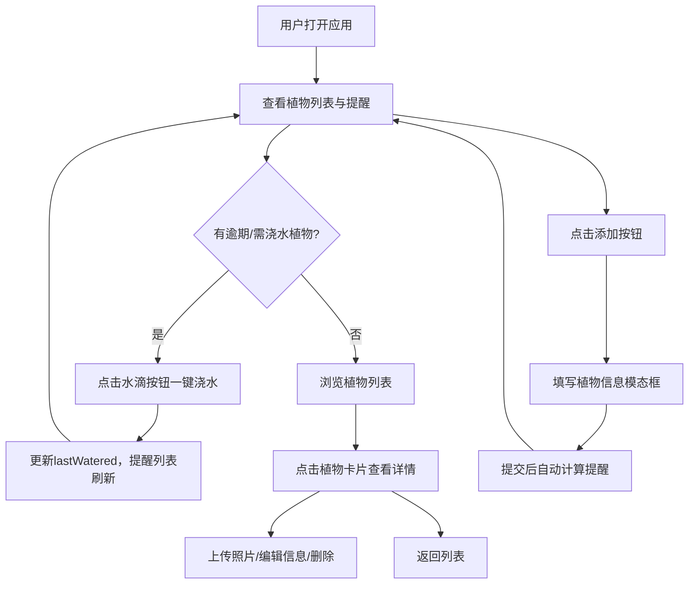

## 1. 产品概述

阳台照料助手是一款面向家庭阳台植物爱好者的在线护理与浇水提醒应用，帮助用户登记每盆植物的品种、位置、浇水频率和上次浇水时间，系统根据预设间隔自动判断需浇水植物并按优先级排序，支持一键标记浇水完成和上传植物照片记录生长变化。

- 解决家庭养花因出差或遗忘导致植物萎蔫的痛点
- 目标用户为有阳台种植习惯的家庭用户，提供轻量化的植物管理体验

## 2. 核心功能

### 2.1 用户角色

| 角色 | 注册方式 | 核心权限 |
|------|----------|----------|
| 普通用户 | 无需注册，直接使用 | 管理植物、查看提醒、上传照片 |

### 2.2 功能模块

1. **主页面**：植物列表区域（左侧1/3）+ 提醒列表 + 当前选中植物详情区域（右侧2/3）
2. **植物详情页**：植物照片展示（瀑布流）+ 详细信息 + 操作按钮（浇水、拍照、编辑、删除）

### 2.3 页面详情

| 页面名称 | 模块名称 | 功能描述 |
|----------|----------|----------|
| 主页面 | 顶部导航栏 | 固定高度60px，浅绿色背景，带阴影，包含应用标题、搜索框、排序下拉、添加植物按钮 |
| 主页面 | 植物列表区域 | 左侧1/3占满高度可滚动，淡绿渐变背景，展示植物卡片列表，支持排序筛选和搜索 |
| 主页面 | 提醒列表 | 嵌入植物列表顶部或侧边，按优先级展示需浇水植物，逾期/即将到期不同图标和竖条颜色 |
| 主页面 | 植物详情区域 | 右侧2/3占满高度，上半部分照片区域（瀑布流历史照片），下半部分详细信息和操作按钮 |
| 植物添加模态框 | 添加表单 | 模态框从下向上0.3秒滑入动画，半透明遮罩，包含名称、品种下拉、位置选择、浇水频率、照片上传 |
| 浇水提醒 | 一键浇水 | 提醒项右侧水滴图标按钮，点击更新lastWatered为当前时间，0.5秒"已浇水"绿色提示淡出 |
| 植物拍照 | 照片上传 | 相机图标按钮调用摄像头或选择本地图片，瀑布流展示历史照片，最新在前，右下角标注日期 |

## 3. 核心流程

用户打开应用 → 查看植物列表和浇水提醒 → 点击提醒项或植物卡片查看详情 → 一键标记浇水完成 → 提醒列表实时刷新 → 添加新植物 → 系统自动计算提醒 → 上传植物照片记录生长

## 4. 用户界面设计

### 4.1 设计风格

- 主色：#7ECB7E（清新绿），辅助色：#F5F5DC（米白），强调色：#FF8C00（橙色，高紧迫度提醒）
- 文字色：#333333，背景：60度角从淡绿到白色线性渐变
- 按钮：主色#7ECB7E，圆角8px，悬停#5A9E5A，0.3秒背景色过渡
- 卡片：圆角16px，阴影2px rgba(0,0,0,0.1)，hover阴影提升到6px
- 字体：系统默认无衬线字体
- 图标风格：lucide-react线性图标

### 4.2 页面设计概览

| 页面名称 | 模块名称 | UI元素 |
|----------|----------|--------|
| 主页面 | 顶部导航栏 | 浅绿色背景，60px高度，0.5px阴影，左侧标题，中间搜索框，右侧排序下拉和添加按钮 |
| 主页面 | 植物列表 | 淡绿渐变背景，植物卡片纵向排列，每卡片左侧状态竖条（绿/黄/红），圆角16px淡绿到白色渐变 |
| 主页面 | 提醒列表 | 逾期项左侧2px橙色竖条+橙色危险三角图标，即将到期2px黄色竖条+蓝色时钟图标，hover淡黄背景 |
| 主页面 | 植物详情 | 上半部照片瀑布流（0.3秒淡入），下半部信息+操作按钮，水滴浇水按钮/相机拍照按钮 |
| 添加模态框 | 表单 | 半透明遮罩，从下向上0.3秒滑入，名称输入/品种下拉/位置选择/频率输入/照片上传 |

### 4.3 响应式设计

- 桌面端（≥768px）：左右分栏布局（1/3列表 + 2/3详情）
- 平板端（480px-768px）：上下结构，列表在上，详情在下，各占一半高度
- 手机端（<480px）：全屏切换模式，底部Tab栏在"我的植物"和"植物详情"之间切换

### 4.4 交互与动画

- 所有卡片和按钮0.3秒hover过渡动画
- 排序切换时列表项0.5秒错开入场动画（每卡片延迟0.1秒）
- 提醒列表中逾期项文字透明度随逾期时长从1渐变到0.5
- 浇水完成后0.5秒"已浇水"绿色文字提示并淡出
- 照片切换0.3秒淡入动画
- 添加模态框从下向上0.3秒滑入动画
