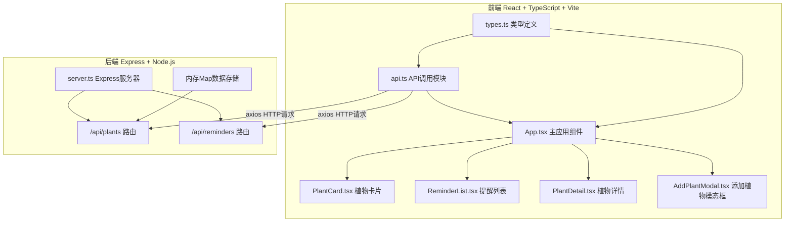
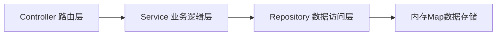
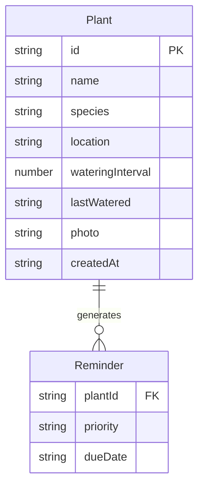

## 1. 架构设计



## 2. 技术说明

- 前端：React@18 + TypeScript + Vite + Tailwind CSS + Zustand
- 初始化工具：vite-init（react-express-ts模板）
- 后端：Express@4 + cors + uuid
- 数据库：内存Map（每次启动预填充2个示例植物）

## 3. 路由定义

| 路由 | 用途 |
|------|------|
| / | 主页面，包含植物列表、提醒列表和植物详情 |

## 4. API定义

### 4.1 植物管理API

| 方法 | 路径 | 请求体 | 响应 | 用途 |
|------|------|--------|------|------|
| GET | /api/plants | - | Plant[] | 获取所有植物 |
| GET | /api/plants/:id | - | Plant | 获取单个植物 |
| POST | /api/plants | Plant（不含id和createdAt） | Plant | 新增植物 |
| PUT | /api/plants/:id | Partial\<Plant\> | Plant | 更新植物 |
| DELETE | /api/plants/:id | - | {success: boolean} | 删除植物 |

### 4.2 提醒API

| 方法 | 路径 | 请求体 | 响应 | 用途 |
|------|------|--------|------|------|
| GET | /api/reminders | - | Reminder[] | 获取当前所有需提醒的植物及优先级 |

### 4.3 TypeScript类型定义

```typescript
interface Plant {
  id: string;
  name: string;
  species: string;
  location: '南' | '东' | '西' | '北';
  wateringInterval: number;
  lastWatered: string;
  photo: string;
  createdAt: string;
}

interface Reminder {
  plantId: string;
  priority: '高' | '中' | '低';
  dueDate: string;
}
```

## 5. 服务器架构图



## 6. 数据模型

### 6.1 数据模型定义



### 6.2 初始数据

启动时预填充2个示例植物：
1. 绿萝 - 南阳台 - 3天浇水一次
2. 多肉 - 东阳台 - 7天浇水一次
