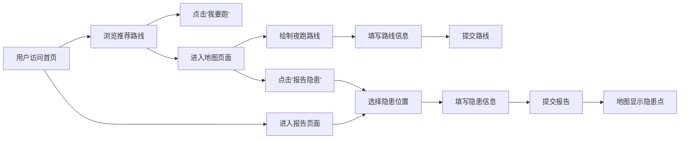

## 1. 产品概述

城市夜跑安全地图是一个专为夜跑爱好者设计的安全共享平台，解决夜跑者对路线治安和照明条件的担忧。通过跑者共享路线安全评级、照明情况，以及实时报告安全隐患，让每位跑者都能安心夜跑。

- 核心目标：提供可视化的夜跑安全信息平台，降低夜跑安全风险
- 目标用户：城市夜跑爱好者、健身人群、夜间户外活动者
- 市场价值：填补夜间户外活动安全信息共享的空白，打造社区化安全生态

## 2. 核心功能

### 2.1 用户角色
| 角色 | 注册方式 | 核心权限 |
|------|----------|----------|
| 普通用户 | 无需注册（模拟登录状态） | 查看路线、绘制路线、报告隐患、浏览推荐路线 |

### 2.2 功能模块
1. **首页**：推荐路线列表、卡片展示、安全排序
2. **地图页面**：交互式地图、路线绘制、隐患标记、动画效果
3. **报告页面**：隐患定位、类型选择、严重程度评级、提交反馈

### 2.3 页面详情
| 页面名称 | 模块名称 | 功能描述 |
|----------|----------|----------|
| 首页 | 路线卡片网格 | 展示推荐路线，按安全评级和报告数排序，支持悬停效果 |
| 首页 | 路线卡片 | 缩略地图、路线名称、距离、照明星级、用户标签、"我要跑"按钮 |
| 地图页面 | 地图容器 | Leaflet 交互式地图，支持缩放、拖动、点击绘制路线 |
| 地图页面 | 路线绘制 | 半透明荧光绿折线，0.5秒呼吸动画，实时距离计算 |
| 地图页面 | 路线表单 | 名称、距离、照明/安全评级（1-5星）、路线类型选择 |
| 地图页面 | 隐患标记 | 红色脉冲波纹动画，支持 GPS 定位或手动选点 |
| 报告页面 | 定位地图 | 内嵌地图，点击选择隐患位置 |
| 报告页面 | 隐患表单 | 类型选择（路灯损坏/流浪狗/可疑人员/路面坑洼）、严重程度（低/中/高） |

## 3. 核心流程

用户主要流程：
1. 首页浏览推荐路线，按安全评级排序
2. 点击路线卡片的"我要跑"按钮标记计划跑步
3. 进入地图页面，点击绘制路线，填写评级信息后提交
4. 在地图上发现隐患时，点击报告按钮，定位并填写信息
5. 隐患报告提交后5分钟内对所有用户可见

## 4. 用户界面设计

### 4.1 设计风格
- 主色调：深蓝色 #1a2332（夜晚主题，营造安全氛围）
- 强调色：荧光绿 #00ff88（代表安全、活力）
- 卡片样式：圆角 14px，半透明毛玻璃背景（backdrop-filter: blur(10px)）
- 按钮样式：圆角设计，悬停有缩放和颜色过渡动画
- 字体：现代无衬线字体，深色背景下高对比度白色文字
- 图标风格：线性图标，金色星星评级，红色隐患标记

### 4.2 页面设计概述
| 页面名称 | 模块名称 | UI 元素 |
|----------|----------|----------|
| 首页 | 路线卡片网格 | 响应式 Grid 布局，2-4 列自适应，卡片悬停 0.3 秒渐变荧光绿背景 |
| 首页 | 路线卡片 | 左侧缩略地图，右侧信息区，底部"我要跑"按钮（点击变绿色对勾） |
| 地图页面 | 地图容器 | 全屏地图，顶部导航栏，底部工具栏 |
| 地图页面 | 绘制折线 | 半透明荧光绿，0.5 秒呼吸动画（opacity 0.4-0.8 循环） |
| 地图页面 | 评级组件 | 5 颗星星，点击选中金色填充，0.2 秒脉冲缩放动画 |
| 地图页面 | 隐患标记 | 红色半透明圆形，脉冲波纹动画向外扩散 |
| 报告页面 | 严重程度按钮 | 黄/橙/红三色背景，选中放大 1.1 倍，0.3 秒过渡 |

### 4.3 响应式设计
- 桌面端（≥1200px）：首页 4 列卡片网格，地图侧边栏信息面板
- 平板端（768-1199px）：首页 2-3 列卡片网格，信息面板半屏显示
- 移动端（<768px）：首页单列卡片布局，地图全屏显示，底部导航栏

### 4.4 动画效果
- 路线呼吸动画：`@keyframes breathe { 0%, 100% { opacity: 0.4; } 50% { opacity: 0.8; } }` 周期 0.5 秒
- 星星脉冲动画：`@keyframes pulse { 0%, 100% { transform: scale(1); } 50% { transform: scale(1.2); } }` 周期 0.2 秒
- 隐患波纹动画：`@keyframes ripple { 0% { transform: scale(0.8); opacity: 1; } 100% { transform: scale(2); opacity: 0; } }` 循环播放
- 按钮过渡：`transition: all 0.3s ease` 背景色和缩放变化
