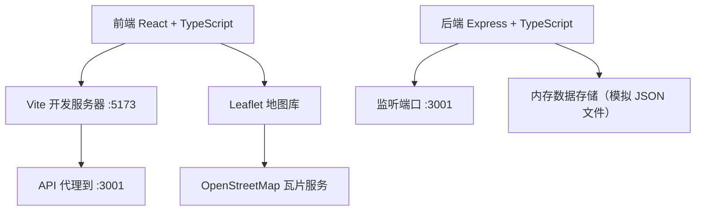
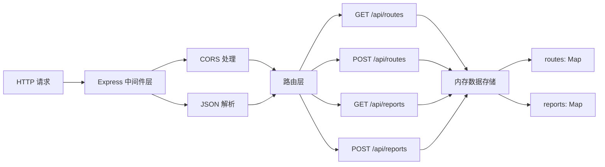
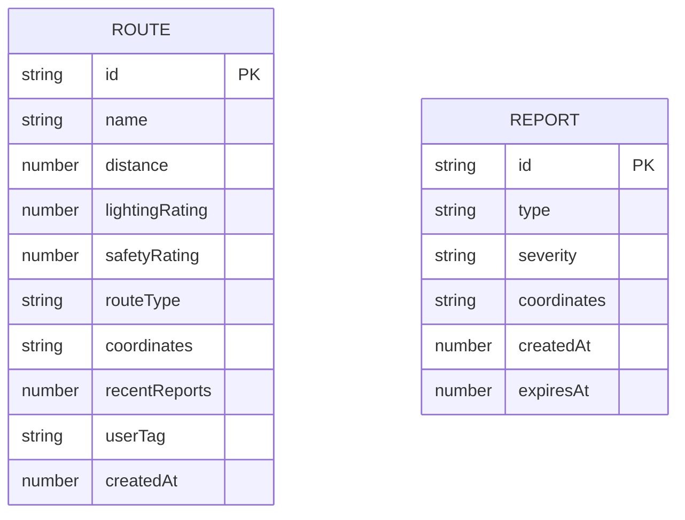

## 1. 架构设计



## 2. 技术描述

- 前端：React 18 + TypeScript + Vite + React Router DOM + Leaflet + react-leaflet
- 后端：Express 4 + TypeScript + CORS + UUID
- 地图服务：Leaflet 1.9 + react-leaflet 4 + OpenStreetMap 瓦片
- 数据存储：内存对象模拟（后续可升级为 Prisma + SQLite）
- 构建工具：Vite 5 + @vitejs/plugin-react
- 代码规范：TypeScript 严格模式

## 3. 路由定义

| 前端路由 | 页面组件 | 用途 |
|----------|----------|------|
| / | HomePage | 首页推荐路线列表 |
| /map | MapPage | 交互式地图，路线绘制和隐患报告 |
| /report | ReportPage | 隐患报告页面 |

## 4. API 定义

### 4.1 类型定义

```typescript
interface Route {
  id: string;
  name: string;
  distance: number;
  lightingRating: number;
  safetyRating: number;
  routeType: 'riverside' | 'park' | 'street';
  coordinates: [number, number][];
  recentReports: number;
  userTag?: string;
  createdAt: number;
}

interface Report {
  id: string;
  type: 'streetlight' | 'stray_dog' | 'suspicious' | 'pothole';
  severity: 'low' | 'medium' | 'high';
  coordinates: [number, number];
  createdAt: number;
  expiresAt: number;
}
```

### 4.2 接口定义

| 方法 | 路径 | 请求体 | 响应 | 用途 |
|------|------|--------|------|------|
| GET | /api/routes | - | Route[] | 获取路线列表，按安全评级降序排列 |
| POST | /api/routes | { name, distance, lightingRating, safetyRating, routeType, coordinates } | Route | 创建新路线 |
| GET | /api/reports | - | Report[] | 获取有效隐患报告列表（5分钟内） |
| POST | /api/reports | { type, severity, coordinates } | Report | 提交隐患报告 |

## 5. 服务器架构图



## 6. 数据模型

### 6.1 数据模型定义



### 6.2 项目文件结构

```
auto36/
├── package.json
├── index.html
├── tsconfig.json
├── vite.config.js
├── server/
│   └── src/
│       └── index.ts
└── client/
    └── src/
        ├── App.tsx
        ├── types.ts
        ├── styles/
        │   └── global.css
        ├── pages/
        │   ├── HomePage.tsx
        │   ├── MapPage.tsx
        │   └── ReportPage.tsx
        └── components/
            └── RouteCard.tsx
```

## 7. 性能优化要求

- 地图交互帧率 ≥ 30FPS
- 路线绘制响应延迟 ≤ 150ms
- 使用 CSS 动画而非 JS 动画确保流畅性
- 内存存储定期清理过期隐患报告
- 响应式布局避免重排重绘
