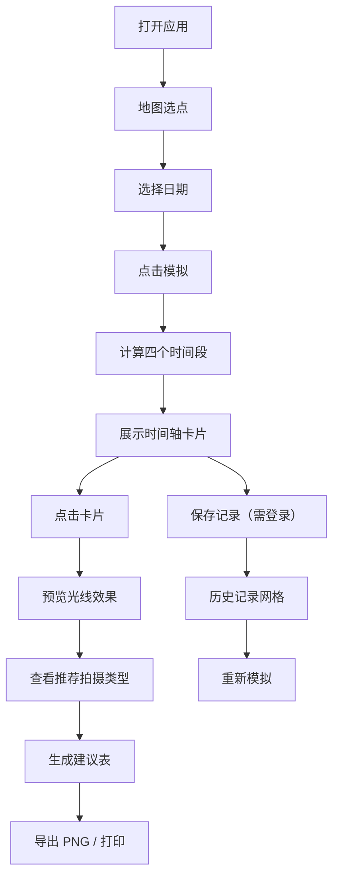

## 1. 产品概述

旅行摄影光线预览工具，帮助摄影爱好者在出行前预览不同时间段的光线效果，生成拍照时间建议表，避免因时间估算错误错过最佳光线窗口。

- 目标用户：摄影爱好者、旅行摄影师
- 核心价值：精确计算日出/日落/黄金时刻/蓝色时刻，可视化模拟光线效果，生成可打印的建议表
- 产品定位：摄影出行规划辅助工具

## 2. 核心功能

### 2.1 用户角色

| 角色 | 注册方式 | 核心权限 |
|------|----------|----------|
| 游客用户 | 无需注册 | 使用地图选点、光线模拟、生成建议表 |
| 注册用户 | 用户名+密码注册 | 保存历史模拟记录、查看历史记录、重新模拟 |

### 2.2 功能模块

1. **地图页面**：Leaflet 地图选点、日期滑块、模拟按钮、生成建议表按钮
2. **时间轴卡片**：四个时间段卡片展示（清晨、正午、黄昏、夜晚）
3. **光线预览区**：半透明径向渐变模拟环境光照效果，星星粒子动画
4. **推荐信息面板**：展示当前时间段推荐拍摄类型
5. **建议表页面**：可打印排版、导出为 PNG 图片
6. **用户认证**：登录/注册表单
7. **历史记录**：网格卡片展示最近 10 条记录，支持重新模拟

### 2.3 页面详情

| 页面名称 | 模块名称 | 功能描述 |
|----------|----------|----------|
| 地图主页 | 控制面板 | 日期滑块（未来 30 天）、模拟按钮、生成建议表按钮 |
| 地图主页 | 地图区域 | Leaflet 交互地图，点击选点 |
| 地图主页 | 时间轴卡片 | 四个并列卡片，显示时间段名称、emoji、时间范围，渐变背景 |
| 地图主页 | 光线预览区 | 点击卡片后显示模拟光照效果，淡入动画 |
| 地图主页 | 信息面板 | 推荐拍摄类型（风景/人像/长曝光等） |
| 建议表页面 | 建议表内容 | 地点、日期、四个时间段详细信息，圆形色标 |
| 建议表页面 | 导出按钮 | html-to-image 导出为 PNG 并下载 |
| 登录页 | 登录表单 | 用户名、密码输入，登录跳转 |
| 注册页 | 注册表单 | 用户名、密码输入，注册跳转 |
| 首页/历史记录 | 记录网格 | 10 张历史卡片，地图缩略图、日期、最佳时间段、重新模拟按钮 |

## 3. 核心流程

用户打开应用 → 在地图上点击选择目标地点 → 拖动滑块选择未来 30 天内的日期 → 点击模拟按钮 → 系统计算日出/日落/黄金时刻/蓝色时刻 → 展示四个时间轴卡片 → 点击卡片预览光线效果和推荐拍摄类型 → 点击生成建议表 → 进入建议表页面查看排版 → 导出为 PNG 图片 / 打印

注册用户可保存当前模拟记录 → 返回首页查看历史记录网格 → 点击重新模拟快速载入参数

## 4. 用户界面设计

### 4.1 设计风格

- **主题色**：深色主题
  - 背景色：#1a1a2e
  - 卡片背景：#16213e
  - 主色调：#0f3460
  - 高亮色：#e94560
- **按钮样式**：圆角矩形，0.15 秒缩放反馈，0.2 秒过渡动画
- **字体**：系统无衬线字体（-apple-system, BlinkMacSystemFont, "Segoe UI", Roboto, sans-serif）
- **布局风格**：左中右三栏结构（桌面端），单栏布局（移动端 <768px）
- **图标/emoji**：使用 emoji 图标区分时间段（🌅清晨 ☀️正午 🌇黄昏 🌙夜晚）

### 4.2 页面设计概述

| 页面名称 | 模块名称 | UI 元素 |
|----------|----------|---------|
| 地图主页 | 三栏布局 | 左：控制面板、中：地图+预览区、右：信息面板 |
| 地图主页 | 时间轴卡片 | 四个并列卡片，渐变背景（深夜蓝→黄昏橙→深夜蓝），悬停反馈 |
| 地图主页 | 滑块控件 | 圆形拖拽把手（直径 20px，高亮色） |
| 地图主页 | 光线预览区 | 径向渐变叠加，0.3 秒淡入，星星粒子动画（夜晚） |
| 建议表页面 | 打印样式 | CSS @media print 优化，24px 标题深灰色 |
| 建议表页面 | 时间段条目 | 左侧圆形色标，右侧导出按钮 |
| 历史记录 | 卡片网格 | 悬停上移 4px + 阴影，0.3 秒 ease-out 过渡 |
| 历史记录 | 最佳时间段 | 加粗 14px，主色调蓝色文字 |

### 4.3 响应式

- 桌面端（≥768px）：左中右三栏布局
- 移动端（<768px）：单栏布局，控制面板置于顶部
- 触摸优化：点击区域 ≥44px，滑块拖拽手感流畅
- 性能目标：所有动画 ≥50fps，地图加载 + 模拟计算 ≤2 秒
