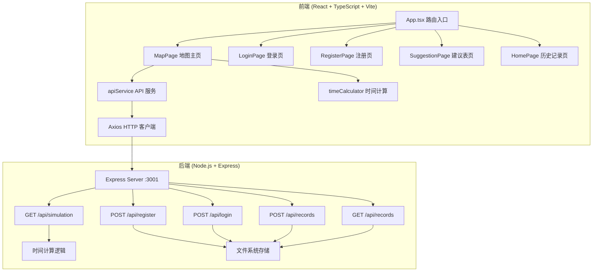
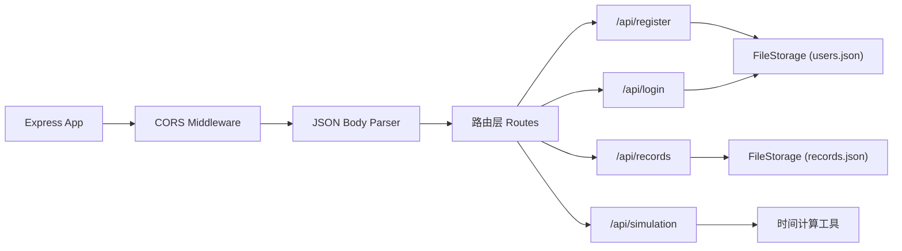
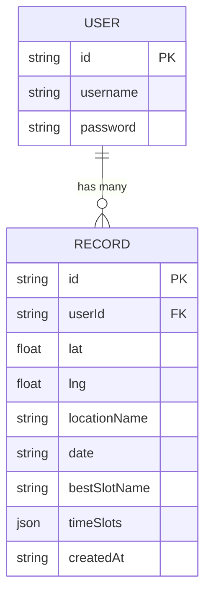

## 1. 架构设计



## 2. 技术描述

- **前端框架**：React 18 + TypeScript 5
- **构建工具**：Vite 5
- **路由**：react-router-dom 6
- **HTTP 客户端**：axios
- **地图组件**：Leaflet + react-leaflet
- **图片导出**：html-to-image
- **状态管理**：React useState/useContext（轻量场景）
- **后端框架**：Express 4
- **跨域处理**：cors
- **ID 生成**：uuid
- **数据存储**：文件系统（JSON 文件）
- **前端端口**：5173
- **后端端口**：3001

## 3. 路由定义

| 路由路径 | 页面组件 | 用途 |
|----------|----------|------|
| / | MapPage | 地图主页，核心光线模拟功能 |
| /login | LoginPage | 用户登录 |
| /register | RegisterPage | 用户注册 |
| /suggestion | SuggestionPage | 建议表展示与导出 |
| /home | HomePage | 历史记录网格 |

## 4. API 定义

### 4.1 类型定义

```typescript
interface TimeSlot {
  id: string;
  name: string;
  emoji: string;
  startTime: string;
  endTime: string;
  color: string;
  recommendedTypes: string[];
}

interface SimulationData {
  location: { lat: number; lng: number; name?: string };
  date: string;
  timeSlots: TimeSlot[];
}

interface UserRecord {
  id: string;
  userId: string;
  location: { lat: number; lng: number; name?: string };
  date: string;
  bestSlotName: string;
  timeSlots: TimeSlot[];
  createdAt: string;
}

interface User {
  id: string;
  username: string;
  password: string;
}
```

### 4.2 请求/响应

**POST /api/register**
- Request: `{ username: string, password: string }`
- Response: `{ success: boolean, userId: string, username: string }`

**POST /api/login**
- Request: `{ username: string, password: string }`
- Response: `{ success: boolean, userId: string, username: string }`

**POST /api/records**
- Request: `{ userId, location, date, bestSlotName, timeSlots }`
- Response: `{ success: boolean, recordId: string }`

**GET /api/records?userId=xxx**
- Response: `{ records: UserRecord[] }`

**GET /api/simulation?lat=&lng=&date=**
- Response: `{ timeSlots: TimeSlot[] }`

## 5. 服务器架构



## 6. 数据模型

### 6.1 ER 图



### 6.2 文件存储结构

- `server/data/users.json`：用户数组 `User[]`
- `server/data/records.json`：记录数组 `Record[]`

## 7. 项目文件结构

```
auto37/
├── package.json
├── index.html
├── vite.config.js
├── tsconfig.json
├── src/
│   ├── App.tsx
│   ├── components/
│   │   ├── MapPage.tsx
│   │   ├── LoginPage.tsx
│   │   └── RegisterPage.tsx
│   ├── pages/
│   │   └── SuggestionPage.tsx
│   ├── utils/
│   │   └── timeCalculator.ts
│   └── services/
│       └── apiService.ts
└── server/
    ├── index.js
    └── data/
        ├── users.json
        └── records.json
```
