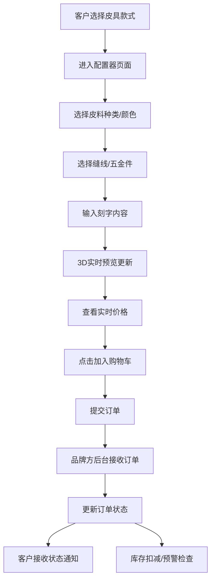

## 1. 产品概述

本项目为小手工皮具品牌打造一件起订个性化定制平台，让客户在线选择皮具款式并通过可视化配置器自由搭配皮料、颜色、缝线、五金件和刻字内容，实时预览3D效果图。品牌方在后台管理订单、生产进度和库存。

- 核心目标：提供沉浸式定制体验，降低定制门槛，提升品牌运营效率
- 目标用户：追求个性化的皮具消费者、手工皮具品牌运营者

## 2. 核心功能

### 2.1 用户角色
| 角色 | 注册方式 | 核心权限 |
|------|----------|----------|
| 客户 | 无需注册，直接使用 | 浏览款式、配置皮具、3D预览、下单 |
| 品牌管理员 | 后台登录 | 订单管理、状态更新、库存预警、消息记录 |

### 2.2 功能模块
1. **在线配置器**：款式选择、组件配置、3D实时预览、价格计算、加入购物车
2. **订单管理**：订单列表、状态变更、筛选排序、生产追踪
3. **库存预警**：低库存物料通知、阈值配置、全局通知条
4. **通知消息**：订单确认邮件、状态更新通知、发送记录查询

### 2.3 页面详情
| 页面名称 | 模块名称 | 功能描述 |
|---------|----------|----------|
| 配置器页 | 款式选择 | 展示钱包、手环、卡包等款式卡片，点击进入配置 |
| 配置器页 | 组件列表 | 皮料分组展示（含纹理预览）、颜色圆形色块、缝线颜色、五金件选择、刻字输入 |
| 配置器页 | 3D预览区 | Three.js渲染，自动缓慢自转，配置切换平滑过渡0.5s ease-out |
| 配置器页 | 价格摘要 | 实时价格计算、配置摘要展示、加入购物车按钮（缩放动画0.2s） |
| 后台管理页 | 订单表格 | 订单号、客户名、配置摘要（前50字符）、金额、状态标签、操作人、时间戳 |
| 后台管理页 | 状态管理 | 彩色状态标签（待确认#FF9800、生产中#2196F3、质检中#9C27B0、已发货#4CAF50、已完成#9E9E9E），下拉快速更改 |
| 后台管理页 | 库存预警 | 顶部全局通知条（红色背景，滑入动画0.3s ease），点击展开低库存列表 |
| 后台管理页 | 消息记录 | 最近30天通知发送记录列表 |

## 3. 核心流程

## 4. 用户界面设计

### 4.1 设计风格
- **主色调**：深棕色#5D4037
- **辅助色**：米色#D7CCC8
- **强调色**：焦橙色#FF7043
- **背景色**：浅米色#EFEBE9
- **悬停色**：极浅棕色#F5F0EB
- **字体**：系统字体 sans-serif
- **卡片样式**：细微阴影0 2px 8px rgba(0,0,0,0.1)，圆角12px
- **按钮样式**：圆角矩形border-radius:8px，涟漪反馈效果
- **过渡动画**：所有列表项悬停0.2s ease

### 4.2 页面设计概述
| 页面名称 | 模块名称 | UI元素 |
|---------|----------|--------|
| 配置器页 | 三栏布局 | 左侧组件列表（皮料分组、颜色色块40px带check动画、缝线、五金、刻字输入）、中间3D预览区、右侧价格摘要面板 |
| 配置器页 | 3D场景 | 柔和环境光、产品居中、自动缓慢自转、配置切换平滑过渡动画 |
| 后台管理页 | 订单表格 | 表头固定、斑马纹、状态彩色标签、下拉菜单、按状态筛选、按时间排序 |
| 后台管理页 | 预警通知 | 红色背景通知条、白色感叹号图标、从顶部滑入0.3s ease、点击展开/收起 |
| 后台管理页 | 消息记录 | 卡片式列表、时间轴布局、最近30天数据 |

### 4.3 响应式设计
- 桌面端优先设计，主内容区最小宽度1200px
- 平板端：三栏布局自适应调整宽度比例
- 移动端：配置器改为上下堆叠布局，3D预览区置顶

### 4.4 3D场景设计
- **环境光**：暖色AmbientLight + 两盏方向光模拟工作室照明
- **相机设置**：PerspectiveCamera，fov=45，距离适中展示产品全貌
- **模型动画**：autoRotate速度0.5，配置变化时材质transition=0.5 ease-out
- **背景**：渐变浅米色背景，营造温暖氛围
- **交互**：OrbitControls支持拖拽旋转查看细节
- **性能**：帧率稳定30fps以上，模型面数优化

## 5. 性能要求
- 页面首次加载时间 ≤ 2秒
- 3D预览帧率 ≥ 30fps
- 配置切换响应时间 ≤ 100ms（视觉过渡0.5s）
- API响应时间 ≤ 500ms
