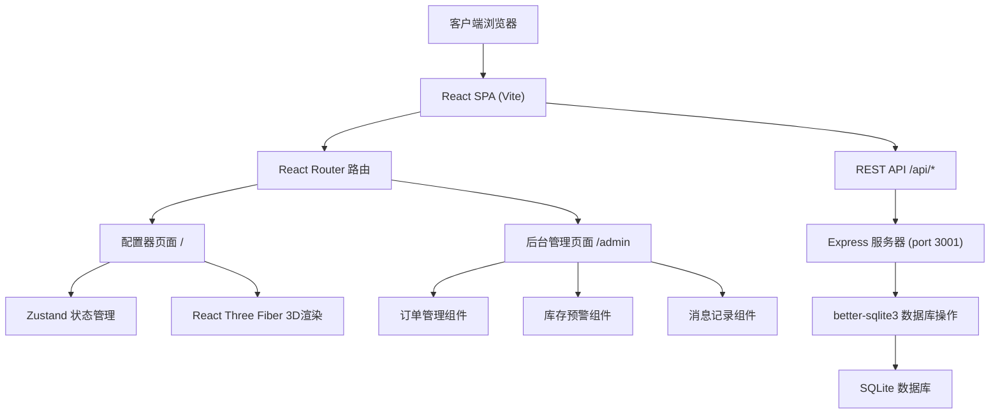
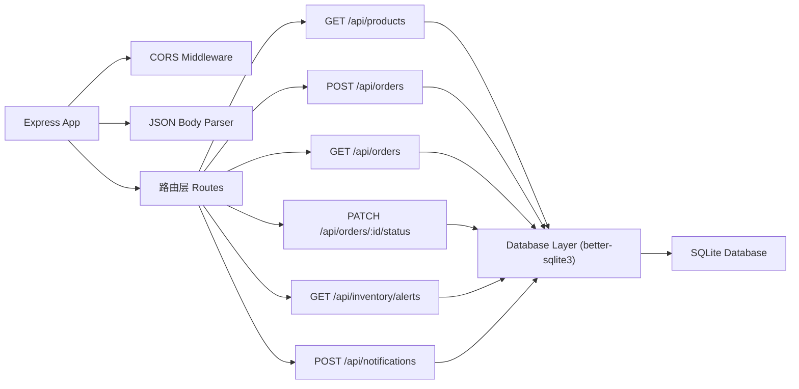
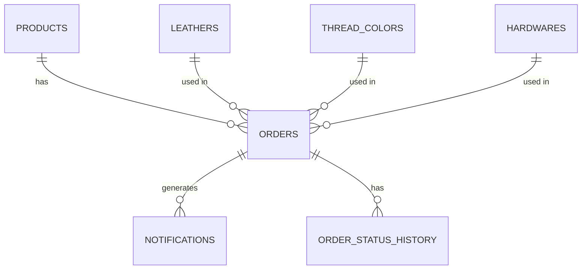

## 1. 架构设计



## 2. 技术栈说明

- **前端框架**：React 18 + TypeScript 5
- **构建工具**：Vite 5
- **3D渲染**：Three.js, @react-three/fiber, @react-three/drei
- **状态管理**：Zustand 4
- **路由管理**：react-router-dom 6
- **后端框架**：Express 4
- **数据库**：SQLite (better-sqlite3)
- **HTTP客户端**：原生fetch API
- **样式方案**：原生CSS + CSS Variables（无Tailwind）

## 3. 目录结构

```
auto4/
├── package.json
├── index.html
├── vite.config.ts
├── tsconfig.json
├── client/
│   └── src/
│       ├── App.tsx              # 路由配置
│       ├── pages/
│       │   ├── Configurator.tsx # 配置器主页面
│       │   └── Admin.tsx        # 后台管理页面
│       ├── store/
│       │   └── useConfigStore.ts # Zustand配置状态
│       ├── components/
│       │   ├── LeatherPreview3D.tsx   # 3D预览组件
│       │   ├── ComponentPanel.tsx     # 左侧组件面板
│       │   ├── PriceSummary.tsx       # 右侧价格摘要
│       │   ├── OrderTable.tsx         # 订单表格
│       │   ├── InventoryAlert.tsx     # 库存预警通知
│       │   └── NotificationList.tsx   # 消息列表
│       ├── types/
│       │   └── index.ts         # 类型定义
│       ├── utils/
│       │   └── api.ts           # API请求封装
│       └── styles/
│           └── global.css       # 全局样式
└── server/
    └── src/
        └── index.ts             # Express服务器入口
```

## 4. 路由定义

| 路由 | 页面 | 说明 |
|------|------|------|
| `/` | 配置器页面 | 皮具款式选择、3D配置、实时预览 |
| `/admin` | 后台管理页面 | 订单管理、库存预警、消息记录 |

## 5. API 接口定义

### 5.1 类型定义

```typescript
// 产品类型
interface Product {
  id: string;
  name: string;
  category: 'wallet' | 'bracelet' | 'cardholder';
  basePrice: number;
  modelPath: string;
}

// 皮料类型
interface Leather {
  id: string;
  name: string;
  type: 'cowhide' | 'sheepskin' | 'vegetable';
  color: string;
  colorName: string;
  texturePreview: string;
  priceAdd: number;
  stock: number;
  minStock: number;
}

// 缝线颜色
interface ThreadColor {
  id: string;
  name: string;
  color: string;
}

// 五金件
interface Hardware {
  id: string;
  name: string;
  type: 'zipper' | 'buckle';
  color: string;
  priceAdd: number;
}

// 配置项
interface Configuration {
  productId: string;
  leatherId: string;
  threadColorId: string;
  hardwareId: string;
  engraving: string;
}

// 订单
interface Order {
  id: string;
  orderNo: string;
  customerName: string;
  customerEmail: string;
  configuration: Configuration;
  configSummary: string;
  totalAmount: number;
  status: 'pending' | 'producing' | 'inspecting' | 'shipped' | 'completed';
  statusHistory: { status: string; operator: string; timestamp: string }[];
  createdAt: string;
  updatedAt: string;
}

// 库存预警
interface InventoryAlert {
  leatherId: string;
  leatherName: string;
  currentStock: number;
  minStock: number;
}

// 通知
interface Notification {
  id: string;
  orderId: string;
  recipient: string;
  type: 'order_confirm' | 'status_update';
  subject: string;
  content: string;
  sentAt: string;
}
```

### 5.2 接口列表

| 方法 | 路径 | 说明 | 请求 | 响应 |
|------|------|------|------|------|
| GET | `/api/products` | 获取产品列表 | - | `Product[]` |
| GET | `/api/leathers` | 获取皮料列表 | - | `Leather[]` |
| GET | `/api/threads` | 获取缝线颜色 | - | `ThreadColor[]` |
| GET | `/api/hardwares` | 获取五金件列表 | - | `Hardware[]` |
| POST | `/api/orders` | 创建订单 | `{ customerName, customerEmail, configuration, totalAmount }` | `Order` |
| GET | `/api/orders` | 获取订单列表 | `?status=&sort=` | `Order[]` |
| PATCH | `/api/orders/:id/status` | 更新订单状态 | `{ status, operator }` | `Order` |
| GET | `/api/inventory/alerts` | 获取库存预警 | - | `InventoryAlert[]` |
| GET | `/api/notifications` | 获取通知记录 | `?days=30` | `Notification[]` |
| POST | `/api/notifications` | 发送通知 | `{ orderId, type }` | `Notification` |

## 6. 服务器架构



## 7. 数据模型

### 7.1 ER图



### 7.2 DDL语句

```sql
-- 产品表
CREATE TABLE IF NOT EXISTS products (
  id TEXT PRIMARY KEY,
  name TEXT NOT NULL,
  category TEXT NOT NULL CHECK(category IN ('wallet', 'bracelet', 'cardholder')),
  basePrice REAL NOT NULL,
  modelPath TEXT NOT NULL
);

-- 皮料表
CREATE TABLE IF NOT EXISTS leathers (
  id TEXT PRIMARY KEY,
  name TEXT NOT NULL,
  type TEXT NOT NULL CHECK(type IN ('cowhide', 'sheepskin', 'vegetable')),
  color TEXT NOT NULL,
  colorName TEXT NOT NULL,
  texturePreview TEXT NOT NULL,
  priceAdd REAL NOT NULL DEFAULT 0,
  stock INTEGER NOT NULL DEFAULT 0,
  minStock INTEGER NOT NULL DEFAULT 10
);

-- 缝线颜色表
CREATE TABLE IF NOT EXISTS thread_colors (
  id TEXT PRIMARY KEY,
  name TEXT NOT NULL,
  color TEXT NOT NULL
);

-- 五金件表
CREATE TABLE IF NOT EXISTS hardwares (
  id TEXT PRIMARY KEY,
  name TEXT NOT NULL,
  type TEXT NOT NULL CHECK(type IN ('zipper', 'buckle')),
  color TEXT NOT NULL,
  priceAdd REAL NOT NULL DEFAULT 0
);

-- 订单表
CREATE TABLE IF NOT EXISTS orders (
  id TEXT PRIMARY KEY,
  orderNo TEXT UNIQUE NOT NULL,
  customerName TEXT NOT NULL,
  customerEmail TEXT NOT NULL,
  productId TEXT NOT NULL,
  leatherId TEXT NOT NULL,
  threadColorId TEXT NOT NULL,
  hardwareId TEXT NOT NULL,
  engraving TEXT NOT NULL DEFAULT '',
  configSummary TEXT NOT NULL,
  totalAmount REAL NOT NULL,
  status TEXT NOT NULL DEFAULT 'pending' CHECK(status IN ('pending', 'producing', 'inspecting', 'shipped', 'completed')),
  createdAt TEXT NOT NULL,
  updatedAt TEXT NOT NULL,
  FOREIGN KEY (productId) REFERENCES products(id),
  FOREIGN KEY (leatherId) REFERENCES leathers(id),
  FOREIGN KEY (threadColorId) REFERENCES thread_colors(id),
  FOREIGN KEY (hardwareId) REFERENCES hardwares(id)
);

-- 订单状态历史表
CREATE TABLE IF NOT EXISTS order_status_history (
  id INTEGER PRIMARY KEY AUTOINCREMENT,
  orderId TEXT NOT NULL,
  status TEXT NOT NULL,
  operator TEXT NOT NULL,
  timestamp TEXT NOT NULL,
  FOREIGN KEY (orderId) REFERENCES orders(id)
);

-- 通知表
CREATE TABLE IF NOT EXISTS notifications (
  id TEXT PRIMARY KEY,
  orderId TEXT NOT NULL,
  recipient TEXT NOT NULL,
  type TEXT NOT NULL CHECK(type IN ('order_confirm', 'status_update')),
  subject TEXT NOT NULL,
  content TEXT NOT NULL,
  sentAt TEXT NOT NULL,
  FOREIGN KEY (orderId) REFERENCES orders(id)
);

-- 初始化数据
INSERT OR IGNORE INTO products (id, name, category, basePrice, modelPath) VALUES
('wallet-001', '经典短款钱包', 'wallet', 299, 'wallet'),
('bracelet-001', '简约皮手环', 'bracelet', 129, 'bracelet'),
('cardholder-001', '复古卡包', 'cardholder', 199, 'cardholder');

INSERT OR IGNORE INTO leathers (id, name, type, color, colorName, texturePreview, priceAdd, stock, minStock) VALUES
('cow-001', '头层牛皮-深棕', 'cowhide', '#5D4037', '深棕色', 'cowhide-brown', 0, 50, 10),
('cow-002', '头层牛皮-黑色', 'cowhide', '#212121', '黑色', 'cowhide-black', 0, 45, 10),
('cow-003', '头层牛皮-酒红', 'cowhide', '#880E4F', '酒红色', 'cowhide-red', 20, 5, 10),
('sheep-001', '羊皮-米白', 'sheepskin', '#FAFAFA', '米白色', 'sheepskin-white', 30, 30, 8),
('sheep-002', '羊皮-浅粉', 'sheepskin', '#F8BBD0', '浅粉色', 'sheepskin-pink', 30, 25, 8),
('veg-001', '植鞣革-原色', 'vegetable', '#D7CCC8', '原色', 'vegetable-natural', 50, 3, 5),
('veg-002', '植鞣革-蜜色', 'vegetable', '#BCAAA4', '蜜色', 'vegetable-honey', 50, 20, 5);

INSERT OR IGNORE INTO thread_colors (id, name, color) VALUES
('t-001', '深棕', '#5D4037'),
('t-002', '黑色', '#212121'),
('t-003', '米色', '#D7CCC8'),
('t-004', '酒红', '#880E4F'),
('t-005', '焦橙', '#FF7043'),
('t-006', '金色', '#FFD54F');

INSERT OR IGNORE INTO hardwares (id, name, type, color, priceAdd) VALUES
('h-001', '黄铜拉链', 'zipper', '#FFD54F', 15),
('h-002', '枪黑拉链', 'zipper', '#424242', 15),
('h-003', '黄铜扣', 'buckle', '#FFD54F', 10),
('h-004', '银扣', 'buckle', '#E0E0E0', 10),
('h-005', '复古铜扣', 'buckle', '#8D6E63', 12);
```

## 8. 性能优化策略

1. **前端性能**
   - Vite构建，代码按需加载
   - 3D模型使用低面数几何体，材质使用基础PBR材质
   - Zustand状态分片，避免不必要的重渲染
   - 组件memo优化，配置变化时只更新相关3D材质

2. **3D性能**
   - 使用React Three Fiber的自动dispose机制
   - 材质变化使用lerp平滑过渡，避免重创建
   - 限制像素比为2，提升帧率
   - OrbitControls启用damping，交互更流畅

3. **后端性能**
   - SQLite连接池复用
   - 查询添加适当索引
   - 通知数据按时间分区查询
