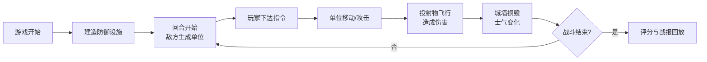

## 1. 产品概述

中世纪城堡攻防实时策略游戏，玩家在10x10网格地图上建造防御体系抵御敌军围攻，直观感受攻城器械投射轨迹、城墙破损动态与士兵士气变化对战斗进程的影响。

- 核心目标：提供沉浸式的城堡攻防战术体验，解决传统回合制策略游戏缺乏动态视觉反馈的问题
- 目标用户：策略游戏爱好者，对中世纪战争题材感兴趣的玩家
- 产品价值：实时物理投射效果 + 动态士气系统 + 可回放战报，带来丰富的战术深度和视觉冲击力

## 2. 核心功能

### 2.1 用户角色

| 角色 | 注册方式 | 核心权限 |
|------|----------|----------|
| 玩家 | 无需注册，直接进入游戏 | 建造防御、指挥单位、观看战报回放 |

### 2.2 功能模块

1. **主游戏画布**：10x10网格地图、单位与建筑渲染、投射物粒子效果
2. **资源面板**：木材/石头/金币资源显示与增长
3. **建筑面板**：城墙/箭塔/城门/兵营的建造与升级
4. **状态栏**：选中单位/建筑的详细属性与士气显示
5. **敌方AI系统**：每回合生成敌军单位、行为决策、路径规划
6. **投射物系统**：抛物线弹道计算、粒子拖尾、爆炸效果
7. **战报回放**：战斗评分、时间轴回放、战况预览

### 2.3 页面详情

| 页面名称 | 模块名称 | 功能描述 |
|----------|----------|----------|
| 游戏主界面 | 网格地图 | 10x10战场，可放置建筑和移动单位 |
| 游戏主界面 | 资源面板 | 显示木材/石头/金币数量，每回合自动增长 |
| 游戏主界面 | 建筑面板 | 垂直图标列表，选中时有金色描边脉冲动画 |
| 游戏主界面 | 状态栏 | 显示选中单位/建筑的名称、耐久度、攻击力、士气 |
| 游戏主界面 | 战报回放 | 战斗结束后显示评分和时间轴回放 |
| 游戏主界面 | 投射物特效 | 弓箭/石块/燃烧弹的抛物线轨迹与粒子效果 |

## 3. 核心流程

玩家进入游戏后，首先在己方区域建造防御设施（城墙、箭塔、城门、兵营），每回合开始时敌方AI从地图左侧生成进攻单位，玩家通过鼠标选中己方单位并右键下达移动/攻击指令，战斗过程中投射物沿抛物线飞行并造成伤害，城墙损毁显示裂痕效果，士气影响单位执行力，战斗结束后系统评分并生成可回放的战报。

## 4. 用户界面设计

### 4.1 设计风格

- **设计主题**：中世纪羊皮纸风格
- **主色调**：#D4A574（羊皮纸米色）
- **辅色调**：#8B5E3C（深棕色）
- **强调色**：#C0392B（暗红色）
- **按钮样式**：圆角矩形（8px圆角），悬停背景色渐变加深（0.2s ease），点击scale(0.95)缩放
- **字体**：衬线风格字体
- **布局风格**：中央画布（70%宽度）+ 左侧资源面板 + 右侧建筑面板 + 底部状态栏
- **视觉效果**：半透明羊皮纸纹理背景（70%不透明度）、纸张颗粒噪点、金色描边脉冲动画

### 4.2 页面设计概览

| 页面名称 | 模块名称 | UI元素 |
|----------|----------|--------|
| 游戏主界面 | 资源面板 | 三种资源图标 + 数值，羊皮纸背景，左上定位 |
| 游戏主界面 | 建筑面板 | 垂直图标列表，选中金色描边脉冲，右侧定位 |
| 游戏主界面 | 状态栏 | 名称/耐久/攻击/士气进度条，底部定位，绿到红渐变士气条 |
| 游戏主界面 | 游戏画布 | 10x10网格，单位移动范围淡蓝色圆形，攻击范围淡红色环形 |
| 游戏主界面 | 战报面板 | 评分显示，时间轴节点，战况预览缩略图 |

### 4.3 响应式设计

- 桌面端（>1024px）：左-中-右三栏布局，画布占70%宽度
- 移动端（≤1024px）：上下布局，左右面板折叠为顶部和底部固定栏，画布缩放至95%宽度
- 触摸优化：增大按钮点击区域，支持长按操作

### 4.4 动画与性能

- **帧率目标**：60fps游戏循环，UI动画不低于30fps
- **粒子系统**：每帧500个粒子上限，超量自动降低发射频率
- **操作响应**：用户操作延迟不超过100ms
- **动画效果**：移动范围淡入（0.3s）、建筑选中脉冲（0.2s）、碰撞弹开（0.1s）、爆炸粒子、碎片飞溅
