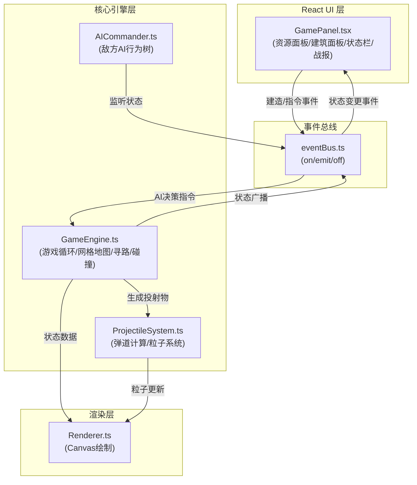

## 1. 架构设计

游戏采用模块化分层架构，核心游戏引擎与 React UI 层通过自定义事件总线解耦通信。Canvas 渲染层独立负责画面绘制，确保游戏逻辑与渲染分离。



## 2. 技术描述

- **前端框架**：React 18 + TypeScript
- **构建工具**：Vite
- **渲染引擎**：HTML5 Canvas 2D
- **状态管理**：自定义事件总线（EventBus）
- **样式方案**：CSS Modules + 内联样式（Canvas 部分）
- **寻路算法**：A* 算法
- **AI系统**：行为树（Behavior Tree）
- **粒子系统**：自定义粒子引擎

## 3. 目录结构

```
src/
├── core/
│   ├── GameEngine.ts      # 游戏主引擎
│   ├── AICommander.ts     # 敌方AI
│   └── ProjectileSystem.ts # 投射物与粒子
├── ui/
│   └── GamePanel.tsx      # React UI面板
├── canvas/
│   └── Renderer.ts        # Canvas渲染器
├── types/
│   └── index.ts           # 类型定义
├── eventBus.ts            # 事件总线
├── App.tsx
├── main.tsx
└── index.css
```

## 4. 数据模型

### 4.1 核心数据类型

```typescript
// 网格坐标
interface Position {
  x: number;
  y: number;
}

// 建筑类型
type BuildingType = 'wall_wood' | 'wall_stone' | 'wall_reinforced' | 'tower' | 'gate' | 'barracks';

// 建筑
interface Building {
  id: string;
  type: BuildingType;
  position: Position;
  durability: number;
  maxDurability: number;
  level: number;
}

// 单位类型
type UnitType = 'soldier' | 'infantry' | 'battering_ram' | 'siege_ladder';

// 单位
interface Unit {
  id: string;
  type: UnitType;
  position: Position;
  health: number;
  maxHealth: number;
  morale: number;
  speed: number;
  attack: number;
  isEnemy: boolean;
  targetPosition?: Position;
  moveProgress: number;
}

// 投射物类型
type ProjectileType = 'arrow' | 'stone' | 'fire_jar';

// 投射物
interface Projectile {
  id: string;
  type: ProjectileType;
  startPos: Position;
  endPos: Position;
  progress: number;
  speed: number;
  damage: number;
}

// 粒子
interface Particle {
  id: string;
  x: number;
  y: number;
  vx: number;
  vy: number;
  life: number;
  maxLife: number;
  size: number;
  color: string;
}

// 游戏资源
interface Resources {
  wood: number;
  stone: number;
  gold: number;
}

// 游戏状态
interface GameState {
  turn: number;
  phase: 'building' | 'combat' | 'ended';
  grid: (Building | null)[][];
  units: Unit[];
  projectiles: Projectile[];
  particles: Particle[];
  resources: Resources;
  selectedUnitId: string | null;
  selectedBuildingId: string | null;
  score: number;
  enemiesKilled: number;
}
```

### 4.2 事件定义

| 事件名 | 数据 | 方向 | 说明 |
|--------|------|------|------|
| `BUILDING_PLACE` | { type, position } | UI → Engine | 放置建筑 |
| `UNIT_MOVE` | { unitId, target } | UI → Engine | 单位移动 |
| `UNIT_ATTACK` | { unitId, targetId } | UI → Engine | 单位攻击 |
| `NEXT_TURN` | void | UI → Engine | 下一回合 |
| `STATE_UPDATED` | GameState | Engine → UI | 状态更新 |
| `GAME_ENDED` | { score, stats } | Engine → UI | 游戏结束 |
| `PROJECTILE_FIRED` | Projectile | Engine → Renderer | 发射投射物 |
| `EXPLOSION` | { position, type } | Engine → Renderer | 爆炸效果 |

## 5. 性能优化策略

1. **游戏循环**：使用 `requestAnimationFrame` 实现60fps主循环
2. **粒子池**：对象池复用粒子对象，减少GC压力
3. **脏渲染**：仅重绘变化区域，提升Canvas性能
4. **粒子上限**：每帧500个粒子上限，超量自动降低发射频率
5. **事件节流**：UI事件节流处理，确保操作响应延迟≤100ms
6. **状态快照**：战报回服用状态快照压缩存储
