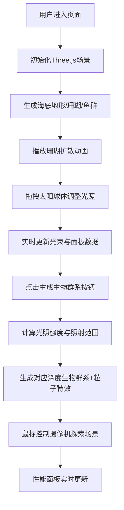

## 1. 产品概述

水下光场与生物群系交互可视化工具是一款面向海洋科学家的3D交互演示系统，解决传统静态图表无法直观展示水深、光照强度、温度与生物分布关系的问题。通过沉浸式3D场景，用户可自由探索水下环境，实时调整光照参数并观察生物群系对光线的动态反应。

## 2. 核心功能

### 2.1 用户角色
| 角色 | 注册方式 | 核心权限 |
|------|----------|----------|
| 海洋科研人员 | 无需注册，直接使用 | 场景交互、参数调整、生物群系生成、数据观察 |

### 2.2 功能模块
1. **3D水下场景**：400x400x200单位三维空间，包含起伏海底地形、渐变海水背景、珊瑚群与鱼群
2. **光照交互系统**：可拖拽太阳球体控制光束位置，实时计算光束强度、角度与能见度
3. **生物群系生成**：根据光照条件动态生成浅水/中层/深水生物群系，附带粒子特效
4. **摄像机控制**：左键旋转、右键平移、滚轮缩放，始终注视场景中心
5. **数据可视化面板**：右侧光束参数面板、左下角性能监控面板
6. **性能监控**：实时FPS、粒子数量、三角形数量统计

### 2.3 页面详情
| 页面名称 | 模块名称 | 功能描述 |
|---------|----------|---------|
| 主场景页 | 3D水下场景 | Perlin噪声生成起伏海底（高度差0-40），顶点颜色从浅沙色到深岩灰渐变 |
| 主场景页 | 珊瑚群系统 | 二十面体组合珊瑚，主体橙红#ff6633，尖端绿色#33cc66渐变，3-5个分支，0.8秒扩散动画 |
| 主场景页 | 鱼群系统 | 挤压球体鱼身，2-5个三角形尾巴，30-60条鱼螺旋游动，速度0.3-0.6单位/秒 |
| 主场景页 | 光照系统 | 金色半透明太阳球（直径8），y轴0-200范围，锥形光束随高度缩放 |
| 主场景页 | 生物群系 | 点击按钮根据光照强度生成对应生态群系，60%以上浅水鱼群、30-60%中层鱼群、30%以下深水生物 |
| 主场景页 | 粒子系统 | 不同深度对应不同粒子特效，浅水白色光点、中层微弱发光、深水#00ff88生物发光 |
| 主场景页 | UI面板 | 右侧数据面板（强度/角度/能见度），左下角性能面板（FPS/粒子数/三角形数） |

## 3. 核心流程

用户进入页面 → 3D场景自动加载并播放珊瑚扩散动画 → 拖拽太阳球体调整光照 → 观察鱼群游动与光束变化 → 点击"生成生物群系"按钮 → 系统根据光照条件在光束落点60单位半径内生成对应生物群系 → 通过鼠标控制摄像机角度探索场景 → 实时监控性能数据

## 4. 用户界面设计

### 4.1 设计风格
- **主色调**：深海蓝#000033 → 浅蓝#0099ff 渐变背景
- **强调色**：橙红#ff6633（珊瑚）、青色#00ffff（数据数值）、金色#ffd700（太阳）
- **生物发光色**：绿色#00ff88（深水生物）
- **面板样式**：深色半透明圆角矩形，#1a1a2e alpha 0.85
- **字体**：无衬线现代字体，数值使用粗体，标题使用中等字重
- **交互反馈**：数值变化0.3秒缓动动画，珊瑚生成0.8秒ease-out扩散，生物群系0.6秒粒子爆发

### 4.2 页面设计概述
| 页面名称 | 模块名称 | UI元素 |
|---------|----------|--------|
| 主场景 | 3D渲染区 | 全屏WebGL画布，渐变海水背景，起伏地形 |
| 主场景 | 太阳交互 | 金色半透明球体，拖拽光标提示，y轴移动限制 |
| 主场景 | 锥形光束 | 白色→淡黄半透明渐变，随高度动态缩放 |
| 主场景 | 右侧数据面板 | 顶部圆角背景，白色标签24px 600字重，青色数值28px 700字重，0.3秒数字缓动 |
| 主场景 | 左下角性能面板 | 黑色半透明背景（alpha 0.6），圆角8px，内边距6px，FPS低于30红色闪烁 |
| 主场景 | 生成按钮 | 醒目位置，悬停效果，点击触发群系生成 |

### 4.3 响应式
- 桌面端优先，全屏体验
- 自适应窗口大小，场景自动缩放
- 触控设备支持双指缩放与拖拽

### 4.4 3D场景指导
- **环境**：垂直渐变海水背景（顶部#0099ff，底部#000033），雾化效果随深度增强
- **光照**：环境光+方向光模拟水下散射，锥形光束使用半透明材质
- **摄像机**：透视相机，初始距离场景中心50-100单位，fov 60度
- **交互**：OrbitControls改造，左键旋转(0.002rad/像素)、右键平移(0.5单位/像素)、滚轮缩放(10-300范围)
- **后处理**：水下光散射效果，轻微体积雾
- **性能**：生物群系满载时最低30fps，合并几何体减少draw call
