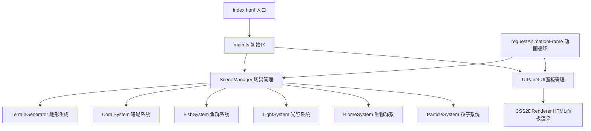

## 1. 架构设计



## 2. 技术描述

- **前端框架**：TypeScript + Vite
- **3D引擎**：Three.js (r150+)
- **UI渲染**：Three.js CSS2DRenderer
- **数学库**：Three.js内置Perlin噪声、向量运算
- **构建工具**：Vite 4.x
- **语言标准**：ES2020 / ESNext
- **无需后端**，纯前端可视化应用

## 3. 目录结构

```
auto41/
├── package.json          # 项目依赖与脚本
├── vite.config.js        # Vite配置
├── tsconfig.json         # TypeScript配置
├── index.html            # 入口HTML
└── src/
    ├── main.ts           # 项目入口
    ├── SceneManager.ts   # 核心场景管理类
    └── UIPanel.ts        # UI面板管理类
```

## 4. 核心类设计

### SceneManager 类
```typescript
class SceneManager {
  // 场景对象
  scene: THREE.Scene
  camera: THREE.PerspectiveCamera
  renderer: THREE.WebGLRenderer
  
  // 核心元素
  terrain: THREE.Mesh
  corals: THREE.Group[]
  fishSchool: THREE.Group
  sunSphere: THREE.Mesh
  lightCone: THREE.Mesh
  
  // 生物群系
  currentBiome: THREE.Group | null
  particles: THREE.Points[]
  
  // 状态
  sunY: number = 100
  lightIntensity: number
  lightAngle: number
  visibility: number
  
  // 方法
  init(): void
  createTerrain(): void
  createCorals(): void
  createFishSchool(): void
  createSunAndLight(): void
  generateBiome(): void
  update(delta: number): void
  onSunDrag(y: number): void
  getLightStats(): { intensity, angle, visibility }
  getPerformanceStats(): { fps, particles, triangles }
}
```

### UIPanel 类
```typescript
class UIPanel {
  css2dRenderer: CSS2DRenderer
  
  // 面板元素
  dataPanel: HTMLDivElement
  performancePanel: HTMLDivElement
  generateButton: HTMLButtonElement
  
  // 动画数值
  animatedIntensity: number = 0
  animatedAngle: number = 0
  animatedVisibility: number = 0
  
  // 方法
  init(sceneManager: SceneManager): void
  createDataPanel(): void
  createPerformancePanel(): void
  createGenerateButton(): void
  updateData(stats: { intensity, angle, visibility }): void
  updatePerformance(stats: { fps, particles, triangles }): void
}
```

## 5. 关键技术点

### 5.1 地形生成
- 使用`THREE.PlaneGeometry`创建400x400平面，细分64x64
- Perlin噪声计算每个顶点y值，范围0-40
- 顶点颜色根据高度从`#f4d03f`（浅沙）插值到`#424949`（深岩）
- 法线重新计算用于光照

### 5.2 鱼群动画
- 每条鱼维护：位置、螺旋中心、螺旋半径（随深度减小）、角度、速度
- 每帧更新：`angle += speed * delta`，`position = center + spiral(radius, angle, depth)`
- 鱼群整体x/z轴缓慢平移，鱼身朝向运动方向

### 5.3 粒子系统
- 使用`THREE.BufferGeometry` + `THREE.Points`批量渲染
- 每个粒子维护：位置、速度、生命周期、大小、颜色、透明度
- 浅水粒子：白色，大小0.3-0.8，生命周期1.5秒，20个/秒
- 中层粒子：淡蓝，大小0.1-0.4，生命周期2秒，10个/秒
- 深水粒子：#00ff88发光，大小0.2-0.6，生命周期3秒，15个/秒

### 5.4 摄像机控制
- 自定义Controls类，基于鼠标事件
- 左键拖拽：更新theta(绕y轴)和phi(绕x轴)角度，`target = lookAt + sphericalToCartesian(theta, phi, distance)`
- 右键拖拽：平移lookAt点，`lookAt += right * deltaX + up * deltaY`
- 滚轮：调整distance，clamp到[10, 300]

### 5.5 性能优化
- 合并珊瑚几何体，减少draw call
- 鱼群使用InstancedMesh（备选方案，如性能不足时启用）
- 粒子系统使用BufferGeometry动态更新
- 限制最大粒子数量（浅水500、中层300、深水600）
- 三角形数量统计：遍历所有Mesh，计算`geometry.index ? count/3 : position.count/3`

## 6. 依赖版本

```json
{
  "dependencies": {
    "three": "^0.160.0"
  },
  "devDependencies": {
    "@types/three": "^0.160.0",
    "typescript": "^5.3.0",
    "vite": "^5.0.0"
  }
}
```
