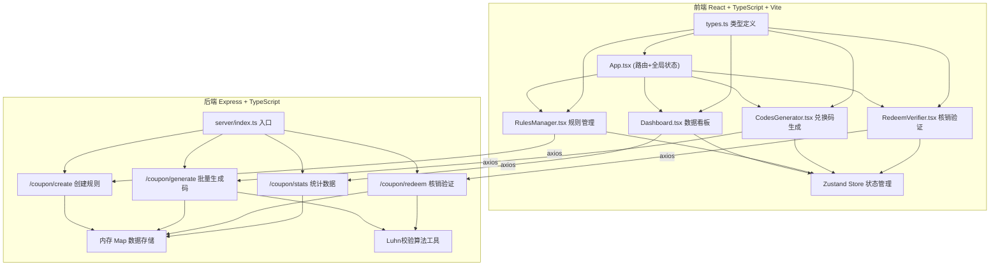
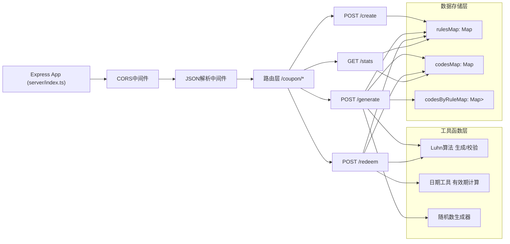
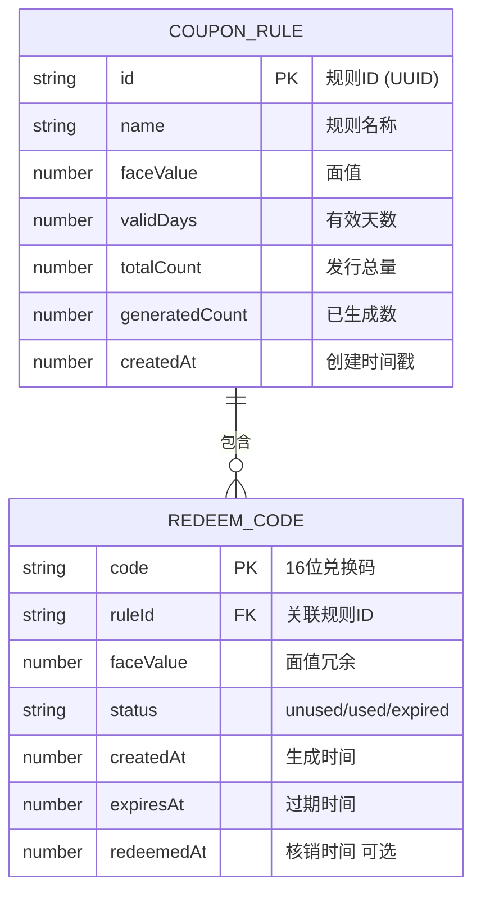

## 1. 架构设计



## 2. 技术选型说明

- **前端框架**：React 18 + TypeScript，严格模式确保类型安全
- **构建工具**：Vite，快速热更新，配置/api代理转发至后端3001端口
- **路由**：React Router DOM v6，单页应用多页面路由
- **状态管理**：Zustand，轻量级全局状态管理，管理规则列表、核销记录等共享数据
- **HTTP客户端**：Axios，统一封装API请求和错误处理
- **后端框架**：Express 4 + TypeScript，轻量高效的RESTful API服务
- **跨域处理**：CORS中间件，允许前端跨域访问
- **唯一ID**：uuid库，生成规则ID
- **数据存储**：内存Map模拟，避免额外数据库依赖，重启重置数据

## 3. 路由定义

| 路由路径 | 页面组件 | 用途说明 |
|-------|---------|---------|
| / | Dashboard.tsx | 数据看板首页，展示核心统计指标 |
| /rules | RulesManager.tsx | 优惠券规则管理页，创建/编辑/查看规则 |
| /codes | CodesGenerator.tsx | 兑换码批量生成页，生成/筛选/导出 |
| /redeem | RedeemVerifier.tsx | 核销验证页，验证+核销+记录展示 |

## 4. API接口定义

### 4.1 类型定义

```typescript
// src/types.ts - 前后端共享类型
interface CouponRule {
  id: string;              // uuid生成的规则ID
  name: string;            // 规则名称
  faceValue: number;       // 面值 1-999
  validDays: number;       // 有效天数 1-365
  totalCount: number;      // 发行总数量 1-10000
  generatedCount: number;  // 已生成数量
  createdAt: number;       // 创建时间戳
}

interface RedeemCode {
  code: string;            // 16位兑换码 COUP-XXXXXXXXXXXX-CC
  ruleId: string;          // 关联规则ID
  faceValue: number;       // 面值冗余存储
  status: 'unused' | 'used' | 'expired';  // 状态
  createdAt: number;       // 生成时间戳
  expiresAt: number;       // 过期时间戳
  redeemedAt?: number;     // 核销时间戳
}

interface RedeemRecord {
  code: string;
  ruleId: string;
  faceValue: number;
  redeemedAt: number;
  success: boolean;
  message?: string;
}

interface StatsData {
  totalCodes: number;      // 总发券数
  redeemedCount: number;   // 已核销量
  totalValue: number;      // 总面值价值
  redeemRate: number;      // 核销率 0-1小数
}
```

### 4.2 请求/响应Schema

**POST /coupon/create - 创建优惠券规则**
```typescript
// 请求
{ name: string; faceValue: number; validDays: number; totalCount: number }
// 响应 200
{ success: boolean; data: CouponRule; message?: string }
```

**POST /coupon/generate - 批量生成兑换码**
```typescript
// 请求
{ ruleId: string; count: number }  // count最大100
// 响应 200
{ success: boolean; data: RedeemCode[]; remaining: number; message?: string }
// 错误 400 - 规则不存在/超出剩余数量
```

**POST /coupon/redeem - 核销兑换码**
```typescript
// 请求
{ code: string }
// 响应 200 成功
{ success: boolean; data: { code: string; faceValue: number; redeemedAt: number }; message?: string }
// 响应 200 失败（码不存在/已核销/已过期）
{ success: boolean; data: null; message: string }
```

**GET /coupon/stats - 获取统计数据**
```typescript
// 响应 200
{ success: boolean; data: StatsData }
```

## 5. 服务端架构



**核心业务说明：**
- 数据全部存储在内存Map中，无需数据库，服务重启后数据重置
- 兑换码格式：`COUP-` + 12位随机数字 + 2位Luhn校验码，总计16字符（含连字符则为 `COUP-XXXXXXXXXXXXYY` 实际为17位，需调整为无连字符：`COUPXXXXXXXXXXXXYY` 共16位）
- Luhn校验：前14位数字（COUP后12位数字前12位中的前12位计算校验和生成最后2位，实际方案：取数字部分共14位，Luhn算法计算2位校验码）

## 6. 数据模型

### 6.1 ER图



### 6.2 内存数据结构

```typescript
// server/index.ts 中定义
const rulesMap = new Map<string, CouponRule>();
const codesMap = new Map<string, RedeemCode>();
const codesByRuleMap = new Map<string, Set<string>>();
```

**索引设计：**
- `rulesMap`：按规则ID快速查询规则信息，O(1)
- `codesMap`：按兑换码快速查询码状态，核销时O(1)查找
- `codesByRuleMap`：按规则ID查询所有码，用于批量导出和统计
