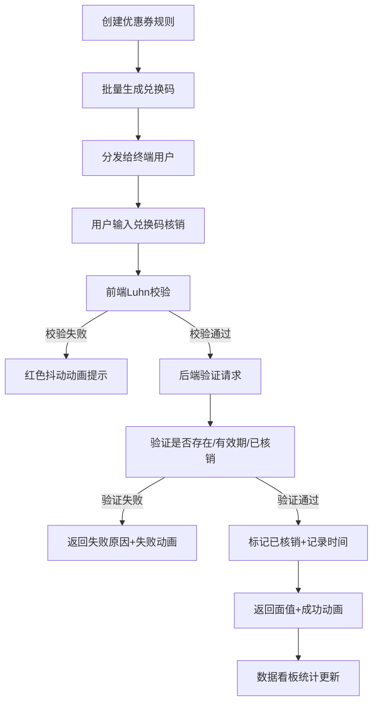

## 1. 产品概述

在线限量优惠券与兑换码生成管理应用，解决小团队在电商运营和线下活动中手动生成兑换码易重复、缺乏防伪校验的痛点。通过Luhn校验算法生成防伪兑换码，提供完整的规则管理、批量生成、核销验证和数据统计功能，帮助团队避免恶意刷券损失。

- 目标用户：小电商运营团队、线下活动组织者
- 核心价值：一键生成带校验的限量兑换码，杜绝重复和伪造，实时核销追踪

## 2. 核心功能

### 2.1 功能模块

1. **数据看板页**：统计总发券数、已核销量、核销率、总面值价值四大核心指标，支持数字滚动动画
2. **规则管理页**：创建/编辑优惠券规则（名称、面值、有效期、发行数量），实时显示剩余可生成数量
3. **兑换码生成页**：按规则批量生成带Luhn校验的16位兑换码，6列网格展示，支持状态筛选和分页
4. **核销验证页**：实时核销验证，前端本地校验+后端二次验证，成功/失败动画反馈，右侧核销记录列表

### 2.2 页面详情

| 页面名称 | 模块名称 | 功能描述 |
|-----------|-------------|---------------------|
| 数据看板 | 统计卡片2x2网格 | 总发券数、已核销量、总面值、核销率，渐变色卡片+悬浮浮动动画，数字从0滚动动画 |
| 规则管理 | 规则创建表单 | 名称、面值(1-999元)、有效天数(1-365)、发行总量(1-10000)，表单校验 |
| 规则管理 | 规则列表 | 按创建时间倒序，显示剩余可生成数量，支持编辑和删除 |
| 兑换码生成 | 规则选择器 | 下拉选择已创建的规则，显示规则信息 |
| 兑换码生成 | 生成控制 | 每次最多生成100个，防止接口超时 |
| 兑换码生成 | 6列网格表格 | 展示兑换码、状态、面值，支持复制单条码 |
| 兑换码生成 | 状态筛选器 | 按未核销/已核销/已过期筛选 |
| 兑换码生成 | 导出功能 | 导出已核销兑换码为CSV，含兑换码/面值/核销时间/状态 |
| 核销验证 | 兑换码输入框 | 等宽字体，绿色呼吸动画/红色抖动动画反馈 |
| 核销验证 | 验证按钮 | 先本地Luhn校验再发后端请求 |
| 核销验证 | 结果反馈弹窗 | 成功：绿色缩放动画；失败：红色抖动动画 |
| 核销验证 | 核销记录列表 | 实时显示核销历史，右侧垂直列表布局 |

## 3. 核心流程

### 3.1 主业务流程

运营人员首先创建优惠券规则（定义面值、有效期、总量）→ 基于规则批量生成带Luhn校验的兑换码 → 分发给用户 → 用户在核销页输入兑换码 → 前端本地格式和Luhn校验 → 后端验证有效期/是否已核销 → 核销成功并记录 → 数据看板实时更新统计数据

## 4. 用户界面设计

### 4.1 设计风格

- **主色调**：深色主题，背景 `#0f0f23`，卡片 `#1a1a2e`，强调色 `#e94560`（悬停变亮至 `#ff6b81`）
- **按钮风格**：圆角4px，主色背景，0.2s背景色过渡
- **字体**：正文常规无衬线，兑换码输入使用等宽字体
- **布局风格**：左侧侧边栏导航 + 右侧内容区域，卡片式面板布局
- **动效体系**：
  - 卡片悬浮：向上浮动3px + 加深边框
  - 输入正确：绿色呼吸动画2秒周期
  - 输入错误：红色抖动动画0.3秒
  - 核销成功：绿色弹窗缩放动画
  - 核销失败：红色抖动动画
  - 统计加载：数字从0计数滚动动画0.5秒

### 4.2 页面设计概览

| 页面名称 | 模块名称 | UI元素描述 |
|-----------|-------------|-------------|
| 数据看板 | 统计卡片 | 2x2网格，渐变背景(#1a1a2e→#16213e)，大字加粗数值，浅灰副标题，悬浮浮动 |
| 规则管理 | 创建表单 | 左对齐标签+输入框，表单验证红框提示，主色提交按钮 |
| 规则管理 | 规则列表 | 表格布局，行悬停变#2a2a3e，剩余数量高亮显示 |
| 兑换码生成 | 6列网格 | 等宽字体显示码，状态标签着色（绿/灰/红），单击复制提示 |
| 核销验证 | 输入区域 | 大输入框居中，等宽字体，实时边框颜色反馈，结果弹窗居中 |
| 核销验证 | 记录列表 | 时间线式布局，最新记录在上，成功/失败状态区分 |

### 4.3 响应式设计

- **桌面端（≥768px）**：左侧固定侧边栏导航，右侧主内容区，表单和列表水平布局
- **移动端（<768px）**：侧边栏转为顶部导航栏，规则管理页表单单列垂直堆叠，6列码表转为2列网格

### 4.4 性能约束

- 批量生成100个兑换码响应 ≤ 300ms
- 核销验证接口响应 ≤ 200ms
- 首屏FCP ≤ 2秒
