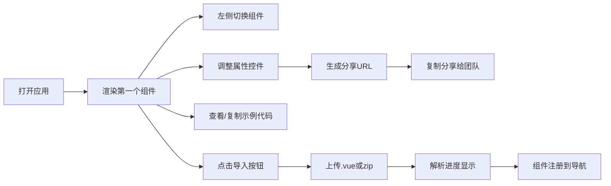

## 1. 产品概述

Vue Component Playground 是一个面向前端开发团队的交互式组件演示文档平台，解决多人协作中组件文档同步困难、设计稿与实现脱节的问题。

- 核心目标：提供组件实时预览、属性调试、示例管理、一键导入的一体化工作流
- 目标用户：前端开发团队、UI/UX 设计师、产品经理

## 2. 核心功能

### 2.1 用户角色

| 角色 | 注册方式 | 核心权限 |
|------|----------|----------|
| 团队成员 | 无需注册，本地使用 | 查看组件、编辑属性、导入组件、分享链接 |

### 2.2 功能模块

1. **组件导航面板**：左侧显示所有注册组件列表，含版本号和状态指示
2. **组件详情页**：实时渲染视图 + 源代码编辑器并排展示，支持拖拽调整比例
3. **属性控制面板**：动态生成多种控件类型，实时响应并生成可分享URL
4. **示例卡片管理**：组件使用示例以卡片网格展示，支持查看和复制代码
5. **组件导入功能**：支持上传单个 .vue 文件或 zip 包，自动解析注册

### 2.3 页面详情

| 页面名称 | 模块名称 | 功能描述 |
|----------|----------|----------|
| 首页 | 组件导航面板 | 展示组件列表，版本状态指示，点击切换组件 |
| 首页 | 顶部导航栏 | 固定高度64px，Logo展示，导入组件按钮 |
| 组件详情页 | 实时渲染视图 | 动态渲染组件，支持props实时变化 |
| 组件详情页 | 源代码编辑器 | Monaco Editor，vue语法高亮，编辑防抖0.3s实时更新 |
| 组件详情页 | 属性控制面板 | 输入框/滑块/颜色选择器/下拉菜单/开关控件 |
| 组件详情页 | 示例卡片区域 | 卡片网格布局，80x80缩略图，查看/复制代码 |
| 导入浮层 | 文件上传区域 | 拖拽/点击上传，圆环进度条，2秒动画过渡 |

## 3. 核心流程

用户打开应用后默认展示第一个组件详情，可通过左侧面板切换组件。在详情页可调整属性控件生成分享链接、查看示例代码、或点击顶部导入按钮上传新组件。

## 4. 用户界面设计

### 4.1 设计风格

- **深色主题配色**：
  - 主背景 #0d1117
  - 侧边栏 #161b22
  - 卡片/面板 #21262d
  - 边框 #30363d
  - 文字主色 #c9d1d9
  - 链接/选中态 #58a6ff
  - 危险操作 #f85149
- **圆角规范**：卡片 8px，输入框/按钮 6px
- **过渡动画**：所有交互 0.2s 过渡
- **字体**：现代等宽代码字体 + 无衬线系统字体组合

### 4.2 页面设计概览

| 页面名称 | 模块名称 | UI元素 |
|----------|----------|--------|
| 首页 | 顶部导航栏 | 固定64px高度，深色背景，Logo左对齐，导入按钮右对齐 |
| 首页 | 左侧导航面板 | 280px宽度，可折叠，展开动画0.2s ease-out，组件列表含版本号和状态圆点 |
| 组件详情页 | 主内容区 | 左右分栏6:4，可拖拽调整，渲染视图左，代码编辑器右 |
| 组件详情页 | 属性面板 | 底部区域，多控件类型分组，值变化时实时反馈 |
| 组件详情页 | 示例卡片 | 网格布局，80x80缩略图裁剪，悬停动效，操作按钮 |
| 导入浮层 | 上传区域 | 拖拽高亮，圆环进度条动画2秒过渡 |

### 4.3 响应式设计

- Desktop-first 设计
- 视口 < 768px 时：
  - 左侧导航面板折叠为底部标签栏
  - 渲染视图与代码编辑区改为上下堆叠
  - 触摸操作优化

### 4.4 性能指标

| 指标 | 目标值 |
|------|--------|
| 组件切换渲染延迟 | ≤ 500ms |
| 同时展示示例卡片数 | ≤ 5个 |
| 单卡片缩略图生成 | ≤ 800ms |
| zip解析速度 | ≥ 10文件/秒 |
| 代码编辑防抖延迟 | 0.3秒 |
